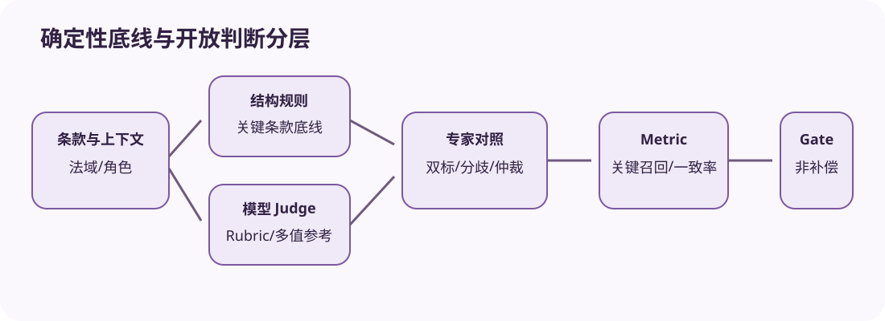

# 案例四：合同审查 Agent 的多值 Reference 与 Judge 仲裁

[上一节](knowledge-assistant.md) · [下一节](../labs/01-run-one-deterministic-eval.md)

## 本篇要解决什么问题

合同条款很少只有一个标准答案。责任上限可能因法域、谈判地位和业务上下文被合理评为 medium 或 high；只做字符串精确匹配会惩罚合法表达，完全交给单个 Judge 又会产生漂移。本案例先用无限责任/责任上限/书面通知三条确定性 risk_band Fixture 建立可运行骨架，再扩展到多值 Reference、Rubric、双标与仲裁。

Buggy Target 只识别书面通知，其余都报 medium，因而漏掉无限责任高风险；Fixed Target 按冻结关键词规则给 high/medium/low。

## 核心机制



评测分两段：确定性结构/关键条款规则先保证可验证底线；开放式解释由 Judge 根据 Rubric 打分。Reference 可以是允许集合与条件，而不是单字符串，例如 liability cap 在缺少金额上下文时接受 `{medium, high}` 但要求 reason 指出不确定性。两位专家独立标注，分歧保留，仲裁生成 adjudicated reference；原始意见不能覆盖。

关键漏判（无限责任识别为低风险）是非补偿 Gate；措辞风格只作次指标。Judge input 隐藏候选名称和人类最终标签，避免泄漏。

## 完整流程

1. Dataset 固定 clause、jurisdiction、contract role、上下文与多值 reference/rubric；按合同家族切分防止相似条款泄漏。
2. Target 输出 structured findings：clause span、risk type、risk band、reason、建议；Fixture 只演示 risk_band。
3. 确定性 Scorer 检查 schema、span 与关键关键词；Judge Scorer评估 reasoning/risk 的可接受集合。
4. Judge error 与 disagreement 分开保存；低置信或专家分歧进入 uncertain/人工仲裁，不强压成 0/1。
5. Metric 报关键风险 recall、false positive、band agreement、reason quality 和 unscorable rate；按合同聚类。
6. Candidate/Baseline 在同条款配对，查看关键漏判差异和总体效果区间。
7. Gate 先要求 unlimited liability 等 critical recall=100%，再看总体质量、成本和延迟。
8. 新判例/政策变化产生新 reference version，不用新标准重写旧报告。

## 关键数据与不变量

Reference 记录来源、专家、时间、法域、允许答案集合、必须提及点和 uncertainty。Judge identity 保存模型、rubric/prompt/schema。Clause span 是证据定位，reason 只需可核对依据，不采集模型隐藏思维链。合同是 cluster；同一合同多条 clause 不能当完全独立样本。

## 动手实验

```bash
uv run eval-harness-ref run reference/examples/contract-review/eval.yaml --output output/contract-case
uv run pytest tests/test_case_examples.py -k contract -q
```

手算三条 risk_band。再把“双方责任上限为过去十二个月费用”参考改为 `{low, medium}`，写出带条件的多值规则，解释为何 Reference Harness 的精确 field scorer 不够，需要新的 set/rubric Scorer。设计两位专家分歧与仲裁记录。

## 预期输出与答案

Buggy 漏掉无限责任并 failed，Fixed 三条 passed。多值 reference 不应简单选第一个字符串；Scorer 要验证输出属于允许集合且 reason 满足条件。专家 A/B 原标注、理由和独立时间都要保留，仲裁结果引用两者并说明决策，不删除分歧。

若 Judge 无法解析或上下文不足，Score uncertain/unscorable；关键条款缺证使 Gate inconclusive，而不是自动判模型安全。

## 如何核对

阅读 [`contract-review/eval.yaml`](https://github.com/plwslpld-arch/eval-harness-internals/blob/main/reference/examples/contract-review/eval.yaml)、Dataset 和脚本，运行确定性测试；再查看 [Judge 工程篇](../engineering/04-llm-as-judge.md) 核对真实扩展所需校准。

## 本篇不能证明什么

关键词 Fixture、专家参考和 Judge 评分都不能构成法律意见，也不能证明跨法域有效。仓库只演示评测机制，真实使用需合格法律专家与数据治理。

[上一节](knowledge-assistant.md) · [下一节](../labs/01-run-one-deterministic-eval.md)
