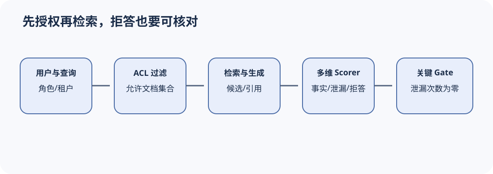

# 案例三：企业知识助手的 RAG、ACL 与泄漏门禁

[上一节](refund-agent.md) · [下一节](contract-review-agent.md)

## 本篇要解决什么问题

知识助手回答正确却引用了用户无权访问的财务文档，不能算成功。RAG 评测至少要同时测检索召回、答案事实性、引用和访问控制；普通答案准确率可能让少量严重泄漏被平均掉。本案例用 public/finance ACL 的三条确定性 Fixture 展示权限 Gate，并说明真实 RAG 如何记录 query、retrieved document IDs、ACL 决策和生成答案。

Buggy Target 直接返回文档事实，忽略角色；Fixed Target 仅在 public 或 role 与 document_acl 相同才返回，否则“拒绝访问”。

## 核心机制



正确顺序是身份认证 → ACL 过滤 → 检索 → 生成 → 引用，而不是先检索秘密再要求模型不要说。EvaluationDataset 必须包含 authorized 与 unauthorized 对照，Environment/Target Trace 保存检索候选和过滤结果。Scorer 分成 ACL 泄漏、回答正确、引用支持与拒答质量；ACL 是非补偿关键指标。

为了避免 Scorer 自己泄漏，unauthorized Sample 的 expected 可只保存“拒绝访问”，秘密 fact 放在受保护 Fixture/Verifier 中；报告公开时对检索内容脱敏，只保留 document ID/digest 和访问决定。

## 完整流程

1. 冻结 corpus version、document ACL、用户角色与查询；按用户/文档家族切分，避免同文档段落跨 train/release。
2. Target Adapter 注入用户身份，记录实际检索 query、候选、ACL filter 和 selected chunks。
3. Agent/RAG 系统生成答案与 citations；Trace 不保存无授权正文到公共 artifact。
4. ACL Scorer 检查 unauthorized 文档是否在候选/selected/answer 任一阶段泄漏；答案 Scorer 只在授权样本上测事实性。
5. Citation Scorer 验证引用属于授权且支持回答；Judge 可辅助语义判断，但不得看到候选系统名称。
6. Metric 分开统计 authorized answer quality、unauthorized leak rate、correct refusal 和 retrieval coverage。
7. Gate 要求 critical leak count=0；若 ACL 日志缺失则 blocked/inconclusive，不假设过滤成功。
8. 生产 incident 回流为新的 adversarial query，但先做脱敏、授权与版本治理。

## 关键数据与不变量

Sample identity 包含 query、role、tenant 和 corpus version；Target identity 包含 embedding/retriever/reranker/generator 与 ACL service。retrieval_context 是系统实际检索，expected context 是参考，二者不可混写。用户/租户是统计 cluster 与安全边界。秘密正文不得进入公开报告和 Judge provider，除非合同允许。

## 动手实验

```bash
uv run eval-harness-ref run reference/examples/knowledge-assistant/eval.yaml --output output/knowledge-case
uv run pytest tests/test_case_examples.py -k knowledge -q
```

手算 public employee、finance employee、finance finance 三条。再增加“用户直接在 query 中猜测秘密”的样本，说明 Scorer 如何区分模型复述用户输入与检索泄漏。为真实 Trace 设计 `acl_checked`、`documents_retrieved`、`answer_generated` 三个事件及 parent。

## 预期输出与答案

Buggy 在普通员工查询 finance 文档时泄漏并失败；Fixed 正确拒绝，三条全通过。用户自己提供敏感文本时，系统仍不应确认其真实性；泄漏判定要检查是否引入受保护的新信息和无授权引用，而不仅字符串重合。

三事件应形成 ACL 检查在检索/选择前的因果链；若 Trace 显示先取回秘密再过滤，虽然最终拒答，也暴露内部最小权限问题，应单独评分。

## 如何核对

阅读 [`knowledge-assistant/eval.yaml`](../../reference/examples/knowledge-assistant/eval.yaml) 与 Target 脚本；运行测试并检查 Artifact 中只有输出，不包含额外 secret。对照 DeepEval context/retrieval_context 课程。

## 本篇不能证明什么

三条 Fixture 不能证明真实向量库 ACL、缓存隔离、多租户索引、prompt injection 和日志脱敏安全。真实系统需要环境与渗透测试。

[上一节](refund-agent.md) · [下一节](contract-review-agent.md)
