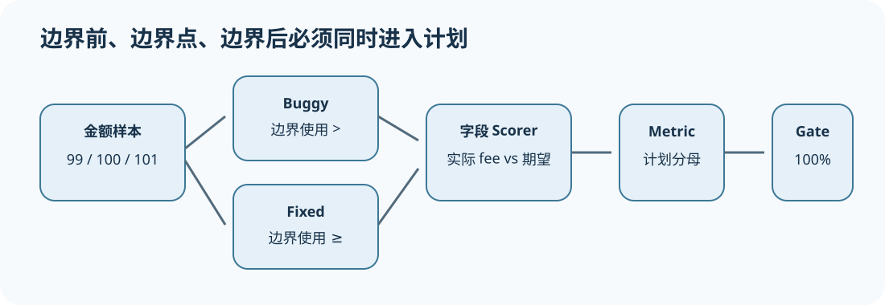

# 案例一：运费边界错误怎样形成完整评测证据

[上一节](../comparisons/07-report-ci-release-gate.md) · [下一节](refund-agent.md)

## 本篇要解决什么问题

订单满 100 元免运费，旧实现却使用 `amount > 100`，导致恰好 100 元仍收费。这个 bug 很小，正适合完整展示 Eval Harness：边界样本怎样构造、两个 Target 怎样比较、为什么脚本自报成功不可信、Artifact 篡改怎样阻断、2/3 通过为何仍不能覆盖关键边界失败。Agent Harness 姊妹仓库可研究 Agent 如何修代码；本仓库只研究如何设计和判定这一组实验。

前置知识是最小 Eval Loop。读完后，你应能运行案例、手工核对六个 Trial，并把相同模式迁移到价格、配额、年龄或日期边界。

## 核心机制



Dataset 固定 99、100、101 三个边界点，expected fee 分别为 10、0、0。Buggy 与 Fixed Target 都通过同一个 SubprocessTarget 调用，避免执行路径差异。Scorer 只比较 output.fee 与 Sample expected.fee。Gate 要求 pass-rate=1.0，因此一个边界失败即可阻断。

这不是为了证明三个样本代表全部订单，而是展示测试构造原则：边界前、边界点、边界后缺一不可；关键合同可以设置非补偿门禁，不能让大量普通样本稀释。

## 完整流程

1. `eval.yaml` 冻结 Dataset、两个脚本、field scorer 和 minimum=1.0。
2. 三个 Sample 与两个 Target 展开为六个 Trial，repetition=1。
3. Runner 以 stdin JSON 传入 amount，脚本 stdout 返回 JSON fee。
4. 每个输出写 TraceEvent 和 Artifact；Bundle 绑定 canonical Attempt。
5. Scorer 读取 output/expected 的 fee：buggy 在 amount=100 得 failed，其余 passed；fixed 三条全 passed。
6. Metric 分母按每个 Target 三个计划 Trial计算，分别为 2/3 与 3/3。
7. Gate 输出 buggy failed、fixed passed；compare 按三个 Sample 配对，平均改进 1/3。
8. inspect 重算 Artifact digest；任何产物被改动，旧报告不能继续作为有效证据。

## 关键数据与不变量

Sample ID 应表达逻辑边界而非数组序号；Target identity 包含脚本与解释器；Trial ID 固定 Sample/Target/repetition；Score 引用 Bundle digest；Metric denominator=3。产品 fee 错误是有效 failed，脚本启动失败才是 infra Attempt。更换 Scorer field、expected 或 threshold 都要产生新身份/政策版本。

## 动手实验

```bash
uv run eval-harness-ref run reference/examples/shipping/eval.yaml --output output/shipping-case
uv run eval-harness-ref compare output/shipping-case --candidate-target fixed --baseline-target buggy --seed 17 --iterations 2000
uv run eval-harness-ref inspect output/shipping-case
```

打开 Dataset 与两个脚本手算输出。然后新增 amount=0 和 amount=100.01，先写 expected 再运行；说明新增样本为何会改变 Metric 分母和 comparison pair_count。

## 预期输出与答案

Buggy 为 2/3、Gate failed；Fixed 为 3/3、Gate passed。配对差值为 `[0,1,0]`，平均 0.3333，样本极少所以区间信息有限。新增两条后每个 Target denominator=5、pair_count=5；这是一份新 Dataset identity，不能把新结果覆盖到旧 run。

若把 Gate 降至 0.6，buggy 数学上可能通过，但“金额恰好 100”是明确业务合同，正确设计应有关键边界 noncompensatory check，而不是只依赖总体比例。

## 如何核对

阅读 [`eval.yaml`](https://github.com/plwslpld-arch/eval-harness-internals/blob/main/reference/examples/shipping/eval.yaml)、[`dataset.jsonl`](https://github.com/plwslpld-arch/eval-harness-internals/blob/main/reference/examples/shipping/dataset.jsonl) 和两个 Target；运行 [`test_shipping_e2e.py`](https://github.com/plwslpld-arch/eval-harness-internals/blob/main/tests/test_shipping_e2e.py)：

```bash
uv run pytest tests/test_shipping_e2e.py -q
```

## 本篇不能证明什么

三条确定性样本只证明冻结规则下的边界行为，不能证明真实计价服务的税费、币种、促销、并发或生产配置正确，也不代表已授权发布。

[上一节](../comparisons/07-report-ci-release-gate.md) · [下一节](refund-agent.md)
