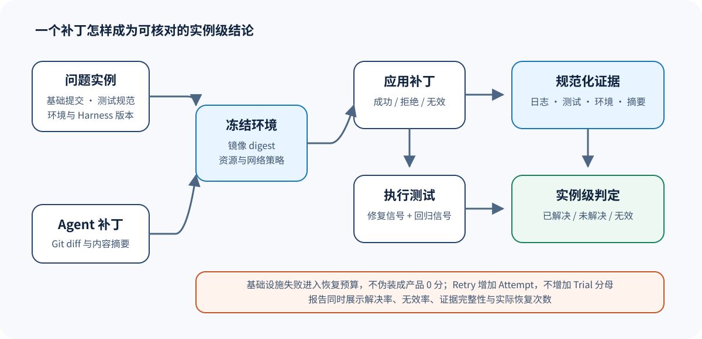

# SWE-bench：补丁评测为什么不等于「跑一次测试」

> 本文不会介绍 SWE-bench 的使用步骤，它借一个环境型 Eval Harness 案例来解释，仓库问题、模型补丁和测试集如何逐步转换为可复核的 Trial、环境终态、评分证据与汇总结果。



## 学完后应该能回答什么

读完本文，你应该能够解释以下问题：

1. 为什么「补丁能应用」只是前置条件，不是任务通过；
2. 为什么测试进程退出码不能单独代表产品质量；
3. 为什么基础设施失败、测试失败和补丁失败必须分开记录；
4. 为什么同一个问题实例要冻结仓库版本、测试规范和镜像身份；
5. 怎样把 SWE-bench 风格的运行结果映射到本仓库的 `Trial → Attempt → Observation → Score → Gate`。

## 先建立一个具体场景

假设 Dataset 中有一个问题实例：某个 Python 项目在空输入下错误抛出异常。实例至少包含：

- 仓库与基础提交；
- 问题描述；
- 预期被修复的行为；
- 用于判定修复是否成立的测试补丁；
- 用于防止回归的测试范围；
- 构建和运行环境约束。

被测 Agent 返回 Git diff 之后，Eval Harness 不会凭 diff 的外观猜测修复是否成立，它会在冻结环境中把补丁应用到指定版本，完成测试后再保存每一步的证据。

## 一次 Trial 的身份是什么

一个 SWE-bench 风格 Trial 的身份需要同时固定问题、Target、环境和评测条件，因此可以写成下面的形式。

```text
trial_id = hash(
  instance_id,
  target_id,
  repository_commit,
  image_digest,
  test_spec_digest,
  harness_version
)
```

这里最容易遗漏环境与测试规范，因为只记录 `instance_id + model_name` 时，基础镜像、依赖解析或测试选择只要发生变化，就可能在身份没有变化的表象下改变结果。

为了把这个身份公式放回本仓库的对象模型中，下表逐一对应了每个通用对象在 SWE-bench 场景里的含义。

| 通用对象 | SWE-bench 场景中的含义 | 必须冻结的内容 |
| --- | --- | --- |
| Sample | 一个仓库问题实例 | 实例 ID、基础提交、问题与测试规范 |
| Target | 生成补丁的 Agent 或已保存补丁 | 模型/Agent 配置或补丁摘要 |
| Environment | 隔离的仓库运行环境 | 镜像 digest、资源限制、网络策略 |
| Trial | 一次预声明的「实例 × Target」实验 | Trial ID 与完整身份摘要 |
| Attempt | Trial 的一次基础设施执行 | Attempt 序号、租约、开始与结束时间 |
| Artifact | 补丁、日志、测试报告、环境元数据 | 内容摘要、大小、媒体类型、相对路径 |
| Observation | 评分器可以消费的规范化事实 | 补丁状态、测试结果、基础设施状态 |
| Score | 对一个 Trial 的判定 | `resolved`、`unresolved` 或 `invalid` |

## 锁定源码中的五个关键入口

本案例基于锁定提交 `7a21e05772954cc81471ae19d56f436cecf43c54`，因此下面五组链接都直接指向不可漂移的源码位置：

1. [`run_instances()`](https://github.com/SWE-bench/SWE-bench/blob/7a21e05772954cc81471ae19d56f436cecf43c54/swebench/harness/run_evaluation.py#L432-L471) 负责组织实例、镜像与运行过程，单个实例的执行在 [`run_instance()`](https://github.com/SWE-bench/SWE-bench/blob/7a21e05772954cc81471ae19d56f436cecf43c54/swebench/harness/run_evaluation.py#L229-L268)；
2. [`exec_run_with_timeout()`](https://github.com/SWE-bench/SWE-bench/blob/7a21e05772954cc81471ae19d56f436cecf43c54/swebench/harness/docker_utils.py#L109-L146) 承担容器内执行与超时，清理在 [`cleanup_container()`](https://github.com/SWE-bench/SWE-bench/blob/7a21e05772954cc81471ae19d56f436cecf43c54/swebench/harness/docker_utils.py#L48-L87)；
3. [`get_logs_eval()`](https://github.com/SWE-bench/SWE-bench/blob/7a21e05772954cc81471ae19d56f436cecf43c54/swebench/harness/grading.py#L113-L152) 把测试日志解析成用例状态，[`get_eval_tests_report()`](https://github.com/SWE-bench/SWE-bench/blob/7a21e05772954cc81471ae19d56f436cecf43c54/swebench/harness/grading.py#L179-L218) 再据此给出实例级判定；
4. [`classify_logs()`](https://github.com/SWE-bench/SWE-bench/blob/7a21e05772954cc81471ae19d56f436cecf43c54/swebench/harness/infra_failure.py#L79-L86) 表达基础设施故障——它把日志归到 [`TIER_ENVIRONMENT`](https://github.com/SWE-bench/SWE-bench/blob/7a21e05772954cc81471ae19d56f436cecf43c54/swebench/harness/infra_failure.py#L22-L25) 这类分层里，而不是简单标记失败；
5. [`make_run_report()`](https://github.com/SWE-bench/SWE-bench/blob/7a21e05772954cc81471ae19d56f436cecf43c54/swebench/harness/reporting.py#L16-L55) 汇总运行结果。

这五个文件并非互不相干的模块清单，因为运行器先产生事实，基础设施层再标记运行是否有效，随后由评分层解释测试结果，最后报告层才能聚合已经成立的实例级判定，于是它们从前到后连成了一条证据链。

## 从补丁到判定的完整流程

### 1. 物化环境

Harness 根据实例和镜像规范准备隔离环境，而在任何补丁进入环境之前，运行器都需要先把以下实际执行条件记录下来：

- 实际使用的镜像 digest，而不只是可变 tag；
- 容器创建参数和资源限制；
- 基础仓库提交；
- Harness 自身版本；
- 测试规范摘要。

如果镜像拉取失败，结果应归为基础设施错误，不能记成 `unresolved`，因为模型此时还没有得到一次有效的产品判定机会。

### 2. 应用补丁

补丁至少有三种不同结果：

| 状态 | 含义 | 是否进入测试 |
| --- | --- | --- |
| `applied` | 补丁成功应用 | 是 |
| `rejected` | 补丁与基础版本不兼容 | 否，通常是产品失败 |
| `invalid` | 补丁为空、损坏或违反输入合同 | 否，按评测协议处理 |

「补丁无法应用」通常不属于基础设施失败，只要仓库版本和执行环境与声明一致，这个结果就说明 Target 产生了无法执行的输出。

### 3. 执行测试

环境型代码评测常见两类测试信号：

- `FAIL_TO_PASS`：问题修复后应该从失败变为通过；
- `PASS_TO_PASS`：原本正确的行为必须继续通过。

只满足第一类时，补丁可能「修好了目标问题却引入回归」，而只满足第二类时，问题又可能根本没有被修复，所以实例级判定必须同时考虑评测协议要求的信号。

### 4. 区分执行错误与产品结果

一个测试命令返回非零退出码，可能表示：

- 测试断言失败；
- 测试收集失败；
- 依赖缺失；
- 进程超时；
- 容器被系统终止；
- Harness 无法解析日志。

如果把这些情况全部压缩成 `0 分`，报告就无法区分产品表现和执行环境问题，因此应当先构造下面这份规范化 Observation。

```json
{
  "patch_status": "applied",
  "execution_status": "completed",
  "tests": {
    "fail_to_pass": {"passed": 4, "total": 4},
    "pass_to_pass": {"passed": 117, "total": 118}
  },
  "infrastructure_error": null,
  "parser_status": "valid"
}
```

规范化之后，评分器才能根据当前协议判断该实例应当记为 `resolved` 还是 `unresolved`。一旦 `execution_status` 变成 `timeout`，评分器就只能得到 `invalid/unscorable`，因为这次执行并没有观察到可供判定的代码行为。

### 5. 生成实例级 Score

如果把上述先验证证据、再判定产品结果的顺序改写成教学代码，可以得到下面这个简化形式。

```python
if observation.infrastructure_error:
    return Score(status="invalid", reason="基础设施未完成有效执行")
if observation.patch_status != "applied":
    return Score(status="failed", value=0, reason="补丁无法应用")
if not observation.parser_valid:
    return Score(status="invalid", reason="测试证据无法解析")
resolved = all_required_tests_pass(observation.tests)
return Score(status="passed" if resolved else "failed", value=int(resolved))
```

这段代码只用来解释机制，没有逐行复制上游实现，它所表达的关键顺序是先判断证据有效性，然后才判断产品是否成功——这个顺序不能颠倒。

## Retry 为什么不能改变分母

假设预声明计划包含 100 个问题实例，并且每个实例只对应一个 Trial。其中某个 Trial 第一次因镜像下载超时失败，第二次才正常完成，因而运行记录会呈现为下面的结构。

```text
100 Trials
101 Attempts
99 个一次完成 + 1 个基础设施恢复后完成
```

最终分母仍然是 100 个 Trial，因为第 101 次 Attempt 只记录了其中一个 Trial 的恢复重试，并没有扩大预先声明的样本集。如果第一次测试失败后又让 Agent 重新生成补丁，直到通过才停止，那么被测策略或采样预算已经发生变化，后续必须创建新的 Trial 身份，或者按照预声明的多样本协议统计。

## 报告层应该显示什么

一个可核对的报告至少分开展示：

- 计划 Trial 数；
- 已获得有效产品判定的 Trial 数；
- `resolved` 与 `unresolved` 数；
- 基础设施错误、证据解析错误和预算耗尽数；
- 实际 Attempt 数及重试原因；
- 每个实例对应的补丁、日志与环境摘要。

如果 100 个 Trial 中有 6 个因基础设施失败而没有得到有效判定，报告若只写「94 个样本中通过 50 个，成功率 53.2%」，就会把这些缺失数据藏起来。更完整的说法是 50 resolved、44 unresolved 和 6 invalid，也就是有效样本的条件成功率为 53.2%，但计划总体的结论仍需按门禁策略处理 6 个缺失判定。

## 映射到 Reference Harness

本仓库没有内置 Docker，也没有声称复刻 SWE-bench，因此对接时需要明确下面这些接口边界：

1. Target Adapter 接收 Sample，返回补丁 Artifact；
2. Environment Adapter 在隔离环境应用补丁并运行测试；
3. Observation Builder 规范化补丁、执行、测试与基础设施事实；
4. Scorer 只消费 Observation，不直接猜测日志含义；
5. Metric 聚合 Trial 级 Score；
6. Gate 同时检查解决率、无效率和证据完整性。

由于解决率、无效率和证据完整性衡量的是不同风险，所以推荐的 Gate 需要同时声明多条规则，不能只留一个阈值。

```yaml
rules:
  - metric: resolved_rate
    operator: gte
    threshold: 0.45
  - metric: invalid_rate
    operator: lte
    threshold: 0.02
  - metric: evidence_completeness
    operator: eq
    threshold: 1.0
```

## 常见误解

### 「测试通过率就是解决率」

不一定，因为解决率属于实例级判定，可能由多组测试和协议条件共同决定，而测试通过率聚合的是测试用例，两者的统计单位不同。

### 「容器失败也算模型失败，反正用户只看结果」

这种记法会把 Harness 可靠性混入模型质量。线上产品可用性评估可以额外统计端到端失败，但原因分层仍然要保留，否则你无法判断应该修 Agent 还是修基础设施。

### 「多跑几次取最好结果更稳定」

每次都取最好结果，会把估计对象从单次策略输出改成多次采样后的最优输出。若要评估 `best-of-k`，就必须在计划中事先声明 k、选择规则和成本，不能在结果出来后才把恢复重试伪装成策略采样。

## 自测题与参考答案

### 题 1

一个补丁应用成功，目标修复测试全部通过，但 3 个原有测试回归。它是否 resolved？

**参考答案：**取决于协议，但在同时要求目标修复和无回归的协议下应为 unresolved；补丁可应用只证明可执行，不能覆盖回归证据。

### 题 2

测试进程因宿主机磁盘已满而终止，是否给 0 分？

**参考答案：**不应直接给产品 0 分。应标记基础设施错误，使本 Attempt 无法提供有效产品判定；是否在预算内恢复由预声明策略决定。

### 题 3

为什么要记录测试规范摘要？

**参考答案：**因为测试选择和解析规则属于实验条件，所以代码和模型不变时，测试规范变化仍可能改变结果；没有摘要就无法证明两次运行可比较。

## 继续阅读

- [Agent Environment 与 Final State](../comparisons/06-agent-environment-final-state.md)
- [Retry 与 Recovery](../engineering/03-retries-and-recovery.md)
- [统计比较](../engineering/05-statistical-comparison.md)
- [Quality Gate](../engineering/07-quality-gates.md)
- [验证与证据边界](../appendices/verification.md)
