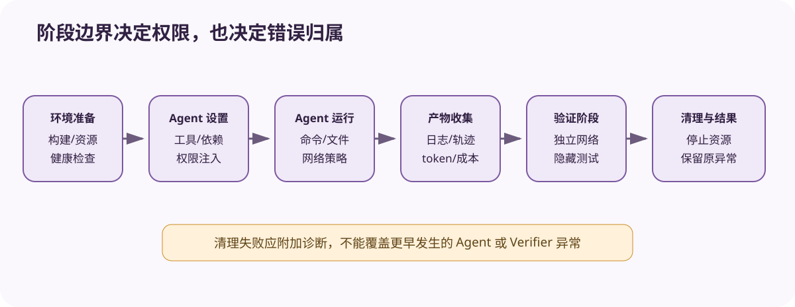

# 横向比较六：Agent Environment 与 Final State

[上一节](05-metric-statistics-uncertainty.md) · [下一节](07-report-ci-release-gate.md)

## 本篇要解决什么问题

模型 benchmark 主要观察生成文本，而 Agent Eval 还必须看到运行过程对环境造成的副作用。Inspect Sandbox、Promptfoo trace assertions、DeepEval agentic trace 与 Harbor container verifier 都能触达 Agent 行为，但它们的隔离能力、终态证据与验证强度并不相同，因此本篇要比较“能够执行工具”与“能够可信验证终态”之间究竟隔着什么。

## 核心机制



统一 Environment Harness 会依次经历五个阶段：create/reset → agent setup/run → collect trace/artifacts → independent verify → cleanup。Target Adapter 只负责接通 Agent 运行，而 Scorer/Verifier 不能信任 Agent 的自我报告，因为环境身份、网络与资源限制本来就是实验条件的一部分。

| Harness | 环境能力 | 终态证据 | 主要边界 |
| --- | --- | --- | --- |
| Inspect AI | Sandbox + tools + solver | EvalLog、文件/命令可评分 | 具体 sandbox provider 能力 |
| Promptfoo | Provider/trace 集成 | trace-aware assertion | 不负责通用容器生命周期 |
| DeepEval | trace/span agentic eval | LLMTestCase + span metrics | 环境创建多由外部系统 |
| Harbor/TB | 专门 container environment | logs、trajectory、workspace、reward | 最完整但成本与安全面更大 |
| Reference | Agent Trace import | 验证 JSONL + final output | 不启动真实环境 |

## 完整流程

1. 固定 Task 初始镜像/仓库、权限和 verifier。
2. 核对 provider capabilities，不支持的网络/资源要求直接 blocked。
3. 每 Trial 创建干净环境，Agent 使用最小权限执行。
4. 收集命令、工具、diff、服务状态与成本，不采集隐藏思维链。
5. Verifier 在受控阶段运行隐藏测试并解析 reward，错误单独分类。
6. 清理并检查污染，结果回连环境 digest、Agent 与 verifier identity。

## 关键数据与不变量

在同一环境里验证，虽然容易看到进程状态，却也更容易受到被测程序篡改，而分离环境能提供更强隔离，复制过程中却可能丢失状态。Final state 必须落在机器可检查的事实上，例如文件摘要、测试结果、数据库记录或服务响应。Agent final message 只是一条 TraceEvent，网络 disabled 的声明也必须有底层 enforcement 证据支撑。

## 动手实验

为退款 Agent 与代码修复 Agent 各列三项终态断言：

```text
退款：ledger entry、approval id、idempotency key
代码：git diff、隐藏测试、工作树允许范围
```

然后把其中一项改成只由 Agent 文本声明，并说明这种自报为什么不足以支撑终态判断。

## 预期输出与答案

退款任务必须查询实际交易或 ledger，不能只相信“已退款”的文字，代码任务也必须运行隐藏测试并检查 diff，不能把“测试通过”当成终态证据——如果 Scorer 无法访问环境，就应记为 unscorable/blocked，而不是因为文本看起来合理便判定成功。

## 如何核对

先对照 [Inspect Sandbox](../harnesses/inspect-ai/02-sandbox-sample-run.md)、[Harbor 生命周期](../harnesses/harbor-terminal-bench/02-environment-agent-lifecycle.md) 和 Trace Import 测试，分别确认环境创建、Agent 执行与独立验证由哪一层负责。

```bash
uv run pytest tests/test_runtime_extensions.py -k trace -q
```

## 本篇不能证明什么

终态测试通过只说明检查到的最终事实符合预期，不能证明中途没有发生越权、侧信道或不可见副作用，因此仍需要 Trace、安全策略与生产补偿机制共同覆盖这些风险。

[上一节](05-metric-statistics-uncertainty.md) · [下一节](07-report-ci-release-gate.md)
