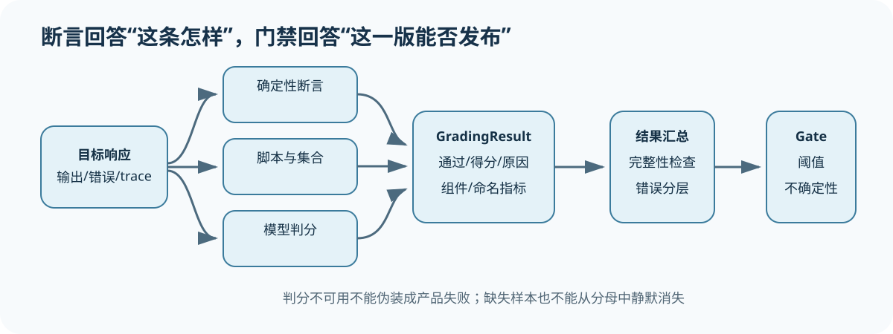

# 横向比较七：Report、CI 与 Release Gate

[上一节](06-agent-environment-final-state.md) · [下一节](../cases/shipping-boundary.md)

## 本篇要解决什么问题

一个 Harness 能生成 HTML、把结果上传到平台，或者让 CI 以非零状态退出，并不代表组织已经有了发布门禁。Report 用来展示证据，CI 负责自动执行，Release Gate（发布门禁）才会按照冻结的政策判断能不能过，部署授权还在更后面。Promptfoo 强调 CI assertions，DeepEval 支持 pytest，Inspect/OpenAI Evals 保存日志，Harbor 汇总 reward，lm-eval 输出 benchmark metric，这些能力都能接进 Gate，但各自解决的问题并不一样。

## 核心机制



按统一分层来看，Artifact/Score 保存行级证据，Metric/Comparison 算出统计结论，Report 只负责把这些内容展示出来，GateDecision（门禁决策）才是机器能读取的政策结果，CI 则提供执行通道。Gate 要先检查 evidence admissibility，再应用 threshold/margin/critical checks，不能漏过证据是否够资格这一步。网页亮了绿勾或者测试进程返回 0，都不能充当 GateDecision，因为它们没有记录政策怎样处理证据，也没有保存完整血缘。

| Harness | 报告/CI 入口 | 适合做什么 | 仍需补齐 |
| --- | --- | --- | --- |
| lm-eval | result JSON/table | benchmark 对比 | 关键风险与发布政策 |
| Inspect | EvalLog/viewer | 深入 sample/trace 审阅 | 组织 Gate DAG |
| OpenAI Evals | Recorder/final report | 事件审计与指标 | 完整性/不确定性政策 |
| Promptfoo | assertions/threshold/CI | 应用回归检查 | 统计与缺失分层 |
| DeepEval | assert_test/pytest/report | 测试式门禁 | Dataset 分母与 release 隔离 |
| Harbor/TB | reward/results/pass@k | Agent 任务结果 | 发布风险组合与授权 |

## 完整流程

1. CI 锁定代码、来源和环境，运行 Eval，不使用浮动分支。
2. 先检查计划完整、Artifact/Trace 摘要、错误率和 Scorer identity。
3. 生成 Metric/Comparison，保存机器 JSON 与人类报告。
4. Gate 应用版本化政策，输出 passed/failed/blocked/inconclusive 和 evidence IDs。
5. CI 根据状态失败或请求人工复核。报告作为 artifact 发布。
6. 组织发布系统读取已批准 Gate，但仍执行权限、变更窗口和回滚流程。

## 关键数据与不变量

Report 随时可以重新渲染，所以不能让它充当唯一证据源，GateDecision 则必须绑住 policy version、metric IDs 和 run identity。每次 CI rerun 都要新建 Run/Attempt 记录，把先前的失败历史原样留下。Badge 只告诉你最新的门禁状态，说明不了任意 commit 当时是什么状态。它也证明不了生产环境与评测环境一致，不能拿来补这个证据缺口。

## 动手实验

请跑一遍完整闭环，然后查看三种报告：

```bash
uv run eval-harness-ref run reference/examples/shipping/eval.yaml --output output/report-demo
uv run eval-harness-ref inspect output/report-demo
```

比较 `report.json`、`report.md` 和 `report.html`，找出它们共同引用的 Gate ID 与 Metric ID，然后删除一个 Artifact，再执行一次 inspect，看看三种报告怎样反映证据缺失。

## 预期输出与答案

三种报告都由同一个 EvaluationReport 生成，所以显示的 Gate 应该一致，其中 JSON 提供机器接口，Markdown/HTML 则给人查看。一旦缺少 Artifact，这次运行的证据就失效了，此时旧 HTML 即使还显示绿色，也不能继续当作有效 Gate。

## 如何核对

阅读 [`reporting.py`](https://github.com/plwslpld-arch/eval-harness-internals/blob/main/src/eval_harness_reference/reporting.py)、[`cli.py`](https://github.com/plwslpld-arch/eval-harness-internals/blob/main/src/eval_harness_reference/cli.py) 和报告测试，看同一份机器结果怎样生成不同视图，再回头检查 Promptfoo/DeepEval/OpenAI Evals 各自怎样组织报告链。

## 本篇不能证明什么

即使 CI 成功、报告可以打开、Gate 状态也是 passed，你仍然不能据此断定代码已经部署，也不能断定线上配置与评测配置相同。至于真实用户是否仍有风险，还得用部署记录和生产验证另拿证据，不能从这次评测里直接推出答案。

[上一节](06-agent-environment-final-state.md) · [下一节](../cases/shipping-boundary.md)
