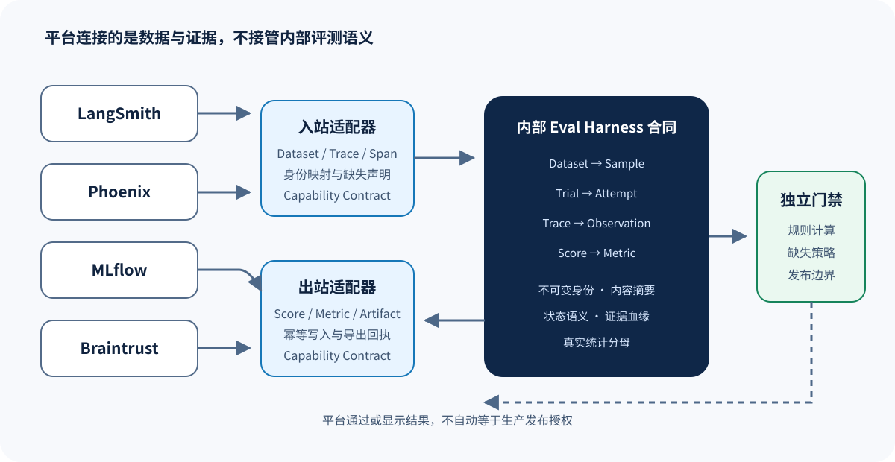

# 平台适配器：LangSmith、Phoenix、MLflow 与 Braintrust 应该接在哪里

> 这些平台可以保存数据集、Trace、反馈或实验结果，但它们不是本仓库六条主源码课程的替代品——本章用统一对象解释“应该适配什么、不能假设什么、怎样避免平台字段反过来污染 Eval Harness 的语义”。



## 为什么单独讲适配器

团队经常先选一个观测或实验平台，再把平台中的 `run`、`trace`、`score` 字段直接当成评测系统的事实模型。这样做很快，但会产生三个问题：

1. 同名字段语义并不相同；
2. 平台没有的概念会被悄悄丢失；
3. 更换平台时，评测协议也被迫重写。

更稳妥的方向是先定义内部合同：

```text
Dataset → Sample → Trial → Attempt → Observation → Score → Metric → Gate
                         │                │
                         └── Trace ───────┘
```

平台适配器只负责导入或导出这些对象——不决定它们的含义。

## 四类平台各自擅长什么

下表是工程定位，不是功能排行榜；平台能力会随版本变化，所以接入时必须以实际 API 和锁定版本复核。

| 平台 | 常见优势 | 适合承担的适配器角色 | 不能默认等价的概念 |
| --- | --- | --- | --- |
| LangSmith | LLM/Agent Trace、Dataset、反馈与实验 | Trace 导入、Dataset 同步、Score 导出 | Attempt 恢复语义、独立发布授权 |
| Phoenix | OpenTelemetry 观测、Trace、评测与分析 | Trace/Span 导入、评测结果导出 | 预声明 Trial Plan、统计分母 |
| MLflow | 实验、参数、Artifact、指标与模型生命周期 | Run 元数据、Artifact、Metric 导出 | Agent 环境终态、Trial/Attempt 区分 |
| Braintrust | Dataset、实验、Scorer、日志与比较 | Dataset/Experiment 同步、Score 导出 | 本仓库的 canonical Attempt 与 Gate 状态机 |

“不能默认等价”不表示平台一定缺少能力，而是说：没有经过合同映射与验证时，不能从字段名称推导语义相同。

## 先写 Capability Contract

每个 Adapter 都应该公开一份能力合同：

```yaml
adapter: example-platform
direction: bidirectional
capabilities:
  dataset: full
  sample_identity: full
  trial_identity: partial
  attempt_recovery: unavailable
  trace_import: full
  artifact_digest: partial
  score_lineage: partial
  metric_export: full
  release_gate: unavailable
limitations:
  - 平台 run_id 不包含预声明 Trial 身份
  - 导入 Trace 时无法恢复 canonical Attempt
```

状态只允许三种：

- `full`：已证明可以保持该语义；
- `partial`：能传输部分信息，但存在明确损失；
- `unavailable`：接口不能表达，或适配器没有实现。

不要使用模糊的 `supported: true`。例如平台可以保存一个数字分数，不代表它保存了 Score 与 canonical Attempt、Observation Bundle、Scorer 版本之间的血缘。

## 入站适配：从平台导入 Trace

假设 Agent 已在平台中产生一条 Trace，入站 Adapter 至少要做五件事：

1. 读取 Trace 和 Span；
2. 规范化时间、父子关系和事件顺序；
3. 把工具输入输出转换成受控 Artifact 或 Observation；
4. 记录来源平台、对象 ID 和导入时间；
5. 对无法恢复的语义显式标记缺失。

推荐的数据结构：

```json
{
  "trace_id": "local-trace-01",
  "source": {
    "adapter": "platform-x",
    "external_trace_id": "tr_123",
    "imported_at": "2026-08-24T00:00:00Z"
  },
  "events": [],
  "capability_snapshot": {
    "causal_order": "full",
    "artifact_digest": "partial",
    "attempt_identity": "unavailable"
  }
}
```

如果 Trace 没有 Trial 身份，Adapter 不能自己猜一个；调用方应明确把它绑定到新建 Trial，或者仅将它当作待分析的外部 Observation。

## 出站适配：把 Eval 结果写回平台

出站 Adapter 常见目标是可视化与协作，应优先写入：

- Trial ID 与 Attempt ID；
- Target、Dataset、Scorer 的版本摘要；
- Score 的状态、值、理由和证据引用；
- Metric 的统计单位、分母与不确定性；
- Gate 的规则结果，但不要把平台标签当作发布授权。

平台字段不够时，可以把不可分解的合同保存为版本化 JSON Artifact，而不是删掉字段。例如：

```json
{
  "schema": "eval-harness.score.v1",
  "trial_id": "trial-001",
  "canonical_attempt_id": "attempt-002",
  "observation_digest": "sha256:...",
  "scorer_digest": "sha256:...",
  "status": "passed",
  "value": 1
}
```

## Dataset 同步为什么危险

双向同步 Dataset 时，需要决定哪个系统是身份真相源。典型冲突包括：

- 平台允许就地修改样本，而本地运行引用旧内容；
- 样本 ID 不变，但输入或参考答案发生变化；
- 附件只保存可变 URL，没有内容摘要；
- 删除平台样本导致历史 Run 无法重放。

推荐规则：

1. Eval Plan 引用不可变 Dataset revision；
2. 每个 Sample 有内容摘要；
3. 同步是生成新 revision，不覆盖历史 revision；
4. Run 保存实际展开后的 Sample 身份；
5. 平台删除不级联删除本地证据。

## Trace 与 Trial 不是一回事

一个 Trial 可能没有模型 Trace，例如纯规则函数；也可能有多条 Trace，例如环境初始化、Agent 执行和评分 Judge 分别产生 Trace；反过来，一条平台 Trace 也可能只是开发调试调用，不属于任何预声明 Eval Trial。

因此不要做下面这种硬编码：

```text
platform_trace_id == trial_id
```

正确关系更像：

```text
Trial 1 ── 1..N Attempt
Attempt 1 ── 0..N Trace
Trace 1 ── 1..N Event/Span
Score ── 绑定一个 canonical Attempt 的 Observation
```

## 平台 Scorer 与本地 Scorer 怎样共存

有三种合理模式：

### 模式 A：平台只存结果

Scorer 在本地运行，Adapter 把 Score 和血缘写到平台。语义最容易控制，适合发布门禁。

### 模式 B：平台执行 Scorer

Adapter 发起平台评测，再导回结果；必须记录平台评测定义、模型、Prompt、版本和原始响应，超时和解析失败要保留为状态，不能折叠成 0 分。

### 模式 C：双重评分

同一 Observation 同时送给本地和平台 Scorer，用于校准或迁移；两个 Score 是不同 Scorer 产生的独立事实，不能事后挑较高者作为正式结果。

## Gate 为什么必须留在独立边界

平台可以展示比较结果、触发 CI 或发送通知，但发布 Gate 还需要：

- 冻结的 Eval Plan；
- 明确的统计单位和分母；
- 缺失证据策略；
- 多规则组合逻辑；
- 审批或发布系统的责任边界。

Adapter 可以导出 `gate_status=passed`，但这个字段只代表本仓库规则的计算结果——它不自动等于“允许生产发布”，除非组织的发布系统明确把该 Gate 注册为一个授权输入。

## 一个可测试的 Adapter 接口

```python
from typing import Protocol

class TraceImporter(Protocol):
    capability_contract: dict[str, str]

    def import_trace(self, external_id: str) -> "ImportedTrace": ...

class ResultExporter(Protocol):
    capability_contract: dict[str, str]

    def export_score(self, score: "ScoreEnvelope") -> "ExportReceipt": ...
```

测试不应只断言“API 返回 200”，至少要覆盖：

- 身份字段是否稳定往返；
- 丢失字段是否按合同报告；
- 重复导出是否幂等；
- 外部对象被修改后是否能检测漂移；
- 凭证或敏感内容是否被日志过滤；
- 平台不可用时是否保留本地正式结果。

## 选型时问的八个问题

1. Dataset 是否有不可变 revision？
2. Trace 是否保留稳定的因果顺序？
3. Artifact 是否能绑定内容摘要？
4. Scorer 定义是否可版本化和导出？
5. 错误、跳过和无效是否区别于数值 0？
6. Metric 是否能展示真实统计分母？
7. 数据导出后能否独立重放关键结论？
8. 平台停用时，Eval Plan 与原始证据是否仍然可用？

如果前六个问题有多个“不确定”，应把平台定位为观测与协作层，而不是评测系统的唯一事实源。

## 自测题与参考答案

### 题 1

平台有 `run_id`，能否直接映射成本仓库 Trial ID？

**参考答案：**不能仅凭名称映射。必须核对它是否稳定绑定 Sample、Target、配置、环境和计划身份；若只代表一次 API 调用，最多是 Trace 或 Attempt 的外部标识。

### 题 2

平台不能保存 canonical Attempt，应如何声明？

**参考答案：**将 `attempt_recovery` 标为 `unavailable` 或 `partial`，把完整 Score Envelope 作为 Artifact 保存，并避免从平台聚合结果反推正式分母。

### 题 3

为什么不把平台的“实验通过”直接当作发布授权？

**参考答案：**实验结果是证据，发布授权是组织决策；后者还依赖风险、审批、环境和责任边界；二者可以连接，但不能默认等价。

## 继续阅读

- [Trace、Artifact 与血缘](03-trace-artifact-lineage.md)
- [Report、CI 与 Release Gate](07-report-ci-release-gate.md)
- [Run Identity 与可复现性](../engineering/02-run-identity-and-reproducibility.md)
- [LLM-as-a-Judge](../engineering/04-llm-as-judge.md)
- [验证与证据边界](../appendices/verification.md)
