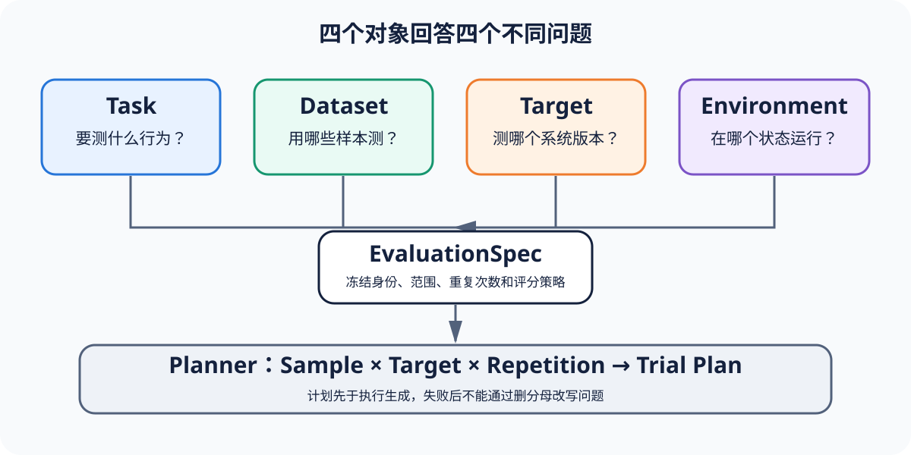

# 最小 Eval Loop：从冻结规范到可复核报告

[上一节](../foundations/07-eval-to-rl-and-release-eval.md) · [下一节](02-run-identity-and-reproducibility.md)

## 本篇要解决什么问题

你很容易把 Eval Loop 写成「读数据、调用模型、算平均分」三行伪代码，可这么一写，谁负责保证结果能够复核，就全被藏起来了。真正开跑以前，实现既要固定样本和 Target 的身份，也要给每个计划项分配稳定的 Trial。基础设施一旦失败，系统必须留下 Attempt（尝试），Target 的输出也得写进 Trace 和 Artifact，后面的判断才有证据可查。Scorer 只能读取明确的 Observation，Metric 必须保留预先声明的分母，Gate 也不能相信 Target 自报的 success。这几层不能混。本篇就拿 Reference Harness 的运费边界案例来走一遍，看这些责任怎样首尾相接。

只要你有 Python 基础，也熟悉前七篇用过的共同术语，就可以从 CLI 一路查到 JSON、Markdown 和 HTML 报告，并指出某个结果在哪一层变了状态。这里跑通的仍然只是经过裁剪的教学简化版本。Reference Harness 没有实现分布式队列，也不会真的调用模型，但你在生产系统里仍然绕不开这些关键对象各自负责的事。

## 核心机制



`PipelineConfig` 先冻结 evaluation_id、Dataset 路径、Target Adapter、repetition、Scorer 和 Gate，`plan_trials` 随后才把 sample × target × repetition 展开成具体计划，所以执行还没开始，分母就已经定下来了。`run_trial_batch` 会用有限的本地并发执行这些计划，但仍按原来的计划顺序返回结果，因此并发不会改写 Trial 的坐标。进入每个 Trial 后，`run_trial` 管理基础设施 Attempt，拿到成功输出便生成两个 TraceEvent 和按内容寻址的 Artifact，再由 `build_observation_bundle` 把它们绑定到 canonical Attempt。

评分时，Scorer `FieldMatchesExpectedScorer` 只从 `target_completed` 事件里读取 output 和 expected，因为 Target 怎么评价自己，不能算独立证据。`aggregate_pass_rate` 用计划中的 Trial ID 计算 Metric 的 denominator，即使某个 Trial 没有 Score，也不会偷偷缩小分母。`evaluate_gate` 一旦发现证据 invalid、unscorable 或 uncertain，就直接返回 inconclusive，只有证据有效时才套用预先声明的 threshold。`write_report` 则拿同一份 EvaluationReport 生成机器可读的 JSON、供人审阅的 Markdown 和独立 HTML。

## 完整流程

以 `reference/examples/shipping/eval.yaml` 为入口：

1. CLI `run` 检查配置路径，将错误压缩为中文消息而不泄漏 traceback。
2. Pipeline 在配置目录内安全解析 dataset/script，拒绝绝对路径和 `..` 越界。Dataset JSONL 每行验证为 Sample。
3. Planner 为三个金额、两个 Target、一次 repetition 生成六个稳定 Trial。Trial ID 包含运行、Target、Sample 与重复身份。
4. SubprocessTarget 通过 argv 和 stdin JSON 调用本地脚本，禁用 shell。超时/启动失败抛 InfrastructureError，非零退出或非 JSON 输出是 product failure。
5. Runner 只重试 InfrastructureError。一旦 Target 返回有效产品失败或完成结果，就建立唯一 canonical Attempt，不用重试「刷过」。
6. TraceWriter 强制事件序号和父事件存在。ArtifactStore 以 SHA-256 命名输出。ObservationBundle 摘要覆盖 Trial、Attempt、事件与 Artifact 引用。
7. Scorer、Metric 和 Gate 逐层产生不可变对象。报告与 evidence/run 文件最后写入输出目录。

## 关键数据与不变量

你可以按谁负责什么，把整条链路分成四组：`EvaluationSpec → Sample → Trial` 负责计划，`Attempt → TrialResult` 负责执行，`TraceEvent → ArtifactRef → ObservationBundle` 保存证据，ScoreRecord 记录每次评分，MetricEstimate 汇总这些评分，GateDecision 再保存门禁判断。把这些对象串起来以后，关系就不能随意改：一个 Trial 最多只能选出一个 canonical Attempt，Bundle 只能绑定这个 Attempt，Score 还必须带上 Bundle digest 和 scorer_id。Metric denominator 必须从 Trial plan 里取，否则证据一缺，分母就会悄悄变化，Gate 也可能把 invalid 或 unscorable 的证据硬判成 passed。

错误状态也不能全塞进一个布尔值，因为 Attempt 分为 succeeded、infra_failed、cancelled，Trial 分为 completed、blocked、invalid，Score 和 Gate 还各有自己的状态集合。因此，报告里的「fixed-release passed」是 Gate 根据证据判出来的结论，不能把它理解成脚本退出码换了个写法。

## 动手实验

从仓库根目录运行：

```bash
uv run eval-harness-ref run reference/examples/shipping/eval.yaml --output output/shipping
uv run eval-harness-ref inspect output/shipping
uv run eval-harness-ref score output/shipping
uv run eval-harness-ref gate output/shipping
```

打开 `output/shipping/evidence.json` 后，先任选金额 100 的 buggy Trial，沿 trial_id → canonical_attempt_id → bundle digest → score_id → metric_id → gate_id 写出完整链路。接着修改输出 Artifact 的一个字节，再运行 inspect，观察摘要门禁如何拦下被改写的证据。

## 预期输出与答案

运行后，你会看到 `buggy-release：failed` 和 `fixed-release：passed`，而计划里共有 6 个 Trial，两个 pass-rate 的 denominator 都是 3。金额为 100 时，buggy 输出 fee=10，期望值却是 fee=0，所以这项 Score 是 failed，buggy 也只通过了 2/3，没有达到 minimum=1.0。只要有人改了 Artifact，inspect 就应该报「Artifact 摘要不一致」，不能继续显示原来的 Gate。

重新运行 score 或 gate 时，系统不会再跑一次 Target，因为这两个命令只读取已经冻结的 evidence。这样才能把「执行证据」和「政策判定」分开，不过重新判定以前，系统必须先确认 evidence 完整无损。

## 如何核对

从 [`cli.py`](https://github.com/plwslpld-arch/eval-harness-internals/blob/main/src/eval_harness_reference/cli.py) 的 `run` 进入 [`pipeline.py`](https://github.com/plwslpld-arch/eval-harness-internals/blob/main/src/eval_harness_reference/pipeline.py)，然后按照调用顺序依次追 `_load_samples`、`plan_trials`、`run_trial_batch`、`build_observation_bundle`、scorer、metric、gate 和 `write_report`。相应的测试入口可以从 [`test_shipping_e2e.py`](https://github.com/plwslpld-arch/eval-harness-internals/blob/main/tests/test_shipping_e2e.py) 与 [`test_cli.py`](https://github.com/plwslpld-arch/eval-harness-internals/blob/main/tests/test_cli.py) 开始找。

## 本篇不能证明什么

确定性案例全部通过，只能说明这套小型实现符合当前测试合同，无法证明真实模型足够稳定、数据集能代表线上分布，也无法证明当前并发方式撑得住大规模运行，更不能因此授权生产发布。Reference Harness 提供了一套可以运行、也方便讨论的共同语言，但它不是企业控制面。

[上一节](../foundations/07-eval-to-rl-and-release-eval.md) · [下一节](02-run-identity-and-reproducibility.md)
