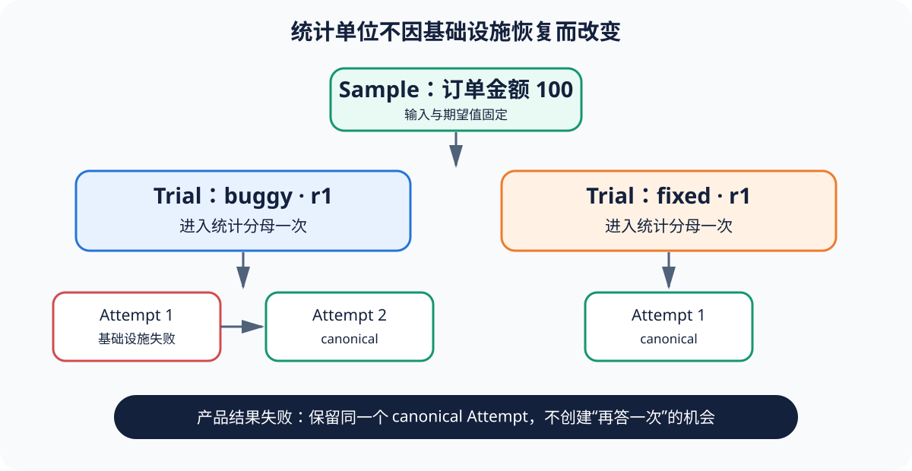

# Retry 与 Recovery：恢复基础设施，不能重抽产品答案

[上一节](02-run-identity-and-reproducibility.md) · [下一节](04-llm-as-judge.md)

## 本篇要解决什么问题

如果模型第一次答错、第二次答对，Harness 能不能自动重试并记为通过？不能，除非产品本身的服务契约就包含重试，而且这段行为属于被测 Target。Eval Harness 的 retry 只应恢复“没有得到有效产品观察”的基础设施故障，否则失败样本会被不断重抽直到成功，分母和失败概率一起被改写；本篇用 Trial/Attempt、不同行为预算和 canonical Attempt 建立严格边界。

前置知识是 Sample/Trial/Attempt。读完后，你应能给 timeout、429、进程启动失败、模型拒答、工具错误、断言失败和日志写入失败分类，并设计不会通过恢复机制作弊的状态机。

## 核心机制



Trial 是预先进入统计计划的观察单位，Attempt 是同一 Trial 的基础设施执行记录；Reference Harness 的 `run_trial` 捕获 `InfrastructureError`，写入 `infra_failed` Attempt 后按 `max_infra_attempts` 继续；一旦 Target 返回 `TargetResult`，不论 kind 是 completed 还是 product_failure，都将当前 Attempt 标为唯一 canonical 并结束重试；所有基础设施 Attempt 用尽后，Trial 为 blocked，没有 Bundle 和 Score，但 Metric denominator 仍包含它。

产品服务内部的退避重试属于 Target 行为——例如应用本身遇到 429 后按线上政策重发，Harness 只能在 Trace 中观察；Harness retry 则是运行器无法启动进程、沙箱临时失联等实验基础设施恢复；两种 retry 即使都叫 retry，也必须用不同预算和事件类型。

## 完整流程

1. Planner 固定 Trial 计划与 `max_infra_attempts`，开始后不能根据结果追加 Trial。
2. Runner 创建 Attempt ordinal=1 并调用 Target Adapter。
3. Adapter 在进程无法启动、Harness 级 timeout 等情况下抛带 code 的 InfrastructureError；Runner记录失败但不生成产品 output。
4. 若预算剩余，创建下一个 Attempt；每次 Attempt 都应保存开始/结束、错误、资源与 Trace，不能覆盖前一次。
5. Target 有有效返回时建立 canonical Attempt；非零退出、拒答、无效 JSON若定义为产品 contract 失败，也停止重试。
6. ObservationBundle 只绑定 canonical Attempt，但审计报告仍保留所有 Attempt，解释为何选中它。
7. 若无 canonical Attempt，Trial blocked；Scorer 不应伪造 0 分；Metric 保留计划 denominator，Gate 可因关键 blocked evidence 给 inconclusive/blocked。
8. 分布式实现还需要 lease、fencing token 和原子 canonical commit；最小本地实现不假装已解决这些问题。

## 关键数据与不变量

`AttemptStatus={succeeded, infra_failed, cancelled}`；`TrialStatus={completed, blocked, invalid}`。Attempt ID 由 Trial ID + ordinal 得出；一个 Trial 最多一个 canonical，canonical 必须是 succeeded，产品失败仍可由 succeeded Attempt 产生，因为“成功执行”与“产品通过”是两层语义。

预算至少区分 Harness infra attempts、Target 内部调用/工具预算、Judge 预算和全局墙钟预算；可恢复错误名单要白名单化，因为将所有 Exception 都视为可重试会掩盖确定性程序错误。取消不应自动继续——它可能来自用户、全局预算或上游任务撤销。

## 动手实验

运行 Runner 测试：

```bash
uv run pytest tests/test_runner.py -q
```

阅读三个测试 Target：第一次 InfrastructureError 后成功、直接 product_failure、所有尝试都 InfrastructureError；为每种情况画出 Attempt 列表、canonical 标记、TrialStatus、是否产生 Bundle，以及 Metric denominator。再假设产品模型第一次输出错误答案，写出为何不应触发 Harness retry。

## 预期输出与答案

基础设施先失败后成功：两个 Attempt，第二个 canonical，Trial completed；直接 product_failure：一个 succeeded canonical Attempt，Trial completed，Scorer 后续可能 failed；全部 infra failure：达到预算数量的 infra_failed Attempt，无 canonical，Trial blocked，无 Score，但仍在计划 denominator。

错误答案是有效产品观察，应进入 Score failed；若业务 Target 自己定义“最多请求模型三次再投票”，这三次是单个 Trial 内的 Target Trace，而不是 Harness 的三个 Attempt，也不能当成三个独立样本。

## 如何核对

查看 [`runner.py`](https://github.com/plwslpld-arch/eval-harness-internals/blob/main/src/eval_harness_reference/runner.py) 的循环与返回分支、[`targets/base.py`](https://github.com/plwslpld-arch/eval-harness-internals/blob/main/src/eval_harness_reference/targets/base.py) 的错误合同、[`test_runner.py`](https://github.com/plwslpld-arch/eval-harness-internals/blob/main/tests/test_runner.py) 的三种状态；再结合 [`metrics.py`](https://github.com/plwslpld-arch/eval-harness-internals/blob/main/src/eval_harness_reference/metrics.py) 核对 blocked Trial 是否仍占分母。

## 本篇不能证明什么

本地线程与单进程 canonical 规则不能证明分布式 worker 恰好一次、远端请求幂等或崩溃恢复无重复副作用，所以生产队列需额外 lease、fencing、幂等键与事务性提交。

[上一节](02-run-identity-and-reproducibility.md) · [下一节](04-llm-as-judge.md)
