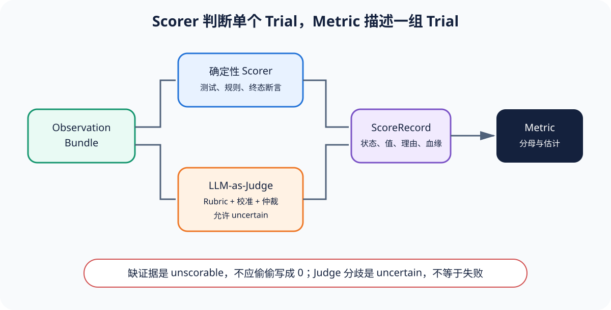

# LLM-as-a-Judge：先定义测量合同，再接入模型

[上一节](03-retries-and-recovery.md) · [下一节](05-statistical-comparison.md)

## 本篇要解决什么问题

开放式回答、合同风险和多轮 Agent 轨迹很难用精确匹配评分，所以很多评测会直接加入 LLM-as-a-Judge。可是「让更强模型打 0 到 1 分」还不是完整方案，因为它没有交代 rubric、输入可见性、输出 schema、失败/弃权、位置偏差、校准数据和成本。Judge 是带有不确定性的测量器，不是事实裁判——本篇会从 Reference Harness 的离线 Judge Protocol 出发，设计一层既能替换实现、又能核对证据的适配层。

核心路线默认不访问网络。`JudgeScorer` 可以接受任何实现 `judge_id + judge(ObservationBundle)` 的对象，而离线 Stub 与真实 API 使用同一份结果合同。这样一来，测试既能锁住 lineage，又不会把模型凭据或漂移带进基础门禁。

## 核心机制



Judge 的输入应来自已经冻结的 ObservationBundle，并且明确选择 output、reference、trace、tools 和 artifacts，否则隐藏标签或候选名称就可能泄漏给评分器。JudgeResult 保存 value、passed 与 reason，JudgeScorer 在此基础上增加 scorer_id、judge_id、Bundle digest、canonical Attempt 和 ScoreStatus。如果评分模型调用需要 retry，恢复的也只是 Judge 基础设施，不能因此重新运行 Target。

可靠接入首先需要 Rubric 定义构念和可观察证据，然后由 Judge Adapter 固定模型、prompt、schema、参数和重试政策。Calibration 再用人工双标和仲裁数据测量一致率、偏差、稳定性与阈值，这三层合起来才是一份可检验的测量合同。Release Eval 需要使用冻结的 Judge 版本，而训练 reward 使用的 Judge 与独立发布 Judge 也必须隔离，否则训练优化会直接污染发布标准。

## 完整流程

1. 从业务风险定义 rubric 条目和不可补偿规则，给出 passed/failed/uncertain/unscorable/invalid 的可操作条件。
2. 构造 Judge input view，只含授权 Observation。对 Candidate/Baseline 比较时随机化顺序并隐藏系统名称。
3. 固定 Judge identity：provider、model/version、系统提示、rubric、few-shot、温度、seed（若支持）、输出 JSON schema、解析器 commit。
4. 调用 Judge，验证结构化输出和值域。解析失败、超时和拒绝属于 Judge error，不是产品 0 分。
5. JudgeResult 经 JudgeScorer 转为 ScoreRecord，lineage 回到 Bundle。reason 作为诊断，不当作模型思维链或事实证明。
6. 在独立校准集上与至少两位人类标注和仲裁结果比较，报告分层一致率、混淆矩阵、阈值敏感性和重复测量方差。
7. 未达到预注册质量要求时，Judge 结果为 uncertain/unscorable 或进入人工复核，而不是调 prompt 直到发布通过。
8. 运行中记录 token、成本、延迟、缓存与错误。报告同时展示 Judge error rate。

## 关键数据与不变量

Judge identity 与 Scorer identity 都必须版本化，因为 Rubric 改一个词、模型别名漂移或输出解析器改变，都可能改写测量合同。`reason` 不应包含隐藏 chain-of-thought，只需给出可审计的判定依据、引用证据和 rubric 条目。如果 Judge 可以 abstain，ScoreStatus 就应表达 uncertain/unscorable。不能把它压成 failed。

成对 Judge 需要保存 pair key 和展示顺序，而把 A/B 交换后再评一次，可以帮助检测位置偏差。即使多个 Judge 同时投票，统计单位仍然是原来的 Trial，不能把 Judge 数量当成样本量。人工仲裁结果应独立存储。原始分歧不能被覆盖。

## 动手实验

运行离线接口测试：

```bash
uv run pytest tests/test_runtime_extensions.py -k judge -q
```

先为合同风险案例写一个包含 high/medium/low 三档的 rubric，并增加 `uncertain` 条件。然后定义 StubJudge，让它返回 value=0.8、passed=true 和 reason，再沿输出检查 ScoreRecord 的 trial_id、canonical_attempt_id、bundle digest 和 scorer_id。最后列出真实 Judge 接入时必须新增的配置与校准报告字段，观察离线 Stub 隐去了哪些生产责任。

## 预期输出与答案

离线测试不调用网络，但 Score 仍应保留 value=0.8、reason「满足离线规则」以及完整 lineage。换成真实配置后，至少还要增加 judge_id、provider/model version、prompt/rubric digest、schema、参数、重试/超时、cache policy、成本和校准数据版本。

如果 Judge 超时，系统应产生 Judge error/不可评分，而不是把产品记为 0 分。如果两位人工存在分歧且仲裁尚未完成，结果就应是 uncertain，因为测量还没有收敛。如果 Judge 与人工在关键高风险条目上系统性漏判，那么即使整体一致率很高，它也不能用于 release gate。

## 如何核对

阅读 [`scorers/judge.py`](https://github.com/plwslpld-arch/eval-harness-internals/blob/main/src/eval_harness_reference/scorers/judge.py) 的 Protocol、JudgeResult 与 lineage 适配，核对 [`test_runtime_extensions.py`](https://github.com/plwslpld-arch/eval-harness-internals/blob/main/tests/test_runtime_extensions.py) 的离线 Stub。再对比 [`scorers/rules.py`](https://github.com/plwslpld-arch/eval-harness-internals/blob/main/src/eval_harness_reference/scorers/rules.py)，理解确定性规则与 Judge 的失败面不同。

## 本篇不能证明什么

结构化输出、reason、多人投票或高总体一致率，都不能证明 Judge 没有偏差，也不能证明它真正理解业务并适合高风险发布。校准结论只适用于当时的数据分布、rubric 和模型版本，任何一项发生变化后，都需要重新验证。

[上一节](03-retries-and-recovery.md) · [下一节](05-statistical-comparison.md)
