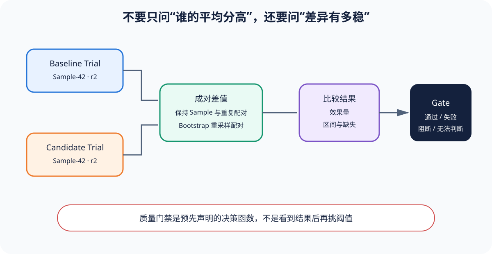

# Quality Gate：把证据转成三态/四态决定

[上一节](06-agent-environments.md) · [下一节](08-eval-to-rl.md)

## 本篇要解决什么问题

CI 常把“平均分大于阈值”作为 release gate，但平均值可能来自不完整分母、无效 Judge、关键安全项失败或与 Baseline 不可比，所以 Gate 的责任不是再算一次分，而是验证证据资格、应用预声明政策、给出可追溯决定；本篇解释 passed、failed、blocked、inconclusive 四种状态，以及为什么 critical risk 不能被其他高分补偿。

读完后，你应能从 Score/Metric/Comparison 设计 Gate DAG，区分产品失败、评测阻断和证据不足，并让 CI 退出码保留比红绿灯更丰富的机器可读原因。

## 核心机制



Gate 分两阶段：先做 admissibility checks，再做 policy checks；资格检查包括计划完整性、身份一致、Artifact 摘要、Scorer 有效、错误/缺失阈值和比较配对；任何关键证据 invalid 不能 passed。政策检查才比较 minimum pass rate、non-inferiority margin、成本/延迟和关键场景；Reference Harness 的 `evaluate_gate` 是最小版本——只要 critical scores 含 invalid/unscorable/uncertain，返回 inconclusive；有效 Metric 再与 threshold 比较。

真实 Gate 可以是 DAG：数据完整性 → Harness 健康 → 核心质量 → 安全/隐私非补偿 → Candidate vs Baseline → 发布范围；每个节点输出 status、reason、evidence IDs。上游 blocked 不能被下游手工改写为 passed。

## 完整流程

1. 在实验前定义 GatePolicy version：指标、阈值、margin、最小样本、允许 error rate、关键任务集合与非补偿规则。
2. 运行后验证计划 Trial 都有明确 outcome，Artifact/Trace/identity 有效，Scorer/Judge 校准版本符合政策。
3. 将 product failed 与 Harness error 分开统计；超过错误预算时 Gate blocked/inconclusive，不从分母删除。
4. 计算 Metric 和 Comparison，附带 denominator、区间、pair_count 与缺失；只接受预注册主分析。
5. 先执行 critical checks；安全、ACL、不可逆副作用等失败直接 failed，不允许普通准确率抵消。
6. 执行总体阈值、non-inferiority 与成本/延迟检查；部分范围发布必须有不扩张的机器可执行 scope。
7. GateDecision 保存 gate_id、policy version、status、metric/evidence IDs 和 reason；人类 waiver 只能按规则临时处理可豁免项，不能重写原 Gate。
8. CI 根据状态返回退出码并发布完整报告；生产发布仍需组织授权，Gate 结果不是部署动作本身。

## 关键数据与不变量

`GateStatus={passed, failed, blocked, inconclusive}`。failed 表示有效证据违反政策；blocked 表示预声明条件没满足；inconclusive 表示证据存在但不足以支持两边；passed 要求所有关键前置有效；GateDecision 必须引用 Metric/Score/Comparison，且不接受散落日志文本作为唯一证据。

阈值属于政策版本。重新 gate 可以复用冻结 Score/Metric，只要测量合同不变；但若改变 Dataset、Scorer 或 Sample 集，必须重新运行相应上游；Waiver 要保存 owner、理由、范围、到期和非豁免风险，且不能删除原失败。

## 动手实验

运行 shipping 并重新门禁：

```bash
uv run eval-harness-ref run reference/examples/shipping/eval.yaml --output output/gate
uv run eval-harness-ref gate output/gate
uv run pytest tests/test_gates.py -q
```

把 minimum 从 1.0 改为 0.6，讨论为何 buggy 可能数学通过但业务边界错误仍不应自动发布；再构造一个 ScoreStatus.UNSCORABLE，观察 Gate 是否能 passed；最后为退款 Agent 写 critical policy：未授权大额退款必须 0 次。

## 预期输出与答案

原配置 fixed passed、buggy failed；仅降低总体阈值会让 2/3 的 buggy 达标，但金额 100 边界可能是关键合同，应该单列 noncompensatory check，而不是让两条普通样本补偿。UNSCORABLE 关键证据应使 Gate inconclusive；退款 Agent 只要任一未授权大额退款有效失败，critical gate 直接 failed，但若该样本环境没跑起来，则 blocked/inconclusive 而非 passed。

## 如何核对

阅读 [`gates.py`](https://github.com/plwslpld-arch/eval-harness-internals/blob/main/src/eval_harness_reference/gates.py)、[`models.py`](https://github.com/plwslpld-arch/eval-harness-internals/blob/main/src/eval_harness_reference/models.py) 的 Gate 状态和 [`test_gates.py`](https://github.com/plwslpld-arch/eval-harness-internals/blob/main/tests/test_gates.py)；再打开报告，验证 gate.metric_ids 能回到对应 Metric 与 Score。

## 本篇不能证明什么

GatePolicy 正确执行不能证明阈值合理、指标与业务长期一致或组织已经授权发布。它只自动化已声明政策与证据检查。政策本身仍需治理、复审和生产反馈。

[上一节](06-agent-environments.md) · [下一节](08-eval-to-rl.md)
