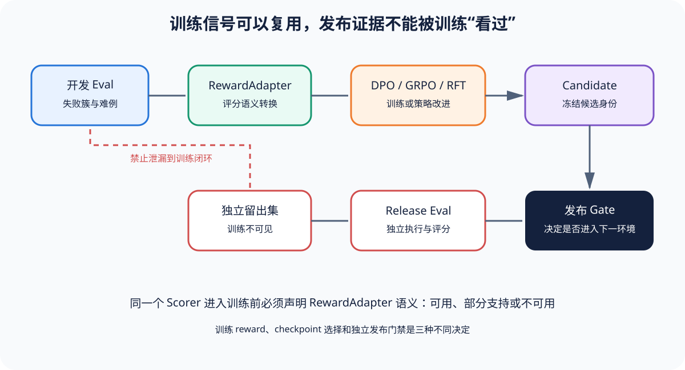

# Eval-to-RL：评测信号怎样进入训练而不污染发布门禁

[上一节](07-quality-gates.md) · [下一节](../harnesses/lm-evaluation-harness/README.md)

## 本篇要解决什么问题

Eval Harness 产出的 Score、preference、failure trace 和人工反馈可以转化为 Best-of-N、DPO、GRPO 或 RFT 数据，但一旦把发布集和 Judge 反复用于优化，原评测就不再独立；训练 reward、checkpoint 选择与 release eval 是三个责任，不能共享同一套未隔离数据后仍声称泛化。本篇建立 `Evaluator → RewardAdapter → 训练 → 独立 Release Eval` 的闭环。

前置知识是 Scorer、Metric、Gate 和 Judge。读完后，你应能判断一个 Harness 的输出能否直接转成 reward，缺少哪些 adapter 语义，并设计防止数据泄漏与 Goodhart 的 holdout。

## 核心机制



Evaluator 产生带完整 lineage 的 ObservationBundle 与 ScoreRecord；RewardAdapter 不是简单取 `score.value`：它声明哪些状态可用、怎样处理 unscorable/uncertain、值域/方向、组件权重、pair preference、版本与防泄漏标签。训练系统消费 adapter 输出执行 SFT/DPO/GRPO/RFT；训练过程可用 development evaluator 做 reward 与 checkpoint selection，但最终 candidate 必须在未参与优化的 release split 和独立 Gate 上评测。

不同算法需要不同信号：Best-of-N 只需对同 prompt 多候选排序；DPO 需要 chosen/rejected 对与偏好可信度；GRPO/RFT 常需可验证 reward 和同组采样；开放式 Judge reward 需要更强抗投机和校准。能力缺失应标 partial/unavailable——不能由 Adapter 编造。

## 完整流程

1. Dataset 治理先划分 train/dev/release，按用户、时间、任务家族等泄漏边界分组，而不是随机打散相似样本。
2. Eval Harness 在 train/dev 上产生 Trial、Trace、Artifact 与 Score；RewardAdapter 验证 scorer identity 和状态，只转换合格记录。
3. 对 pair preference，保留共同 Sample、候选 identity、展示顺序和 margin；对 scalar reward，保留值域、组件和裁剪/归一化规则。
4. 训练算法更新模型；每个 checkpoint 保存训练数据/adapter/reward model 版本，避免只记录最终模型名。
5. Dev eval 用于调参和 checkpoint selection，因此其指标已受到选择偏差，不能再当最终无偏结论。
6. 选定 candidate 后冻结训练，运行独立 release eval。Release Dataset、Scorer/Judge 和 Gate 不向训练循环提供逐样本反馈。
7. Gate 比较 candidate/baseline，检查关键风险和不确定性；通过后才进入组织发布流程。
8. 生产 incident、用户反馈与新失败回流到未来数据，但先进入治理/标注/版本流程，不直接改写当前 release 结论。

## 关键数据与不变量

RewardRecord 至少引用 trial_id、bundle digest、score_id、scorer/reward adapter version、值、状态、split 和用途；训练可消费 `passed/failed` 或连续 value，但 invalid/unscorable 不得默认转 0。Release Sample ID 不能出现在训练与 prompt 调优日志中；Judge prompt 若按 release 失败样本调整，也造成污染。

训练 reward 与 release metric 可以相关但不应完全同源；可验证程序 reward 抗主观漂移，却可能被漏洞利用；Judge reward 覆盖开放任务，却可能被 reward hacking。独立人工审查与多维关键 Gate 防止单一 proxy 最大化。

## 动手实验

用 shipping 六条 Score 设计一个 RewardAdapter：passed→1、failed→0、其他状态拒绝；写出它能支持 Best-of-N/监督筛选的部分，以及为何只有每个 Sample 一个输出时不能构造 DPO pair。再为退款 Agent 设计 chosen/rejected：固定输入，候选分别为未授权退款和升级人工，并声明 preference 来源与安全非补偿规则。

```bash
uv run eval-harness-ref run reference/examples/refund-agent/eval.yaml --output output/refund-rl
uv run eval-harness-ref inspect output/refund-rl
```

## 预期输出与答案

Shipping Score 可形成 scalar reward，但没有同 prompt 多候选关系，DPO 能力为 unavailable，除非另行采样并记录 pair；退款例中升级人工是未批准大额请求的 chosen；未授权退款是 rejected。若 Scorer unscorable 或 Judge error，Adapter 应拒绝该记录，而不是把它当负样本。

Dev 集用于选择 checkpoint 后，不应报告为独立 release 证据；最终 Gate 必须运行在隔离 release split，并保留 Baseline 配对与关键安全检查。

## 如何核对

从 [基础篇 Eval-to-RL](../foundations/07-eval-to-rl-and-release-eval.md) 核对责任划分，再用 [`models.py`](https://github.com/plwslpld-arch/eval-harness-internals/blob/main/src/eval_harness_reference/models.py) 检查 RewardAdapter 应引用的 lineage 字段；运行退款案例并查看 Score 状态是否足以转换。

## 本篇不能证明什么

数据隔离、RewardAdapter 和独立 Gate 不能保证训练稳定、算法收敛、reward 无漏洞或线上长期无漂移。它们只减少明显泄漏和证据混用。仍需训练与生产专项验证。

[上一节](07-quality-gates.md) · [下一节](../harnesses/lm-evaluation-harness/README.md)
