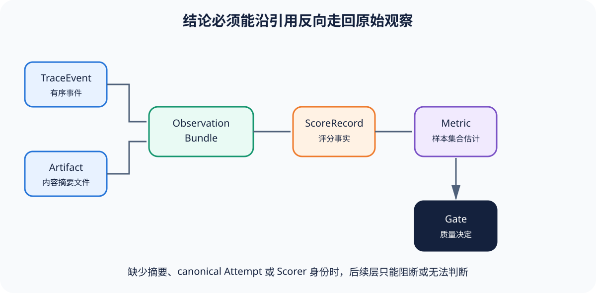

# 04｜Trace、Artifact 与 Observation：让分数能回到证据

[上一章](03-sample-trial-attempt.md) · [下一章](05-scorer-judge-score-metric.md)

## 本篇要解决什么问题

报告写着“通过 92%”并不等于结果可核对。我们还要知道每个 Score 依据哪次执行、看了哪些事件、读取了哪个文件、文件是否被改写，以及评分发生后能否沿引用回到原始观察。Trace、Artifact 与 Observation Bundle 正是把“日志很多”变成“证据有血缘”的三层结构。

## 学完你能解释什么

- 事件流、文件产物和评分输入为什么要分开；
- Trace 的父子关系和序号怎样表达因果，而不仅是时间戳；
- 内容摘要怎样检测 Artifact 被替换；
- 为什么 Score 必须绑定 Observation Bundle 和 canonical Attempt。

## 贯穿案例

shipping Target 返回 `{"fee": 10}`：Runner 写两个事件：Trial 开始、Target 完成；后者的 payload 同时保存 output 与 expected，原始输出还作为内容寻址 Artifact 保存。Bundle 把事件、Artifact 摘要和 canonical Attempt 绑定起来；Scorer 并不再次调用 Target，而是只读取 Bundle，因此之后执行 `score` 可以在不重跑脚本的情况下得到同一结果。

## 核心概念与边界

**TraceEvent** 是运行中可排序、可连接的事实，至少有稳定 event_id、sequence、type、parent_event_id 和 payload。**Artifact** 是不适合内联在事件里的字节对象，例如 Diff、日志、截图、测试报告或环境终态——它用 SHA-256 摘要和相对路径引用。**Observation Bundle** 是评分输入快照，声明“对这个 Trial 的这个 canonical Attempt，评分器被允许看到这些事件和产物”。

Trace 不等于隐藏思维链。Eval Harness 应记录外部可观察的模型消息、工具调用、状态变化和输出，不要求或假装获取模型内部推理。Artifact 也不等于任意附件：没有摘要、类型和来源关系的文件不能自动进入评分。

## 机制图



## 调用链与状态变化

1. Runner 为 canonical Attempt 产生有序事件；TraceWriter 拒绝重复 event_id 和先于父事件出现的子事件。
2. 大对象进入 ArtifactStore，相同字节得到相同摘要并复用同一个内容地址。
3. Bundle Builder 验证 Trial 只有一个 canonical Attempt，再把事件和 ArtifactRef 规范化哈希。
4. Scorer 读取 Bundle，ScoreRecord 保存 Bundle digest、canonical_attempt_id 和 scorer_id。
5. Metric 保存参与聚合的 score_ids，Gate 保存 metric_ids；报告因此可以从决定逐层反查。

Reference Harness 分别在 [`tracing.py`](https://github.com/plwslpld-arch/eval-harness-internals/blob/main/src/eval_harness_reference/tracing.py)、[`artifacts.py`](https://github.com/plwslpld-arch/eval-harness-internals/blob/main/src/eval_harness_reference/artifacts.py) 和 [`reporting.py`](https://github.com/plwslpld-arch/eval-harness-internals/blob/main/src/eval_harness_reference/reporting.py) 实现这三段。

## 关键数据结构

```text
TraceEvent(event_id, sequence, type, parent_event_id, payload)
ArtifactRef(kind, digest, relative_path)
ObservationBundle(bundle_id, digest, trial_id,
                  canonical_attempt_id, events, artifacts)
ScoreRecord(..., observation_bundle_digest, scorer_id)
```

时间戳可用于性能分析，却不应代替 sequence 和 parent 关系，因为不同机器时钟可能漂移；`relative_path` 让报告可迁移——在公开文档和证据里写本机绝对路径既不可复现，也可能泄露用户名；digest 必须覆盖真正进入评分的内容，而不是只哈希文件名。

## 设计取舍

JSONL 适合追加事件、逐行恢复和命令行检查，代价是跨事件约束需要额外验证。把完整输出同时放事件和 Artifact 会有重复，但小型教学实现借此同时展示可读 payload 与内容寻址；生产系统可让事件只保存 ArtifactRef，但必须确保 Scorer 的实际读取被纳入 Bundle digest。

Inspect AI 的锁定 [`log/_log.py`](https://github.com/UKGovernmentBEIS/inspect_ai/blob/ebf4815ee260afcc8c34ad9d66e6f8d98a89e905/src/inspect_ai/log/_log.py) 是 Eval Log 模型的**上游源码事实**；OpenAI Evals 的 [`record.py`](https://github.com/openai/evals/blob/8eac7a7de5215c907fbddc30efdaf316913eccdd/evals/record.py) 展示另一种事件记录边界；把二者统一解释为证据血缘是本篇的**机制解释**。

## 失败语义

- 子事件引用尚未出现的父事件：Trace `invalid`。
- Artifact 文件缺失或摘要不匹配：Bundle 不能评分；不能只相信报告里的旧值。
- Trial 有零个或多个 canonical Attempt：Bundle 构造失败。
- Scorer 需要字段但事件和 Artifact 都未提供：Score `unscorable`，不是 0。
- Trace 包含秘密或不必要个人数据：属于安全失败，应在保存前过滤并阻断发布。

## 动手实验

先运行 shipping 示例，再执行：

```bash
eval-harness-ref inspect output/shipping
eval-harness-ref score output/shipping
```

查看 `evidence.json` 的第一个 Bundle，找到 Artifact digest 与文件相对路径；复制该 Artifact 的内容并计算 SHA-256，对比文件名。然后临时移动一个 Artifact，再运行 `inspect`，观察证据检查失败；完成后恢复文件。

## 预期输出与答案

正常时 `inspect` 报告 6 个 Trial、6 个 Bundle、6 条 Score。Artifact 文件名应等于 `sha256:` 后的 64 位十六进制摘要。缺少任意已引用 Artifact 时，`inspect` 应以非零状态退出并显示“运行证据无效”，而不是继续打印原 Gate。`score` 会从冻结 Bundle 重算 6 条评分，不会产生新的 Attempt。

## 常见误解

“日志存在就能审计”忽略身份和因果；“数据库记录不可变所以不用摘要”忽略管理员、迁移和导出边界；“最终回答足够评分”忽略工具副作用与环境终态；“把全部内部推理都存下来更透明”则带来隐私、安全和不可验证来源问题。

## 如何核对

运行 `python -m pytest tests/test_lineage.py tests/test_cli.py -q`。检查测试是否覆盖父子顺序、事件去重、Artifact 去重、canonical Attempt 绑定和缺失文件。再从 `report.json` 的 Gate 找 metric_id，从 Metric 找 score_ids，从 Score 找 observation_bundle_digest，确认链条可逆。

## 与其他 Harness 的关系

Promptfoo 常围绕测试结果和 Trace 类型组织应用评测；Inspect AI 的 Eval Log 更完整地承载样本与事件；Agent Environment Harness 还需保存容器日志、补丁和终态。实现密度不同，但最小问题相同：Scorer 看见了什么、证据属于哪次运行、内容后来是否变化。

## 本篇不能证明什么

完整血缘只能证明报告与已保存证据的一致性——不能证明 Dataset 正确、Reference 无偏或被测环境没有未记录的外部副作用。证据链解决“结论来自哪里”，不自动解决“问题问得是否正确”。

[上一章](03-sample-trial-attempt.md) · [下一章](05-scorer-judge-score-metric.md)
