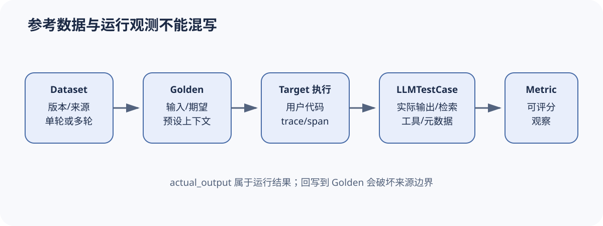

# DeepEval 数据对象：Golden 何时变成 LLMTestCase

[上一节](README.md) · [下一节](02-metric-execution.md)

## 本篇要解决什么问题

评测数据最常见的设计错误，是把“给模型的输入”“参考答案”“模型实际输出”和“运行时检索证据”装进一个模糊 JSON 对象。DeepEval 区分 Dataset、Golden 和 LLMTestCase，恰好提供了理解这些阶段的入口。本篇解释 Dataset 怎样维护单轮/多轮一致性和数据集身份，Golden 为什么适合先于 Target 执行存在，LLMTestCase 又为何必须包含 actual_output 才能被大多数 Metric 测量。

这不是字段字典。我们要沿对象生命周期回答：字段由谁写、何时冻结、怎样关联数据集、哪些运行时观测不能回写成参考数据，以及 agentic iterator 怎样在用户代码执行后补全 TestCase。

## 先建立源码地图

| 源码位置 | 责任 | 核对问题 |
| --- | --- | --- |
| [`deepeval/dataset/dataset.py`](https://github.com/confident-ai/deepeval/blob/a2e0d4cfd3118352d321c1c84bdeba17d4a201bc/deepeval/dataset/dataset.py) | EvaluationDataset、导入、身份与 iterator | 单轮/多轮、rank、alias/id 怎样维护 |
| [`deepeval/test_case/llm_test_case.py`](https://github.com/confident-ai/deepeval/blob/a2e0d4cfd3118352d321c1c84bdeba17d4a201bc/deepeval/test_case/llm_test_case.py) | LLMTestCase 与 ToolCall 等观测 | 可评分用例保存哪些运行事实 |
| [`deepeval/evaluate/execute/loop.py`](https://github.com/confident-ai/deepeval/blob/a2e0d4cfd3118352d321c1c84bdeba17d4a201bc/deepeval/evaluate/execute/loop.py) | Golden 到 TestCase 的运行转换 | 用户代码和 trace 何时进入证据 |

## 完整调用链



1. EvaluationDataset 创建后可接收 goldens 或 test_cases；构造器检查元素类型，并根据首个对象确定单轮或多轮数据集。
2. 加入对象时写入私有 `_dataset_alias`、`_dataset_id` 和 `_dataset_rank`。单轮数据集拒绝 ConversationalGolden/TestCase，多轮数据集拒绝单轮对象，防止执行器面对混合语义。
3. CSV/JSON 导入把列映射为 LLMTestCase 或 Golden 字段；导入只完成结构转换，不能证明来源、授权、去重或参考答案质量。
4. 直接 `evaluate(test_cases, metrics)` 时，actual_output 已由调用者提供，执行器只负责测量，不执行 Target。
5. agentic Dataset iterator 逐个 yield Golden，让用户代码处理输入并产生 trace；控制权返回后，执行循环取得当前 trace，从 Golden 和 span attributes 构造 LLMTestCase。
6. 新 TestCase 继承 dataset alias/id/rank，以便 TestResult 回连原样本；trace/span 上的 input、output、context、retrieval context、tools 等成为运行观测。
7. 若 span 声明指标却无法构造 LLMTestCase，执行器记录可解释错误，而不是用空字符串伪造正常评分输入。

## 关键数据结构

Dataset 是有身份的容器，不是统计单位。Golden 是待执行规格，可含 input、expected_output、context、additional_metadata 等。LLMTestCase 是单次可测观察，核心是 input 与 actual_output；expected_output 支持参考型指标，context 常表示预期可用背景，retrieval_context 表示系统实际检索内容。tools_called 与 expected_tools 让工具使用也可被判分。私有 dataset rank 建立来源顺序，但稳定身份最好另有 sample id 或内容摘要，不能只依赖位置。

在统一术语中，一个 Golden 可映射 SampleSpec；一次 Target 执行生成 Trial/Attempt 和 LLMTestCase 观测。DeepEval 的对象本身未强制 Trial/Attempt 分层，因此调用者做网络重试或重新生成时，应在外部保留尝试记录，避免把最终覆盖后的 actual_output 当成唯一历史。

## 实现取舍与失败语义

直接 TestCase 模式解耦 Target 与 Eval，适合离线导入日志；代价是 Harness 无法独立证明 output 如何产生。agentic iterator 把执行纳入会话，证据更连贯，却依赖全局 trace/session 管理和用户正确埋点。Dataset 强制单轮/多轮一致性是有价值的早失败，但不检查语义重复、数据泄漏或时间切分。

空数据集、错误对象类型和单/多轮混用属于输入合同错误，应在运行前失败。用户代码异常属于 Target/场景执行错误；trace 缺字段导致无法构造 TestCase 属于观察或适配错误；Metric 低分才是产品判据失败。四者不能合并成同一个失败率。

## 动手实验

选择一个“根据知识库回答退款问题”的样本，写出 Golden 和执行后 LLMTestCase 的最小 JSON 形状。把预先给定政策放入 context，把系统实际检索片段放入 retrieval_context，说明两者不同。再模拟两次网络 Attempt：第一次超时，第二次成功，指出 DeepEval TestCase 之外还需要保存哪些 attempt 元数据。最后列出 Dataset 版本清单必须增加的来源、许可证、内容摘要与切分信息。

```bash
python scripts/sources.py verify
python -m pytest tests/test_harness_course_docs.py -q
```

## 预期输出与答案

Golden 至少包含 input 和 expected_output/expected context；执行后 TestCase 增加 actual_output、retrieval_context、tools_called 和运行 metadata。context 表示评测规格提供或期望的背景，retrieval_context 是被测系统真实观测，两者混用会让检索指标失去意义。两次 Attempt 应保留 attempt_id、开始结束时间、错误、重试原因、输入摘要和第二次成为 canonical 的规则。

Dataset 版本还要记录生成/采集来源、授权、去重、污染检查、时间戳、分区策略和摘要。对象能序列化不代表数据治理完成。

## 如何核对

在 [`deepeval/dataset/dataset.py`](https://github.com/confident-ai/deepeval/blob/a2e0d4cfd3118352d321c1c84bdeba17d4a201bc/deepeval/dataset/dataset.py#L91-L130) 阅读 `EvaluationDataset` 构造、goldens/test_cases setter 与 add 方法，再定位 agentic `evaluate` iterator；在 [`deepeval/evaluate/execute/loop.py`](https://github.com/confident-ai/deepeval/blob/a2e0d4cfd3118352d321c1c84bdeba17d4a201bc/deepeval/evaluate/execute/loop.py) 核对 Golden 怎样转为 LLMTestCase。

## 本篇不能证明什么

Dataset alias、云端 ID、rank 或成功导入不能证明样本唯一、无泄漏、代表真实用户或可以合法公开。LLMTestCase 字段齐全也不能证明 actual_output 来自声明模型；需要独立运行清单和证据摘要。

[上一节](README.md) · [下一节](02-metric-execution.md)
