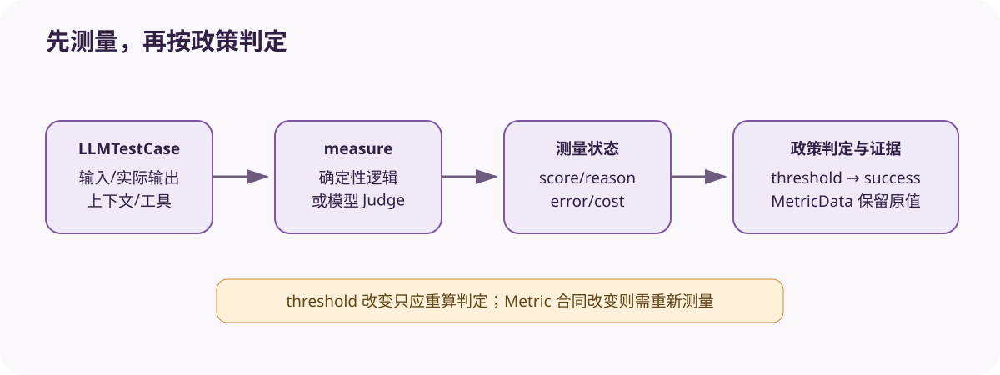

# DeepEval Metric：有状态评分器怎样产出可解释结果

[上一节](01-dataset-golden-test-case.md) · [下一节](03-async-cache-errors.md)

## 本篇要解决什么问题

Metric 很容易被看成一个单纯的 `test_case -> float` 函数，但 DeepEval 的 `BaseMetric` 会明确持有 threshold、score、reason、error、success、verbose_logs、evaluation_model 和 cost。具体 `measure` 先把状态写回对象，执行循环再读取这些字段组成 MetricData，所以这种设计虽然方便编写自定义指标，也同时带来了并发复用、状态清理、阈值解释与错误分类问题。下文会把这些隐含合同逐层展开。

读完之后，你应该能实现一个最小的自定义 Metric，并分清哪些字段属于原始测量、哪些属于政策判断、哪些只是运行诊断，同时也能解释模型 Judge 与确定性 Scorer 为什么不能只拿同一个 score 横向比较。

## 先建立源码地图

| 源码位置 | 责任 | 阅读焦点 |
| --- | --- | --- |
| [`deepeval/metrics/base_metric.py`](https://github.com/confident-ai/deepeval/blob/a2e0d4cfd3118352d321c1c84bdeba17d4a201bc/deepeval/metrics/base_metric.py#L54-L93) | Metric 抽象和 `is_successful` | 测量状态与阈值语义 |
| [`deepeval/evaluate/execute/loop.py`](https://github.com/confident-ai/deepeval/blob/a2e0d4cfd3118352d321c1c84bdeba17d4a201bc/deepeval/evaluate/execute/loop.py) | 执行、跳过、错误与结果更新 | 对象状态怎样冻结为证据 |
| [`deepeval/evaluate/evaluate.py`](https://github.com/confident-ai/deepeval/blob/a2e0d4cfd3118352d321c1c84bdeba17d4a201bc/deepeval/evaluate/evaluate.py) | 指标输入验证和入口行为 | 阈值与 assert_test 的关系 |

## 完整调用链



1. 调用者构造 Metric 实例并设置 threshold、strict_mode、evaluation model 等配置；入口验证至少一项指标具有阈值，确保 assert 语义可判定。
2. 执行器为 TestCase 与 Metric 建立 pair。在每次执行前清理 metric.error 等上次状态，并根据同步/异步模式调用 `measure` 或 `a_measure`。
3. 具体 Metric 从 LLMTestCase 读取所需字段。确定性指标直接计算；LLM-as-a-Judge 指标可能生成 prompt、调用评估模型、解析结构化结果并累计 evaluation_cost。
4. Metric 写回 score、reason、verbose_logs 等；若异常被保留，则写 error。`is_successful` 在 error 时返回 false，在无 threshold 时依据 score 是否存在，否则比较 score 与 threshold；strict_mode 可要求满分。
5. 执行公共逻辑把 Metric 状态转换为 MetricData，包括 name、threshold、success、score、reason、strict、evaluationModel、error 与 cost，并挂到 TestResult。
6. `assert_test` 遍历 metrics_data，把 error 非空或 success 为 false 的指标列为失败，生成可读字符串并抛出 AssertionError。
7. 批量 `evaluate` 不只给布尔断言，还保留每个 TestCase 的指标结果供控制台、文件和 TestRun 汇总。

## 关键数据结构

BaseMetric 的抽象方法是 `measure`/`a_measure`，而返回 float 只是接口露在外面的部分——真正的结果还保存在实例字段里。`score` 是测量值，`threshold` 表示当前政策，`success` 是二者结合后得出的判断，而 `reason` 用来解释测量，`error` 表示测量不可得，`evaluation_cost` 则记录 Judge 的运行成本。需要继续排查时，还可以查看 `score_breakdown` 和 verbose_logs 提供的组件诊断。分数只是其中一项。

因此，证据存储应同时保留原始 score 与测量配置，而不能只留下 success，因为阈值变化时，我们可以不重跑 Target 就重新计算政策结论。阈值不是测量值。可一旦 Metric 的 prompt、model 或解析逻辑发生变化，测量合同也随之改变，此时旧 score 能否复用就必须由指标自身的版本语义决定。

## 实现取舍与失败语义

有状态基类让自定义 Metric 写起来更直观——控制台也可以直接读取 reason，不过同一个实例一旦跨 TestCase 并发复用，就可能发生数据竞争。执行框架需要复制实例、串行访问，或以其他方式确保任务隔离，而每个 Metric 在开始新测试前都必须清除上次留下的 error 与 score，否则前一用例会污染后一用例。

低于阈值意味着测量有效但没有通过，而 Judge 输出解析失败属于 Metric error，TestCase 缺少必需字段属于输入或适配错误，Judge API 限流则落在评分基础设施。这些错误不能混算。strict_mode 只是按特定语义收紧通过条件，属于政策配置，并不会让分数变得“更准确”。模型 Judge 给出的 reason 也是模型生成的解释，不是事实证明，所以仍然需要校准、人工复核和对抗样本。

## 动手实验

先在纸面上实现 `ExactJsonMetric`，让它验证 actual_output 能否解析成 JSON 且包含 `answer` 字段，满足条件得 1，否则得 0，并给出 reason。接着写出 measure 前后 BaseMetric 各字段的变化，再设计 `FaithfulnessJudgeMetric`，列出必须额外锁定的模型、模板、温度、解析 schema 与重试策略。最后把 0.7 和 0.9 两个 threshold 分别应用到同一批 score，并说明这一步为何只是重新判定，而不是重新测量。

```bash
python scripts/sources.py verify
python -m pytest tests/test_harness_course_docs.py -q
```

## 预期输出与答案

ExactJsonMetric 在测量前应把 score、reason 与 error 置空或重置，测量后 score 为 0/1，reason 描述满足或违反的具体条件，而 error 只在指标自身无法运行时出现。Judge Metric 的 identity 不能只有一个类名，至少还要包含评估模型标识、系统与用户模板摘要、参数、输出 schema、库 commit 和依赖版本。

把不同 threshold 应用到同一批结果，只会改变 success 与汇总，不会改写原始 score，而 strict_mode 一旦变化，也必须记录在结果里。若 Judge 逻辑已经改变，原 score 对应的测量合同也就不再相同，此时不能只重算 success 就把它冒充成同一指标版本。

## 如何核对

先阅读 [`deepeval/metrics/base_metric.py`](https://github.com/confident-ai/deepeval/blob/a2e0d4cfd3118352d321c1c84bdeba17d4a201bc/deepeval/metrics/base_metric.py#L54-L93) 中的字段、抽象方法和 `is_successful`，再到 [`deepeval/evaluate/execute/loop.py`](https://github.com/confident-ai/deepeval/blob/a2e0d4cfd3118352d321c1c84bdeba17d4a201bc/deepeval/evaluate/execute/loop.py#L167-L206) 搜索 `_execute_metric`、MetricData 和 test run update，从而核对发生异常后是否继续，以及结果究竟在何时冻结。

## 本篇不能证明什么

Metric 带有 reason、threshold 和 cost，并不能证明它测量的构念有效、Judge 与专家一致、阈值经过业务验证，也不能说明不同指标的 0.8 可以直接比较。指标的可靠性、效度、偏差和鲁棒性，都需要独立的验证数据来检验。

[上一节](01-dataset-golden-test-case.md) · [下一节](03-async-cache-errors.md)
