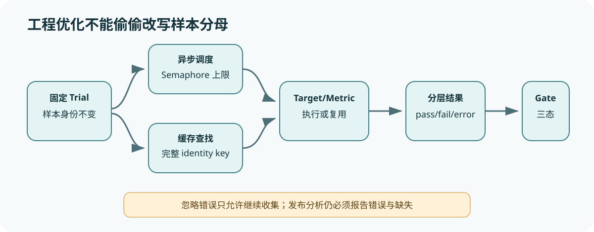

# DeepEval 执行策略：异步、缓存与错误不能改变统计单位

[上一节](02-metric-execution.md) · [下一节](../harbor-terminal-bench/README.md)

## 本篇要解决什么问题

当 Judge 调用昂贵而慢时，异步并发、缓存和忽略错误都是必要工程能力——它们也最容易让评测数字失真，而并发可能污染有状态 Metric，缓存可能复用过期评分，ignore_errors 可能改变分母，失败重跑又可能把同一测试变成多个独立观察；本篇从 DeepEval 的 AsyncConfig、CacheConfig、ErrorConfig 和 agentic loop 出发，建立正确的恢复与统计边界。

我们关注的不是“开哪个参数更快”，而是每个参数改变了哪一层：执行调度、评分调用、证据记录还是外部测试行为——任何优化都必须保持 Sample/Trial 身份、结果完整性和错误可见性。

## 先建立源码地图

| 源码位置 | 责任 | 核对问题 |
| --- | --- | --- |
| [`deepeval/evaluate/evaluate.py`](https://github.com/confident-ai/deepeval/blob/a2e0d4cfd3118352d321c1c84bdeba17d4a201bc/deepeval/evaluate/evaluate.py) | 配置默认值、同步/异步选择、收尾 | 参数怎样进入执行器 |
| [`deepeval/evaluate/execute/loop.py`](https://github.com/confident-ai/deepeval/blob/a2e0d4cfd3118352d321c1c84bdeba17d4a201bc/deepeval/evaluate/execute/loop.py) | semaphore、任务、cache/error 和 TestRun | 并发与异常怎样传播 |
| [`deepeval/metrics/base_metric.py`](https://github.com/confident-ai/deepeval/blob/a2e0d4cfd3118352d321c1c84bdeba17d4a201bc/deepeval/metrics/base_metric.py) | 有状态测量对象 | 并发隔离需要保护什么 |

## 完整调用链



1. `evaluate` 接收 AsyncConfig、CacheConfig 和 ErrorConfig；异步模式取得事件循环并调用异步执行器，同步模式直接顺序执行；
2. 异步 agentic loop 创建 `asyncio.Semaphore(max_concurrent)`，把每个用户 callback 绑定到当前事件循环并受信号量控制，避免无限并发和跨 loop Future 混用；
3. Target/user code 结束后捕获 trace，构造 TestCase；执行器为 metrics 计算缓存键，命中时复用 MetricData，未命中才运行 `a_measure`/`measure`；
4. Metric 或 trace 发生错误时，ErrorConfig 决定是否抛出或把 error 写入结果继续，继续不代表成功，后续汇总必须保留不可评分状态；
5. CacheConfig 区分 use_cache 与 write_cache，TestRunManager 的磁盘保存行为随配置改变，但缓存与最终证据存储不是同一概念；
6. 任务完成后，每个 TestCase 更新 TestRun；异步任务集合属于当前 iterator run，结束时一次性归集，避免状态泄漏到下一事件循环；
7. 入口记录 run_duration、超参数和输出；在 CLI 测试模式中由 CLI 统一 finalize，普通 evaluate 才自行 wrap-up，避免重复收尾。

## 关键数据结构

AsyncConfig 至少表达 run_async、max_concurrent、throttle 等调度政策；CacheConfig 表达读取/写入行为；ErrorConfig 表达 ignore_errors 与跳过策略。这些配置都应进入 RunManifest。Semaphore 限制“同时进行的协程数”，不提供 Trial 身份、顺序或事务语义，而缓存值应携带 test case 摘要、metric identity/config、Judge model、代码版本和输出 schema，否则命中无法审计。

错误结果需要机器可读类型：target_error、trace_error、metric_error、timeout、cancelled、cache_corrupt 等。Reference Harness 的 Trial/Attempt 模型可把基础设施重试放在同一 Trial 下，选定一个 canonical Attempt；DeepEval 入口本身并不自动给外部 Target 重试建立这种统计合同。

## 实现取舍与失败语义

高并发降低墙钟时间，却可能触发 Provider 429、共享 Metric 状态覆盖、输出顺序变化和费用激增——信号量给出上限，但真正安全值还由 Judge 速率限制、内存和对象隔离决定；缓存减少成本和随机漂移，却可能掩盖模型或模板升级，缓存必须可关闭，并在实验身份变化时失效。

ignore_errors 适合长批次收集更多诊断，但发布分析必须先报告评测错误率与缺失模式；将错误样本删除会产生 complete-case 偏差，将 error 当 0 分又混淆产品质量和 Harness 健康；更稳妥的输出是 pass/fail/error 分层，并允许 Gate 在关键错误存在时给 inconclusive。

## 动手实验

设 100 个测试，90 个完成，其中 72 个通过；5 个 Judge 超时，5 个 Target 错误；分别计算“仅完成项通过率”和“按全体样本通过率”，说明两者各自遗漏什么；再设计一个缓存键：列出必须覆盖的 TestCase、Metric 和依赖字段；最后模拟 max_concurrent=20 导致限流，比较降低并发、Judge 内部 retry 与重跑整个 Trial 的证据差异。

```bash
python scripts/sources.py verify
python -m pytest tests/test_harness_course_docs.py -q
```

## 预期输出与答案

仅完成项若把所有错误排除，分母 90、通过率 80%；全体样本分母 100、已证实通过率 72%；前者掩盖 10% 缺失，后者又不能说明错误样本本来会通过还是失败，因此应同时报告 72 pass、18 fail、5 judge error、5 target error，并让 Gate 按预注册规则处理。

缓存键至少包含规范化 TestCase 输入/输出/上下文摘要、Metric 类与配置、阈值之外的测量参数、Judge 模型与 prompt、代码 commit 和依赖版本；限流 retry 是同一评分 Attempt 内的传输恢复，整 Trial 重跑会重新产生 Target/评分证据，必须保留旧 Attempt，不能增加独立样本数。

## 如何核对

在 [`deepeval/evaluate/evaluate.py`](https://github.com/confident-ai/deepeval/blob/a2e0d4cfd3118352d321c1c84bdeba17d4a201bc/deepeval/evaluate/evaluate.py#L180-L219) 查看三种 Config 如何传入执行器及 CLI finalize 分支；在 [`deepeval/evaluate/execute/loop.py`](https://github.com/confident-ai/deepeval/blob/a2e0d4cfd3118352d321c1c84bdeba17d4a201bc/deepeval/evaluate/execute/loop.py#L167-L206) 搜索 Semaphore、tasks、cache_config、error_config、MetricData 与 TestRun update。

## 本篇不能证明什么

信号量、缓存和错误记录不能证明线程安全、缓存键完整、远程服务稳定或统计无偏，而是否允许 ignore_errors 通过 CI 是组织政策，不能由库默认值替代。

[上一节](02-metric-execution.md) · [下一节](../harbor-terminal-bench/README.md)
