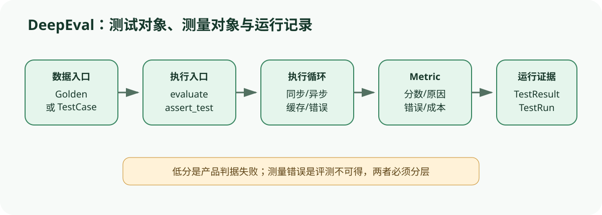

# DeepEval 源码课程：从测试用例到 MetricData 的评测生命周期

[上一节](../promptfoo/03-assertion-results-ci.md) · [下一节](01-dataset-golden-test-case.md)

## 本篇要解决什么问题

DeepEval 经常以“像 pytest 一样测试大模型应用”出现，但源码中的核心并不是一个 `assert score >= threshold`——输入可能是已经包含 actual_output 的 `LLMTestCase`，也可能是等待用户代码执行的 Golden；指标可能同步、异步、面向单轮、对话或 trace；缓存、忽略错误、并发和测试运行管理器又会改变执行与记录方式。本课程追踪这些对象怎样汇合为 `TestResult`、`MetricData` 与一次 TestRun。

锁定版本为 `a2e0d4cfd3118352d321c1c84bdeba17d4a201bc`。DeepEval 项目还包含大量具体指标、追踪、平台集成和 Agentic 入口，本课程只解释锁定范围内可直接核对的执行骨架——我们会把它映射到统一的 Dataset → Sample → Target → Scorer → Result 模型，同时保留 DeepEval 自己的 Golden、TestCase、Metric 命名。

## 先建立源码地图

| 站点 | 锁定文件 | 责任 |
| --- | --- | --- |
| 公开入口 | [`deepeval/evaluate/evaluate.py`](https://github.com/confident-ai/deepeval/blob/a2e0d4cfd3118352d321c1c84bdeba17d4a201bc/deepeval/evaluate/evaluate.py) | `assert_test`、`evaluate`、配置与 TestRun 收尾 |
| 执行循环 | [`deepeval/evaluate/execute/loop.py`](https://github.com/confident-ai/deepeval/blob/a2e0d4cfd3118352d321c1c84bdeba17d4a201bc/deepeval/evaluate/execute/loop.py) | 测试、trace、metric 的同步/异步执行与错误处理 |
| 指标基类 | [`deepeval/metrics/base_metric.py`](https://github.com/confident-ai/deepeval/blob/a2e0d4cfd3118352d321c1c84bdeba17d4a201bc/deepeval/metrics/base_metric.py) | score、threshold、success、reason 与测量接口 |
| 数据集 | [`deepeval/dataset/dataset.py`](https://github.com/confident-ai/deepeval/blob/a2e0d4cfd3118352d321c1c84bdeba17d4a201bc/deepeval/dataset/dataset.py) | Golden/TestCase 集合、身份和 agentic iterator |
| 单轮用例 | [`deepeval/test_case/llm_test_case.py`](https://github.com/confident-ai/deepeval/blob/a2e0d4cfd3118352d321c1c84bdeba17d4a201bc/deepeval/test_case/llm_test_case.py) | input、actual_output、expected_output、context、tools 等观测 |

## 完整调用链



1. 调用者选择两种边界：把已执行结果封装成 `LLMTestCase` 交给 `evaluate`，或遍历 Dataset 的 Golden，在用户代码产生输出和 trace 后由 agentic loop 构造 TestCase。
2. `evaluate` 验证输入与 metrics，配置 AsyncConfig、DisplayConfig、CacheConfig、ErrorConfig，并重置或取得全局 TestRunManager。
3. 同步路径调用 `execute_test_cases`，异步路径通过事件循环调用 `a_execute_test_cases`；指标对象会按运行模式初始化并在每个测试上测量。
4. 指标的 `measure`/`a_measure` 写入 score、reason、error 等状态；基类 `is_successful` 按 threshold、strict_mode 和 error 得出成功语义。
5. 执行器把指标状态转换为 MetricData，附着到 TestResult/API test case，更新 TestRun。缓存可复用先前评分，ignore_errors 决定错误是终止还是保留为结果。
6. `evaluate` 输出控制台/文件报告，写入运行时长和超参数，保存临时 TestRun，并根据 CLI 与普通调用模式选择由谁完成 wrap-up。
7. `assert_test` 复用执行器，但在任何有阈值的指标失败或出错时抛出 AssertionError，适合测试框架门禁，不等同统计发布判定。

## 关键数据结构

`Golden` 更接近待执行样本，保存输入、期望与上下文，但通常没有被测应用的 actual_output；`LLMTestCase` 是可评分观测，包含 input、actual_output、expected_output、context、retrieval_context、tools_called、expected_tools、metadata 等。`BaseMetric` 是有状态 Scorer 实例，测量后持有 score、threshold、reason、error、success、verbose_logs 和 evaluation_cost，`MetricData` 是把这些状态冻结到结果中的记录，`EvaluationResult` 汇总 TestResults、confident link 与 run identity。

这里涉及多测试和并发。如何重置同一个 Metric 实例的状态非常关键。对象字段便于实现具体指标，却要求执行器在每次运行前清理 error 等字段，并避免跨协程污染。结果证据应保存 metric 名称、实现/模型版本、threshold、strict mode 和单次输出，而不是只保存最终布尔值。

## 实现取舍与失败语义

允许用户直接提交 TestCase，使 DeepEval 可以评测任何外部系统输出；agentic iterator 又能把被测代码执行纳入 trace。两者的证据强度不同——前者信任调用者填入 actual_output，后者可以关联运行 trace，但仍需锁定用户代码与环境。

Metric 失败表示有效测量低于阈值，metric.error 表示没有得到可信测量。`ignore_errors=True` 让批量运行继续，却不应把错误项从分母静默移除。缓存可节省 Judge 调用。前提是 key 覆盖测试、指标配置、模型和依赖版本。异步并发提高吞吐，但会暴露有状态 Metric、事件循环和全局 TestRun 管理的隔离要求。

## 动手实验

为问答系统设计一个 Golden 和对应 LLMTestCase，分别填写 input、actual_output、expected_output、context 与 retrieval_context，说明每个字段由谁产生。再设计两个 Metric：确定性格式检查和模型 Judge；列出 score、threshold、reason、error、cost 应怎样记录。最后比较 `evaluate(..., ignore_errors=True)` 与 `assert_test` 在 Judge 超时时应产生的外部行为。

```bash
python scripts/sources.py verify
python -m pytest tests/test_harness_course_docs.py -q
```

## 预期输出与答案

Golden 的 input/expected/context 属于数据集定义，actual_output 属于 Target 执行，retrieval_context 是本次系统观测而非预先答案。格式 Metric 可离线给出确定分数；Judge Metric 还要记录评分模型、prompt/config 和成本。忽略错误模式应保留 error 并继续其他测试；`assert_test` 则应在失败指标字符串中显示 score、threshold、strict、error 与 reason 后抛出。

课程门禁不需要 API key，只验证源码锁定、教学结构和本仓库离线实验；它不声称运行具体 DeepEval Judge。

## 如何核对

从 [`deepeval/evaluate/evaluate.py`](https://github.com/confident-ai/deepeval/blob/a2e0d4cfd3118352d321c1c84bdeba17d4a201bc/deepeval/evaluate/evaluate.py) 比较 `evaluate` 与 `assert_test`，再进入 [`deepeval/evaluate/execute/loop.py`](https://github.com/confident-ai/deepeval/blob/a2e0d4cfd3118352d321c1c84bdeba17d4a201bc/deepeval/evaluate/execute/loop.py) 查同步/异步与 agentic 路径，最后用 [`deepeval/metrics/base_metric.py`](https://github.com/confident-ai/deepeval/blob/a2e0d4cfd3118352d321c1c84bdeba17d4a201bc/deepeval/metrics/base_metric.py) 核对 success 语义。

## 本篇不能证明什么

API 易用、指标有阈值或 pytest 失败不能证明指标有效、Judge 无偏、数据集代表线上分布、运行可复现或版本可以发布。它们是评测机制，不是发布授权。

[上一节](../promptfoo/03-assertion-results-ci.md) · [下一节](01-dataset-golden-test-case.md)
