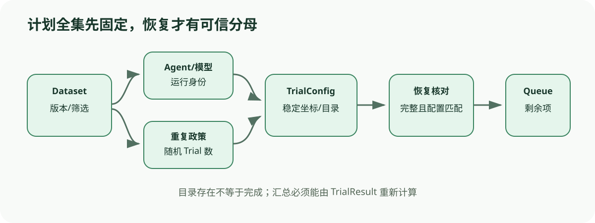

# Job、Dataset 与 Trial：运行计划怎样固定统计单位

[上一节](README.md) · [下一节](02-environment-agent-lifecycle.md)

## 本篇要解决什么问题

运行 100 个任务、每个 3 次，看似就是 300 个并发工作项；真正实现还要处理任务过滤、不同 Agent/模型组合、恢复既有结果、结果目录冲突、随机重复身份和 Job 级统计。Harbor 的 Job 与 Terminal-Bench 1 的 Harness 都把这些责任放在 Trial 之上。本篇解释计划怎样展开、配置怎样锁定，以及为什么恢复逻辑是统计正确性的一部分。

重点是区分三类对象：Dataset 决定候选任务，Job/Harness 决定本次实验政策，Trial 才是一个 Agent 在一个任务环境中的独立运行。任何一个层级被修改，都可能让历史结果与新结果不可直接合并。

## 先建立源码地图

| 源码位置 | 责任 | 阅读问题 |
| --- | --- | --- |
| [`src/harbor/job.py`](https://github.com/harbor-framework/harbor/blob/74f0176384cff88b99306770473b4875760c5a21/src/harbor/job.py) | Job.create、任务解析、TrialQueue、既有结果 | 如何生成与恢复 Trial |
| [`terminal_bench/harness/harness.py`](https://github.com/harbor-framework/terminal-bench-1/blob/d28711d0da2675d0bb1d56de45ae5df6082438a3/terminal_bench/harness/harness.py) | RunLock、task/attempt 展开和 resume | 配置匹配与残留清理 |
| [`terminal_bench/dataset/dataset.py`](https://github.com/harbor-framework/terminal-bench-1/blob/d28711d0da2675d0bb1d56de45ae5df6082438a3/terminal_bench/dataset/dataset.py) | 数据集缓存、include/exclude、限制与排序 | 本次实际任务集合如何确定 |

## 完整调用链



1. Dataset 根据 name/version/path 或 YAML 构造，缓存远程内容，再应用 include、exclude、task_ids 和 n_tasks；排序可以按预计时长改善并发利用率。
2. Job.create 解析 Task 配置、Agent skills 与环境资源政策；Terminal-Bench Harness 初始化 Agent class 和 Dataset。
3. 计划层对 task × agent/model × repetition 展开。每个 Trial 获得稳定名称/UUID、独立输出目录和完整 TrialConfig。
4. Job 若发现已有目录，读取 JobConfig、TrialConfig 与 TrialResult，验证身份后把完成项加入 existing results/rewards/stats，并只调度 remaining configs。
5. Terminal-Bench 用 RunLock 比较当前 dataset、agent 与 run config；不一致时拒绝 resume。结果文件完整的 Trial 被跳过，只有部分 artifacts 的任务目录会先清理后重跑。
6. TrialQueue 按并发策略运行剩余 Trial，并在 START/CANCEL/END 等事件更新 Job 级状态；完成结果逐项写盘，不等待整个 Job 才保存。
7. JobResult/BenchmarkResults 由 TrialResults 汇总；统计代码按 task 聚合多次重复，计算 resolved、accuracy 与 pass@k。

## 关键数据结构

DatasetConfig 固定数据集名、版本、路径和筛选条件。JobConfig/RunLock 固定 Agent、模型、并发、n_attempts、超时、网络和环境政策。TrialConfig 是不可混淆的运行坐标。TrialResult 是已执行证据；“目录存在”或“config 存在”都不能代替它。JobStats 与 BenchmarkResults 是由 TrialResult 派生的缓存，重建时应能从行级结果重新计算。

Terminal-Bench 的 TrialResults 包含 task_name、trial_name、reward 等，BenchmarkResults 先得到每 task 的成功计数再估计 pass@k。这保留了 task 作为聚类单位，避免把 300 条 Trial 当成 300 个不同任务来夸大覆盖。

## 实现取舍与失败语义

预先展开计划便于进度显示与恢复，但大规模矩阵可能占内存，动态任务还需版本冻结。按预计时长排序提升吞吐，不应改变 Trial 内容；如果全局超时使后排任务更易缺失，排序反而会影响缺失机制，分析时必须记录。

严格 RunLock 防止错误合并，代价是小配置变化也需新 run_id，这是正确成本。清理不完整产物前必须确认目录只属于目标 Trial；已完成结果如果缺摘要或配置不匹配，应拒绝复用。取消、进程崩溃和用户中断要保留状态，不得因没有 reward 就从计划中消失。

## 动手实验

设 Dataset 有 12 个任务，include 选 8 个，exclude 再去掉 2 个，2 个 Agent、每项 3 个随机 Trial。计算计划规模，并设计稳定坐标。假设完成 30 条、8 条有完整 config 但无 result、其余未启动，写出 resume 应复用、清理与重新调度的数量。再说明若模型版本改变，为什么不能沿用原 run_id。

```bash
python scripts/sources.py verify
python -m pytest tests/test_harness_course_docs.py -q
```

## 预期输出与答案

实际任务 6 个，计划为 `6 × 2 × 3 = 36` 个 Trial。稳定坐标至少含 dataset commit/task id、Agent+模型 identity 和 repetition index。30 个完整结果复用；8 个无 result 的描述与总计划矛盾，因为计划仅 36，说明恢复清单本身必须先校验而不能盲算。若改为 4 条不完整，则清理 4 条并重新调度，另 2 条未启动也调度，共 6 条。模型版本变化会改变 Target identity，应建立新 Job。

这个刻意的矛盾训练读者先验证计划全集和集合关系，而不是把日志数字直接相加。

## 如何核对

在 [`src/harbor/job.py`](https://github.com/harbor-framework/harbor/blob/74f0176384cff88b99306770473b4875760c5a21/src/harbor/job.py) 阅读 `_maybe_init_existing_job`、`_init_trial_configs` 与 remaining config；在 [`terminal_bench/harness/harness.py`](https://github.com/harbor-framework/terminal-bench-1/blob/d28711d0da2675d0bb1d56de45ae5df6082438a3/terminal_bench/harness/harness.py) 阅读 `_validate_resume_configuration` 和 `_filter_completed_and_cleanup_incomplete_tasks`。

## 本篇不能证明什么

计划完整、RunLock 匹配和 resume 成功不能证明 Trial 真的独立、随机种子有效、任务难度代表真实场景或历史结果未被人工修改。证据摘要和不可变存储仍需额外机制。

[上一节](README.md) · [下一节](02-environment-agent-lifecycle.md)
