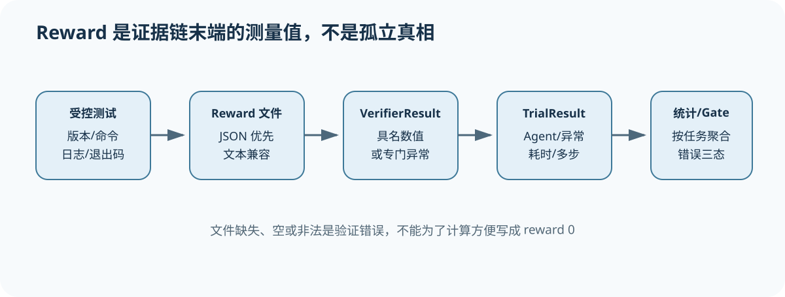

# Verifier、Reward 与 Result：成功数字怎样回连执行证据

[上一节](02-environment-agent-lifecycle.md) · [下一节](../../README.md)

## 本篇要解决什么问题

终端任务的最终输出通常是 reward 0/1 或一组具名 rewards，看起来比模型 Judge 更客观；但 reward 文件也可能缺失、为空、格式错误、由错误测试版本生成，甚至被 Agent 提前写入。Verifier 的可信度来自受控测试、阶段隔离和产物链，而不是数字类型。本篇追踪 Harbor Verifier 怎样布置测试、执行并解析 reward，以及 TrialResult/BenchmarkResults 怎样保留异常和汇总。

读完应能区分：测试失败得到合法 reward 0、Verifier 自身崩溃没有 reward、Reward 解析错误、Agent timeout 与 regrade；也能解释 accuracy 和 pass@k 使用的统计单位与限制。

## 先建立源码地图

| 源码位置 | 责任 | 阅读焦点 |
| --- | --- | --- |
| [`src/harbor/verifier/verifier.py`](https://github.com/harbor-framework/harbor/blob/74f0176384cff88b99306770473b4875760c5a21/src/harbor/verifier/verifier.py) | 测试目录、Verifier 执行、reward 解析 | 合法失败与基础设施错误 |
| [`src/harbor/models/trial/result.py`](https://github.com/harbor-framework/harbor/blob/74f0176384cff88b99306770473b4875760c5a21/src/harbor/models/trial/result.py) | TrialResult、ExceptionInfo、TimingInfo、StepResult | 结果如何保留上下文 |
| [`terminal_bench/harness/models.py`](https://github.com/harbor-framework/terminal-bench-1/blob/d28711d0da2675d0bb1d56de45ae5df6082438a3/terminal_bench/harness/models.py) | BenchmarkResults、accuracy、pass@k | 多次 Trial 怎样聚合 |

## 完整调用链



1. Verification phase 解析 Task 的 tests 和 verifier 配置，确定测试来源、执行命令与工作目录；测试文件被加入 verifier environment，而不是暴露给 Agent。
2. Verifier 清理/准备 verifier 目录，将 tests 注入环境，运行测试命令并下载 verifier 输出。命令退出状态和日志是诊断证据，但最终 reward 由约定文件提供。
3. 若存在 reward JSON，解析为具名数值映射；否则尝试 reward 文本并包装为 `{"reward": number}`。JSON 优先级和路径是外部契约的一部分。
4. 文件不存在、文件为空、数值/JSON 无法解析、测试目录下载失败分别抛出专门异常。它们不会被伪造成 reward 0。
5. 成功解析得到 VerifierResult；TrialResult 同时保存 AgentInfo、AgentContext、verifier_environment_mode、exception、各阶段 TimingInfo，以及单步或多步 StepResult。
6. Regrade 可复用源 Trial 的 Agent 产物并重新运行 Verifier。新结果必须回连 source trial 与 verifier 版本，不能伪装为 Agent 再次执行。
7. Job/Benchmark 聚合每 task 的 Trial reward。accuracy 表示成功 Trial 比例；pass@k 按每 task 的 n 次观察和 c 次成功估计至少一次成功概率，再跨 task 平均。

## 关键数据结构

VerifierResult 的 rewards 是字符串到数值映射，允许主 reward 与组件 reward；值的语义和范围由 Task/Verifier 契约定义，不能假设都在 0 到 1。ExceptionInfo 保存类型、消息和 traceback；TimingInfo 保存阶段起止/时长；StepResult 为多步任务保存每步 Agent/Verifier/exception。TrialResult.compute_token_cost_totals 会从单步或多步 AgentContext 汇总成本。

BenchmarkResults 的 pass@k 输入是每个 task 的成功计数，而不是把所有 Trial 打散。若每 task 的 n 不同、缺失非随机或 Task 数很小，单个平均值需伴随分母、分布和不确定性。reward 组件也不应未经预注册就事后挑选最佳指标。

## 实现取舍与失败语义

文件协议让任意语言的 tests 与 Python Harness 解耦，也形成清晰 artifact；代价是路径、格式与写入原子性必须严格。优先 JSON 支持多 reward，文本兼容简单任务。专门异常避免基础设施失败被计为 Agent 失败，是正确的证据边界。

regrade 能在不重复昂贵 Agent 执行的情况下修复 Verifier 或应用新标准，但它改变 Scorer identity。报告必须并列保留原 verifier result，而不是覆盖。pass@k 适合“允许多次尝试”的产品问题；若线上只有一次机会，只展示 pass@10 会误导。发布 Gate 还要处理环境错误、缺失 Trial、任务权重和关键任务非补偿规则。

## 动手实验

设计 reward JSON：主 reward、功能正确性、安全和资源合规四项，规定合法范围。列出测试失败、reward 文件空、JSON 中出现字符串、下载失败四种情况应得到的 Trial 状态。给两个任务各 3 次 Trial：A 成功 2 次，B 成功 0 次，计算 accuracy、resolved task 数，并描述 pass@1 与 pass@2 的方向。再写出 regrade 证据清单。

```bash
python scripts/sources.py verify
python -m pytest tests/test_harness_course_docs.py -q
```

## 预期输出与答案

测试合法运行但断言失败可以写 reward 0；后三种是 verifier/解析/传输错误，不应写 0。总 Trial accuracy 是 2/6，但 resolved task 可按“至少一次成功”定义为 1/2；pass@2 会高于或等于 pass@1，但任务 B 仍为 0。具体估计应由锁定公式计算并报告每 task n/c。

Regrade 至少保存 source trial id 与 artifact digest、新旧 verifier commit/tests digest、环境 identity、regrade 时间、旧/新 rewards 和差异原因。它不产生新的 Agent Trial。

## 如何核对

在 [`src/harbor/verifier/verifier.py`](https://github.com/harbor-framework/harbor/blob/74f0176384cff88b99306770473b4875760c5a21/src/harbor/verifier/verifier.py) 顺序核对 `_resolve_tests`、verify、reward JSON/text 解析和专门异常；在 [`src/harbor/models/trial/result.py`](https://github.com/harbor-framework/harbor/blob/74f0176384cff88b99306770473b4875760c5a21/src/harbor/models/trial/result.py) 核对异常、阶段时间与多步字段；最后看 [`terminal_bench/harness/models.py`](https://github.com/harbor-framework/terminal-bench-1/blob/d28711d0da2675d0bb1d56de45ae5df6082438a3/terminal_bench/harness/models.py) 的 pass@k 聚合单位。

## 本篇不能证明什么

隐藏 tests、数值 reward 和 pass@k 不能证明测试无漏洞、reward 与真实价值一致、Agent 没有利用环境，或差异具有统计显著性。发布结论必须再结合任务治理、错误率、不确定性与关键风险 Gate。

[上一节](02-environment-agent-lifecycle.md) · [下一节](../../README.md)
