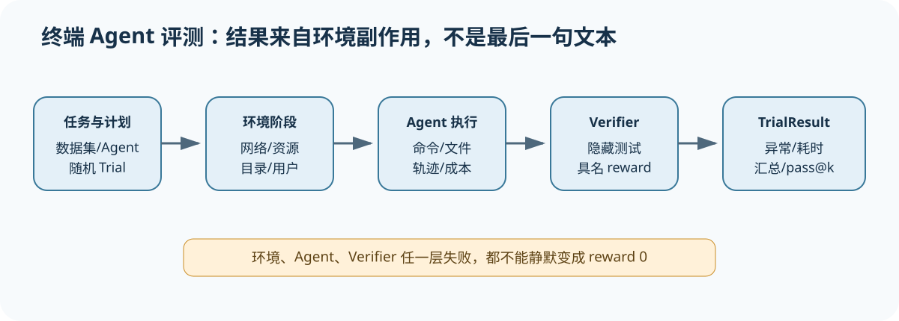

# Harbor 与 Terminal-Bench 1：Agent 终端任务怎样成为可核对的 Trial

[上一节](../deepeval/03-async-cache-errors.md) · [下一节](01-job-dataset-trial.md)

## 本篇要解决什么问题

语言模型基准常把「输入发给模型、比较答案」作为主循环，而终端 Agent 评测必须先启动隔离环境、安装或连接 Agent、执行多轮命令并保留日志与文件，然后才能在相同或独立环境中运行 verifier。Harbor 是从 Terminal-Bench 后续演进出来的通用 Agent Harness/Eval Harness 框架，Terminal-Bench 1 则保留了更紧凑的早期 Harness 结构——把两者放在一起阅读，就能沿源码看到 Job/Dataset 怎样展开 Trial、环境与 Agent 如何交替、Verifier 如何从容器产物生成 reward，以及恢复结果时为什么不能只看一个 `resolved` 布尔值。

本课程锁定 Harbor `74f0176384cff88b99306770473b4875760c5a21` 与 Terminal-Bench 1 `d28711d0da2675d0bb1d56de45ae5df6082438a3`。我们先用 Terminal-Bench 1 解释紧凑基线，再用 Harbor 展示网络策略、资源能力、事件 hook、regrade 与多步结果等扩展，但这并不是两个项目的版本差异大全，也不表示 Harbor 的每项能力都来自 Terminal-Bench 1。

## 先建立源码地图

| 系统 | 锁定文件 | 责任 |
| --- | --- | --- |
| Harbor Job | [`src/harbor/job.py`](https://github.com/harbor-framework/harbor/blob/74f0176384cff88b99306770473b4875760c5a21/src/harbor/job.py) | 解析任务/Agent，生成与调度 Trial，恢复 Job |
| Harbor Trial | [`src/harbor/trial/trial.py`](https://github.com/harbor-framework/harbor/blob/74f0176384cff88b99306770473b4875760c5a21/src/harbor/trial/trial.py) | 环境、Agent、Verifier 生命周期与事件 |
| Harbor Environment | [`src/harbor/environments/base.py`](https://github.com/harbor-framework/harbor/blob/74f0176384cff88b99306770473b4875760c5a21/src/harbor/environments/base.py) | 容器抽象、网络/资源/执行/文件操作 |
| Harbor Verifier/Result | [`src/harbor/verifier/verifier.py`](https://github.com/harbor-framework/harbor/blob/74f0176384cff88b99306770473b4875760c5a21/src/harbor/verifier/verifier.py) · [`result.py`](https://github.com/harbor-framework/harbor/blob/74f0176384cff88b99306770473b4875760c5a21/src/harbor/models/trial/result.py) | 奖励解析、异常、耗时与多步结果 |
| Terminal-Bench Harness | [`terminal_bench/harness/harness.py`](https://github.com/harbor-framework/terminal-bench-1/blob/d28711d0da2675d0bb1d56de45ae5df6082438a3/terminal_bench/harness/harness.py) | Dataset、Agent、并发 Trial 与 resume |
| Terminal-Bench 数据/结果 | [`dataset.py`](https://github.com/harbor-framework/terminal-bench-1/blob/d28711d0da2675d0bb1d56de45ae5df6082438a3/terminal_bench/dataset/dataset.py) · [`models.py`](https://github.com/harbor-framework/terminal-bench-1/blob/d28711d0da2675d0bb1d56de45ae5df6082438a3/terminal_bench/harness/models.py) | 任务选择、TrialResults、accuracy/pass@k |

## 完整调用链



1. Dataset/TaskClient 解析任务版本与选择条件；Job/Harness 再与 Agent、模型、attempt 数组合，生成 TrialConfig 或 trial handler。
2. 运行锁与输出目录固定 dataset、agent、模型、超时、并发和网络等配置；resume 只接受匹配配置，并区分完整结果与残留中间产物。
3. Trial 创建 Agent environment，准备任务文件和目录，执行 Agent setup/run，并把 stdout/stderr、trajectory、文件与 token/cost 记录到 Trial 路径。
4. Agent 结束后切换网络/环境阶段，启动 verifier。Harbor 可让 verifier 与 Agent 同环境或分离环境，避免 Agent 篡改测试或利用验证期网络。
5. Verifier 注入测试、运行测试命令并下载 verifier 目录，从 reward JSON 或文本解析数值；文件缺失、空文件、非法 JSON 分别是验证基础设施错误。
6. TrialResult 保存 AgentInfo、AgentContext、VerifierResult、异常、setup/execution timing 和多步 StepResult；Job 汇总各 Trial reward 与统计。
7. Terminal-Bench BenchmarkResults 根据每 task 的多次 Trial 计算 accuracy 和 pass@k。Attempt 数是每任务重复观察，不是基础设施 retry；结果解释必须保留 task 聚类。

## 关键数据结构

Task 描述 instruction、环境构建和 verifier，而 Dataset 表示锁定后的任务集合，TrialConfig 则把一个 Task、一个 Agent/模型、一个 attempt 与一套环境政策固定成运行单位。AgentContext/AgentResult 保存终端 Agent 的轨迹、token 与成本，VerifierResult 保存具名 rewards，TrialResult 还会记录异常和各阶段时间。汇总不能替代行级证据。JobResult/BenchmarkResults 只是从行级结果派生出的汇总，不能替代 Trial 目录中的配置、日志与 verifier 产物。

放进统一模型后，Terminal-Bench 的 n_attempts 更接近同一 Sample 上的多个随机 Trial，并不是网络重试 Attempt。Reference Harness 使用 Trial/Attempt 这组术语时会把两者明确分开，因为随机重复会增加 Trial 分母，而基础设施恢复仍留在同一个 Trial 下。跨工具比较之前必须先把各自术语翻译到同一模型中，不能只凭字段名称判断对象是否相同。

## 实现取舍与失败语义

容器把任务依赖与副作用隔离开，使文件和命令可以接受验证，不过镜像、运行时、网络与资源限制也因此进入实验身份。将 Verifier 与 Agent 分开能够提高防篡改能力，但需要复制工作区或明确哪些产物共享，而且环境差异本身也可能制造假失败。resume 可以节省成本——却只能在锁定配置相同且结果完整时复用，残留目录不能冒充完成状态。

Agent 没有解决任务属于产品失败，而 Agent 进程崩溃可能来自产品本身，也可能是适配错误。环境构建失败、健康检查失败与 Verifier reward 缺失则属于 Harness 错误，超时还必须注明发生在 setup、agent 还是 verifier 阶段。不同阶段不能混写。只有把这些情况分层记录，Gate 才能区分「不通过」和「无法判断」。

## 动手实验

为「在容器中修复一个损坏的配置文件」设计 Task，列出 instruction、初始文件、网络策略、资源限制、Agent 可写路径、隐藏 verifier 和 reward。给同一个 Task 安排 3 个随机 Trial，再为第二个 Trial 的容器启动失败安排一次基础设施重试，并写出正确的 Trial/Attempt 数量。最后解释为什么只保存 `reward=1` 无法复现或审计这次运行。

```bash
python scripts/sources.py verify
python -m pytest tests/test_harness_course_docs.py -q
```

## 预期输出与答案

三个随机重复对应 3 个 Trial，而第二个 Trial 的容器恢复只是该 Trial 下面的另一个 Attempt，所以统计分母仍然是 3。统计分母没有增加。reward=1 没有说明任务与测试版本、Agent 与模型、环境镜像、网络、资源、轨迹、Verifier 命令和产物，也无法判断奖励是否由合法 verifier 生成。

课程测试只验证锁定链接和教材合同，不会拉起 Docker 或运行外部 Agent，因此具体平台的容器安全与资源隔离仍然需要单独的集成测试。

## 如何核对

先从 [`src/harbor/job.py`](https://github.com/harbor-framework/harbor/blob/74f0176384cff88b99306770473b4875760c5a21/src/harbor/job.py) 追踪 Job.create、TrialConfig 初始化与 queue hooks，再到 [`src/harbor/trial/trial.py`](https://github.com/harbor-framework/harbor/blob/74f0176384cff88b99306770473b4875760c5a21/src/harbor/trial/trial.py) 找到环境、Agent 和 verifier phase，最后与 [`terminal_bench/harness/harness.py`](https://github.com/harbor-framework/terminal-bench-1/blob/d28711d0da2675d0bb1d56de45ae5df6082438a3/terminal_bench/harness/harness.py) 的 resume 及并发逻辑对照。

## 本篇不能证明什么

容器、隐藏测试、reward 文件与 pass@k 都不能证明任务没有漏洞、Agent 从未利用侧信道、测试覆盖完整，或结果能够外推到真实软件工程。课程也不会把框架自身测试通过，扩大解释成某个 Agent 的能力证明。

[上一节](../deepeval/03-async-cache-errors.md) · [下一节](01-job-dataset-trial.md)
