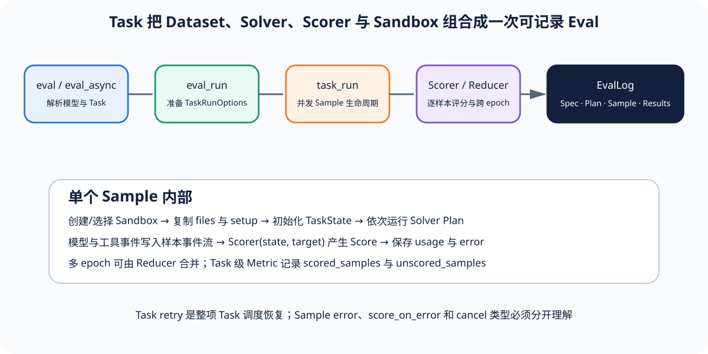

# 01｜Eval、Task 与 Solver：从公共 API 到可执行 Plan

[上一节](README.md) · [下一节](02-sandbox-sample-run.md)

## 本篇要解决什么问题

Inspect AI 的 `eval()` 参数很多，模型、Task、Sandbox、Solver、epochs、并发、预算、日志与 retry 都能在入口覆盖，因此一旦只把它看成一个大函数，就很难分清哪些值属于 Eval 级调度、哪些会进入每个 Task，以及哪些最终改变单个 Sample 的 Solver Plan。本节会沿着同步 API、异步上下文、Task 解析和 TaskRunOptions 四层，把这条装配链逐层拆开。

## 先建立源码地图

公共入口有同步和异步两个——[`eval()`](https://github.com/UKGovernmentBEIS/inspect_ai/blob/ebf4815ee260afcc8c34ad9d66e6f8d98a89e905/src/inspect_ai/_eval/eval.py#L118-L157) 与 [`eval_async()`](https://github.com/UKGovernmentBEIS/inspect_ai/blob/ebf4815ee260afcc8c34ad9d66e6f8d98a89e905/src/inspect_ai/_eval/eval.py#L413-L452)，模型和 Task 的解析则在 [`eval_resolve_tasks()`](https://github.com/UKGovernmentBEIS/inspect_ai/blob/ebf4815ee260afcc8c34ad9d66e6f8d98a89e905/src/inspect_ai/_eval/eval.py#L1899-L1938)。Task 级准备和调度在 [`eval_run()`](https://github.com/UKGovernmentBEIS/inspect_ai/blob/ebf4815ee260afcc8c34ad9d66e6f8d98a89e905/src/inspect_ai/_eval/run.py#L123-L162)。Solver Plan 的解析与单 Task 主循环在 [`_eval/task/run.py`](https://github.com/UKGovernmentBEIS/inspect_ai/blob/ebf4815ee260afcc8c34ad9d66e6f8d98a89e905/src/inspect_ai/_eval/task/run.py#L465-L504)。

源码直接显示，`eval_async` 同时只能有一个活动调用，并通过 anyio TaskGroup 运行 `_eval_async_inner`，而这个结论只属于锁定版本的**源码事实**，不能推广成所有版本或部署模式都不会改变的永久限制。

## 完整调用链

1. `eval` 处理同步显示与异常边界，再调用 `eval_async`，后者规范化 checkpoint 与 control server 参数，创建 TaskGroup。
2. `_eval_async_inner` 解析 model_args/task_args、成本表与日志配置，生成 run_id，并初始化模型、并发限制和运行 hook。
3. `eval_resolve_tasks` 在已初始化的模型/角色上下文中解析 Task，输入可以是 Registry 名称、文件、Task 对象或 TaskSource；每个逻辑 Task 与实际 Model 组合成 ResolvedTask。
4. 入口调用 `eval_run`，该函数创建 SandboxManager，并为每个 ResolvedTask 合并 Eval 参数与 Task 默认配置；调用级 Solver 可以覆盖 Task 自带 Solver，但覆盖结果必须进入日志规格。
5. `resolve_plan` 把单 Solver、Chain 或 Plan 统一为 Plan；Task 的 setup Solver 会被复制后前置，避免重复调用在原对象上不断叠加 setup。
6. Scorer 被转成可重建的 ScorerSpec，Reducer、审批、限制、日志与 SampleSource 一起进入 TaskRunOptions。
7. `run_task_retry_attempts` 以 Task × Model 为调度单位，在并发上限内尽量平衡不同 Model，最终把每项 Task 交给 `task_run`。

## 关键数据结构

`ResolvedTask` 表示 Registry、File 或对象解析后的 Task 及其来源，而 `TaskRunOptions` 是一次 Task 执行所需的冻结装配结果，其中包含 Task、Model、Sandbox、EvalConfig、Solver、Scorer、Logger、SampleSource 和运行限制。`Plan` 是 Solver steps 的有序列表。每个 step 都会记录为 EvalPlanStep，以便日志重放“实际运行了哪些 Solver”。

Task 的 Dataset 与 Sample 是评测输入，Solver 改变 TaskState，包括 messages、output、tools 与 store，而 Scorer 在 Solver 结束后读取 state 与 Target。这个切分比把 prompt、模型调用和评分全塞进一个 callback 更容易审计，但 Task 对象仍是多项配置的聚合根。

## 实现取舍与失败语义

统一同步与异步入口降低了使用门槛，而 anyio 也让并发 Task 与 Sample 更容易组织，不过全局只允许一个活动 `eval_async`，所以同一进程里的嵌套运行仍受限制。调用参数可以覆盖 Task 默认值，这虽然方便实验，却也要求日志保存**解析后配置**，否则只凭 Task 源码无法重建当时的运行。

Solver 覆盖适合用同一份 Dataset 比较不同策略，但因为它可能同时改变工具、消息和终止语义，所以不能只把 Solver 名当作普通超参数。Task 解析失败、模型角色缺失或 Sandbox 规格无效，都应在 Sample 开始前阻断。边界不能混淆。与这些装配错误不同，Solver 返回错误行为属于 Sample 级产品结果，不能自动解释成 Eval 基础设施错误。

## 动手实验

为同一个虚构退款 Dataset 设计两个 Solver：`direct_answer` 只生成一次，`tool_agent` 允许查询订单和调用退款工具。列出在调用级替换 Solver 时必须同步冻结的身份：Solver Registry 名与参数、工具集合、审批策略、Sandbox、Model、消息/turn/token/time/cost limits。

再从锁定源码查找 `resolve_plan`，解释 Task.setup 为什么要在复制后的 Plan 上前置，而不能直接修改复用的 Plan。

## 预期输出与答案

两种 Solver 不能只按最终文本比较，因为 tool_agent 还会留下工具副作用和环境终态，因此至少要冻结 SolverSpec、Model、工具权限、审批和各项预算。`resolve_plan` 之所以复制 Plan，是因为同一 Task 或 Plan 可能被多次 eval，一旦原地 prepend setup，第二次运行就会重复执行 setup，最终让实际 Plan 偏离声明。

在本课程另外两篇都存在并满足内容合同之前，课程测试应继续保持红色，因为这道约束能防止一张全局图取代 Sample 和 Scorer 的细节。

## 如何核对

依次定位 [`eval_async`](https://github.com/UKGovernmentBEIS/inspect_ai/blob/ebf4815ee260afcc8c34ad9d66e6f8d98a89e905/src/inspect_ai/_eval/eval.py#L413-L452)、[`_eval_async_inner`](https://github.com/UKGovernmentBEIS/inspect_ai/blob/ebf4815ee260afcc8c34ad9d66e6f8d98a89e905/src/inspect_ai/_eval/eval.py#L681-L720)、[`eval_resolve_tasks`](https://github.com/UKGovernmentBEIS/inspect_ai/blob/ebf4815ee260afcc8c34ad9d66e6f8d98a89e905/src/inspect_ai/_eval/eval.py#L1899-L1938) 与 [`eval_run`](https://github.com/UKGovernmentBEIS/inspect_ai/blob/ebf4815ee260afcc8c34ad9d66e6f8d98a89e905/src/inspect_ai/_eval/run.py#L123-L162)。在 [`_eval/run.py`](https://github.com/UKGovernmentBEIS/inspect_ai/blob/ebf4815ee260afcc8c34ad9d66e6f8d98a89e905/src/inspect_ai/_eval/run.py#L123-L162) 查看 TaskRunOptions 的构造。最后在 [`_eval/task/run.py`](https://github.com/UKGovernmentBEIS/inspect_ai/blob/ebf4815ee260afcc8c34ad9d66e6f8d98a89e905/src/inspect_ai/_eval/task/run.py#L396-L416) 核对 `resolve_plan` 对 Solver、Chain、Plan 和 setup 的分支。

## 本篇不能证明什么

完整记录 Plan 只能证明锁定实现怎样把声明解析成执行计划，不能证明 Solver 安全、工具权限最小或任务有效。实际模型身份、Sandbox 隔离和 Scorer 有效性，还需要后续证据。

[上一节](README.md) · [下一节](02-sandbox-sample-run.md)
