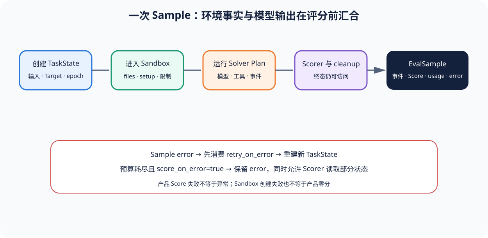

# 02｜Sandbox 与 Sample：一次 Agent Eval 怎样真正运行

[上一节](01-eval-task-solver.md) · [下一节](03-scorer-log-retry.md)

## 本篇要解决什么问题

对普通问答，Sample 似乎只是 input 到 output；对 Agent Eval，Sample 还可能复制文件、执行 setup、创建 Sandbox、暴露工具、产生多轮消息、达到 token/time/cost limit，并在清理前检查终态，因此只看最终 output 会遗漏大量产品行为。本节追踪 `task_run` 如何把 Dataset Sample 变成 TaskState，再如何在隔离上下文中运行 Solver 和保存 EvalSample。

## 先建立源码地图

Sample 生命周期集中在锁定 [`_eval/task/run.py`](https://github.com/UKGovernmentBEIS/inspect_ai/blob/ebf4815ee260afcc8c34ad9d66e6f8d98a89e905/src/inspect_ai/_eval/task/run.py#L465-L504)。Task 级 SandboxManager 与并发准备在 [`_eval/run.py`](https://github.com/UKGovernmentBEIS/inspect_ai/blob/ebf4815ee260afcc8c34ad9d66e6f8d98a89e905/src/inspect_ai/_eval/run.py#L123-L162)。日志侧 `EvalSample`、SandboxEnvironmentSpec、EvalSampleLimit 与事件容器在 [`log/_log.py`](https://github.com/UKGovernmentBEIS/inspect_ai/blob/ebf4815ee260afcc8c34ad9d66e6f8d98a89e905/src/inspect_ai/log/_log.py#L410-L449)。

这三个文件共同说明 Environment 不是 Target 的一个字符串参数，而是具有启动、连接、限制、清理和记录语义的执行对象。

## 完整调用链

1. `task_run` 解析 Plan、Scorer 名称、epoch 与 Sandbox limits，创建进度和结果容器，并从 Dataset/SampleSource 取得待运行 Sample。
2. `create_sample_state` 把 Sample 输入、目标、Model、metadata 和初始消息装入 TaskState；同时，每个新运行具有独立 UUID，避免 sample retry 复用错误状态。
3. `task_run_sample` 初始化 scoring context 和 Sandbox context，其中 Sample 自己的 sandbox 可以覆盖 Task 默认；files、setup 与连接信息在环境初始化阶段处理。
4. 进入 Sandbox 后，Solver Plan 依次运行，而 Generate 函数更新 TaskState，模型调用、工具事件、store、消息和 output 进入 transcript/Event。
5. 消息数、token、turn、wall time、working time 与 cost 等限制在运行期间检查。达到限制可形成 EvalSampleLimit，并根据策略停止、评分或标错。
6. Solver 完成后运行 Scorer；随后 Task cleanup 仍在 Sandbox context 内执行，以便检查或清理环境。
7. `make_eval_sample` 从 state、events、scores、usage、error、limit 与 sandbox 信息构造 EvalSample。只有在清理和日志阶段完成后，Sample 才进入 Task 级聚合。

## 关键数据结构

`TaskState` 是运行中的可变视图，包含 model、sample_id、epoch、input、messages、output、tools、store、metadata 与 scores；`EvalSample` 则是日志中的持久化快照，除输入输出外还记录 target、sandbox、files、setup、events、scores、model_usage、error、limit 和时间摘要。

SandboxEnvironmentSpec 说明环境类型与配置，但真正的环境证据还包括连接、文件、命令结果和终态。EvalSampleLimit 则要区分是 token、message、turn、time、working time 还是 cost 限制，因为这些停止原因对产品解释不同。

## 实现取舍与失败语义

每 Sample Sandbox 隔离最容易复现和清理，却会增加启动成本；复用环境更快，但必须证明 reset 消除了跨 Sample 状态。Inspect AI 允许 Task/Sample 级 Sandbox 和并发上限，给实现者灵活性；教材将其视为能力——不把“用了容器”直接等同于无污染。

`retry_on_error` 是 Sample 级错误重试，递归重建新 TaskState 并保留 error_retries；它与 Solver 内部自我修正、Task 级 retry、普通 Score 失败不同。`score_on_error` 只在重试耗尽后允许错误 Sample 进入 Scorer；这能评估部分完成，但错误仍计入 fail_on_error，不应被 Score 掩盖。操作员 cancel 的 score/error/abort/retry 也具有不同终止语义。

## 动手实验

设计一个“删除指定临时文件”的 Agent Sample：Sandbox 初态有 `target.txt` 与 `keep.txt`，Agent 只能调用 shell 工具，Scorer 检查终态。列出必须记录的观察：初态摘要、每次工具调用、退出码、最终目录清单、目标文件是否缺失、保留文件是否仍在、Sandbox reset 结果。

再回答：Agent 最终文本写“已删除”但 `target.txt` 仍存在时，TaskState.output、EvalSample error、Score 分别应是什么。

## 预期输出与答案

最终文本只是 output；若执行过程无异常，EvalSample 可以没有 error，但环境事实 Scorer 应给 failed。不能因为 Agent 自述成功而通过。若 Sandbox 无法创建，Sample 是基础设施错误，可按 retry_on_error 恢复；若 Agent 执行 `rm` 返回权限错误，这是被测行为证据，是否产品失败由 Task/Scorer 契约决定，不能默认当平台重试。

上述观察中，终态目录与文件摘要应作为 Artifact 或结构化 Event 进入评分；reset 失败会污染后续 Sample，应阻断后续运行，而不是继续累计分数。

## 如何核对

在 [`_eval/task/run.py`](https://github.com/UKGovernmentBEIS/inspect_ai/blob/ebf4815ee260afcc8c34ad9d66e6f8d98a89e905/src/inspect_ai/_eval/task/run.py#L1631-L1670) 搜索 `task_run_sample`、`sandboxenv_context`、`TaskState(`、`span("solvers")`、Scorer 循环、`make_eval_sample` 和递归 retry。再到 [`log/_log.py`](https://github.com/UKGovernmentBEIS/inspect_ai/blob/ebf4815ee260afcc8c34ad9d66e6f8d98a89e905/src/inspect_ai/log/_log.py#L410-L450) 核对 EvalSample 字段，确认哪些观察能持久保存、哪些只存在运行内存。

## 本篇不能证明什么

有 Sandbox 与事件日志不证明环境无逃逸、reset 完整或所有副作用都被观察；真正的 Agent 发布评测仍需威胁模型、最小权限、外部服务隔离和独立终态断言。

[上一节](01-eval-task-solver.md) · [下一节](03-scorer-log-retry.md)
