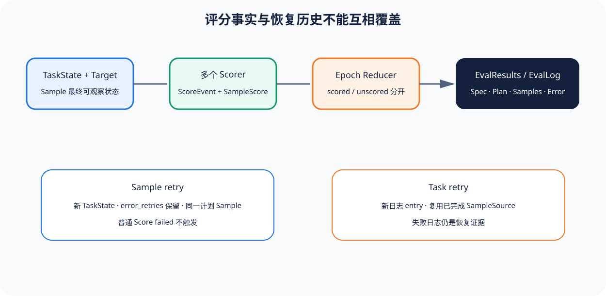

# 03｜Scorer、EvalLog 与 Retry：怎样保留可重评分的运行事实

[上一节](02-sandbox-sample-run.md) · [下一节](../../contents.md)

## 本篇要解决什么问题

Inspect AI 能保存完整 EvalLog，也支持 Sample retry、Task retry、score_on_error、多个 Scorer 和 epoch Reducer。功能丰富也带来解释风险：一次失败后重试的结果怎样进入日志？Scorer 身份能否重建？未评分样本是否从分母消失？Task retry 会不会用成功尝试覆盖失败历史？本节把评分与恢复分别追到持久化对象。

## 先建立源码地图

Scorer Protocol、Registry 包装、ScorerSpec 与 Metric 元数据在锁定 [`scorer/_scorer.py`](https://github.com/UKGovernmentBEIS/inspect_ai/blob/ebf4815ee260afcc8c34ad9d66e6f8d98a89e905/src/inspect_ai/scorer/_scorer.py)。Sample Scorer 调用、Reducer 和 Task 结果聚合在 [`_eval/task/run.py`](https://github.com/UKGovernmentBEIS/inspect_ai/blob/ebf4815ee260afcc8c34ad9d66e6f8d98a89e905/src/inspect_ai/_eval/task/run.py)。Task 级重试调度位于 [`_eval/run.py`](https://github.com/UKGovernmentBEIS/inspect_ai/blob/ebf4815ee260afcc8c34ad9d66e6f8d98a89e905/src/inspect_ai/_eval/run.py)，日志 Schema 位于 [`log/_log.py`](https://github.com/UKGovernmentBEIS/inspect_ai/blob/ebf4815ee260afcc8c34ad9d66e6f8d98a89e905/src/inspect_ai/log/_log.py)。

## 完整调用链

1. `eval_run` 把 Task 的 Scorer 转为 ScorerSpec，保存 Registry 名、构造参数、metadata 和 Metric 规格；未通过 `@scorer` 创建的对象无法可靠记录为可重建规格。
2. `task_run` 为多个 Scorer生成唯一名字。每个 Sample 完成 Solver 后，依次执行 `await scorer(state, Target(sample.target))`。
3. Score 写入 TaskState.scores、ScoreEvent 和 SampleScore；Scorer 若直接篡改同名 state.scores，运行会检测冲突。
4. 多 epoch 的同一 Sample 可由 Reducer 合并；Task 结果明确保存每个 Scorer 的 scored_samples 与 unscored_samples，而不是只给一个平均值。
5. TaskLogger 把 EvalSpec、Plan、Samples、Results、Stats 和 Error 写成 EvalLog。`log_header_only` 或关闭 log_samples 会改变可审计深度，必须进入运行配置。
6. Sample error 先消费 `retry_on_error`；Task error 或显式 cancel/retry 由 `run_task_retry_attempts` 重新排队。Task retry 新建日志 entry，并从失败日志构造 SampleSource 复用已完成 Sample。
7. 调度器按原 index 返回最新 Task 结果，但失败日志位置仍存在。外层审计必须把多条 entry 视为恢复历史，不能只看最后一条。

## 关键数据结构

`ScorerSpec(scorer, args, metadata, metrics)` 记录如何重建评分器。`EvalSample.scores` 是 scorer-name 到 Score 的映射。`EvalScore` 保存 name/scorer、参数、Metric、scored_samples、unscored_samples 和 metadata。`EvalResults.scores` 汇总各 Scorer，`EvalLog` 再保存 status、eval spec、plan、samples、results、stats、error 与 location。

Reference Harness 的 ScoreRecord 强制绑定 canonical Attempt 与 Observation digest；Inspect AI 更强调 TaskState、Sample events 和可重建 Scorer。做 Adapter 时应把缺少的严格 digest/canonical 语义标为 partial，而不是凭字段相似声称完全对应。

## 实现取舍与失败语义

Registry Scorer 便于日志重评分和共享，但动态闭包或本地对象若无法记录构造参数，会降低可复现性。多个 Scorer 与 Reducer 支持丰富评测，却要求每个 Metric 明确分母和 reducer 语义。`scored_samples`/`unscored_samples` 是重要信号；发布 Gate 不应只读取已评分子集的平均值。

Sample retry 重建状态，适合瞬时错误；若模型答错却没有异常，不应进入 retry_on_error。Task retry 复用已完成 Sample 可节省成本，但前提是 Task/Model/Sandbox/Scorer 身份没有改变，失败日志和新日志关联可追踪。源码注释明确区分 retry、abort、score/error graceful resolution 与外部取消；只有错误或显式 retry 且预算未耗尽时重新排队。

## 动手实验

构造 100 个计划 Sample 的思想实验：90 个有 Score，其中 80 passed、10 failed；5 个 Solver error 且 score_on_error=false；5 个 Scorer 返回 None。分别计算“只在 scored samples 上的通过率”和“以计划 Sample 为分母的通过率”，并决定 Gate 应该 passed、failed 还是 inconclusive。

再比较两种恢复：Sample 23 第一次 API 超时后 retry 成功；Task 日志写入阶段失败后 Task retry 复用已完成 Sample。画出每种情况下应该保留的错误、重试和最终 Score 关系。

## 预期输出与答案

只看已评分子集为 80/90≈88.9%；计划分母为 80/100=80%。若政策要求 85% 且关键缺失不可忽略，Gate 不应以 88.9% passed，而应因 10 个未评分样本 inconclusive，或按预声明的保守政策 failed。选择必须在运行前声明。

Sample retry 应保留第一次 error_retries，并让新状态的 Score进入结果；Task retry 应保留失败 EvalLog，新 entry 记录复用 SampleSource 和新的 Task 尝试。两者都不能伪装成“从未失败过”。

## 如何核对

在 [`scorer/_scorer.py`](https://github.com/UKGovernmentBEIS/inspect_ai/blob/ebf4815ee260afcc8c34ad9d66e6f8d98a89e905/src/inspect_ai/scorer/_scorer.py) 查看 Scorer Protocol、装饰器和 `as_scorer_spec`。在 [`_eval/task/run.py`](https://github.com/UKGovernmentBEIS/inspect_ai/blob/ebf4815ee260afcc8c34ad9d66e6f8d98a89e905/src/inspect_ai/_eval/task/run.py) 追 Scorer 循环、ScoreEvent、Reducer 与 unscored count。在 [`_eval/run.py`](https://github.com/UKGovernmentBEIS/inspect_ai/blob/ebf4815ee260afcc8c34ad9d66e6f8d98a89e905/src/inspect_ai/_eval/run.py) 阅读 `run_task_retry_attempts` 对 cancel_type 和 result.status 的分支。

## 本篇不能证明什么

日志字段齐全不能证明 Scorer 校准、Judge 无偏或 Task retry 在外部服务变化后仍可比较。它只提供恢复与评分的可见结构；独立发布 Gate 仍需固定身份、分母和缺失政策。

[上一节](02-sandbox-sample-run.md) · [下一节](../../contents.md)
