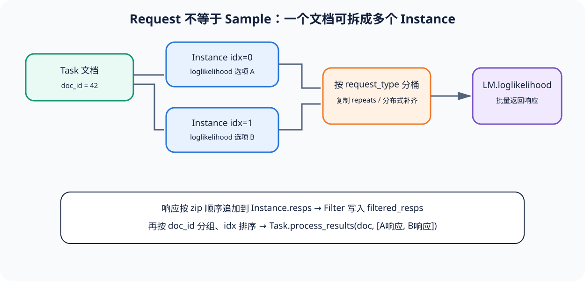

# 02｜请求执行：Instance 怎样分桶、批量调用并回填

[上一节](01-entry-task-loading.md) · [下一节](03-scoring-aggregation-tests.md)

## 本篇要解决什么问题

一条 benchmark 文档并不一定对应一次模型调用。多项选择题可能为每个选项构造一条 loglikelihood 请求，生成题可能只有一条 generate_until，请求还可能因 repeats 被复制。若把“模型请求数”“文档数”和“统计样本数”混在一起，就会误算成本、分母和重试语义。本节沿 `evaluate` 的核心循环追踪 Instance 的完整生命周期。

## 先建立源码地图

调度循环位于锁定 [`evaluator.py`](https://github.com/EleutherAI/lm-evaluation-harness/blob/ffb2f7b0dfbb05a8095b04947a15cc0a70d54c66/lm_eval/evaluator.py)，Task 构造逻辑与各 output_type 的处理位于 [`api/task.py`](https://github.com/EleutherAI/lm-evaluation-harness/blob/ffb2f7b0dfbb05a8095b04947a15cc0a70d54c66/lm_eval/api/task.py)，Instance 字段位于 [`api/instance.py`](https://github.com/EleutherAI/lm-evaluation-harness/blob/ffb2f7b0dfbb05a8095b04947a15cc0a70d54c66/lm_eval/api/instance.py)，Model 请求协议位于 [`api/model.py`](https://github.com/EleutherAI/lm-evaluation-harness/blob/ffb2f7b0dfbb05a8095b04947a15cc0a70d54c66/lm_eval/api/model.py)。

`OutputType` 包含 loglikelihood、loglikelihood_rolling、generate_until 和 multiple_choice。源码注释说明 multiple_choice 在调度时会分派成若干 loglikelihood 请求，因此 output_type 与最终 LM 方法名也不总是一字不差。

## 完整调用链



1. `evaluate` 为每个 Task 计算 limit 或指定 sample indices，再调用 `task.build_all_requests`，传入 rank、world_size、cache、system instruction 和 chat template 等上下文。
2. Task 遍历评测文档、构造上下文并创建 Instance。metadata 在 `__post_init__` 中拆为 task_name、doc_id 和 repeats；idx 表示同一文档内请求顺序。
3. 调度器遍历 `task.instances`，按 request_type 放入全局 requests 分桶。分布式模式先收集各 rank 数量，为较短 rank 计算 padding_requests。
4. 每个分桶内按照 `req.repeats` 复制对象；分布式补齐再增加伪请求，使各 rank 前向批次数一致。
5. `getattr(lm, reqtype)(cloned_reqs)` 调用对应 Model Adapter 方法。返回列表与 cloned_reqs 用严格 zip 对齐，每个响应追加到原 Instance 的 `resps`。
6. Task 执行 filter，生成 `filtered_resps`。调度器按 doc_id 分组、按 idx 排序，恢复“同一文档的多条请求”顺序。
7. `task.process_results(doc, filtered responses)` 把多个响应变为文档级 metric。可选 sample log 同时记录 arguments、原始响应、过滤响应和 doc/prompt/target hash。

## 关键数据结构

下面三种基数必须分别记录：

| 基数 | 由什么决定 | 用途 |
| --- | --- | --- |
| eval docs | Task Dataset 与 limit/samples | 文档级结果的候选分母 |
| Instance | 每个文档的请求构造 | 模型调用与 batching |
| cloned requests | Instance.repeats 与分布式 padding | 实际 Adapter 调用数量 |

`resps` 是所有重复返回，`filtered_resps` 是 filter pipeline 的命名输出。`process_results` 接收到的是某个 filter_key 下、同一 doc 的过滤响应列表。于是 filter 不是报告格式化，而是进入评分前的数据变换；改变 filter 可能改变 metric。

## 实现取舍与失败语义

按 request_type 全局分桶能让不同 Task 的同类请求共同批处理，充分利用模型吞吐；代价是文档顺序被暂时打散，必须依靠 doc_id/idx 正确重组。把 repeats 实现为同一个 Instance 引用的复制，节省对象构造，但要求响应追加顺序绝对稳定。严格 zip 可以检测响应数量不一致，却不能检测 Adapter 返回顺序错误。

分布式 padding 是计算同步需要，伪请求不应进入最终文档 metric。chat template 与 tokenizer identity 参与请求构造缓存键，否则旧请求可能在新模板下被错误复用。unsafe Task 与多模态不兼容会在构造前阻断。具体 LM 网络超时、速率限制和内部 retry 由 Adapter 承担，核心 Instance 没有本仓库 Attempt 的显式失败状态。

## 动手实验

设想一个四选一文档，Task 为四个选项各构造 loglikelihood Instance，metadata 的 doc_id 都是 7，idx 为 0..3，repeats=1。写出 requests 分桶和 LM 返回 `[(-1.2, true), (-0.4, true), (-2.1, true), (-3.0, true)]` 后的 `resps`。再假设 repeats=2，回答文档级统计单位是否变成两个。

你也可以直接运行本仓库的静态课程合同：

```bash
python -m pytest tests/test_harness_course_docs.py -q
```

## 预期输出与答案

四条 Instance 都进入 `loglikelihood` 分桶。响应依次进入各自 `resps`，按 doc_id=7 分组、idx 排序后，`process_results` 能选择最大 loglikelihood 的选项 B。repeats=2 时会有八次响应，但是否形成两个统计观测取决于 Task 如何处理重复；不能仅因 cloned request 增加就把文档分母改成 2。

课程测试应确认本节有图、完整章节、锁定链接和上下导航。它不执行上游模型，所以不会下载 checkpoint 或访问模型 API。

## 如何核对

在 [`evaluator.py`](https://github.com/EleutherAI/lm-evaluation-harness/blob/ffb2f7b0dfbb05a8095b04947a15cc0a70d54c66/lm_eval/evaluator.py) 依次搜索 `requests = defaultdict`、`build_all_requests`、`cloned_reqs`、`getattr(lm, reqtype)`、`req.resps.append`、`instances_by_doc_id` 和 `process_results`。再读 [`api/instance.py`](https://github.com/EleutherAI/lm-evaluation-harness/blob/ffb2f7b0dfbb05a8095b04947a15cc0a70d54c66/lm_eval/api/instance.py)，确认 args 属性如何把非 tuple 参数包装成 tuple。

## 本篇不能证明什么

源码顺序与哈希日志不能证明 Model Adapter 没有服务端重试、响应来自声明模型，或每个 benchmark 文档统计独立。它只解释 Harness 核心怎样组织请求；真实身份、相关性和基础设施 Attempt 仍需外层证据。

[上一节](01-entry-task-loading.md) · [下一节](03-scoring-aggregation-tests.md)
