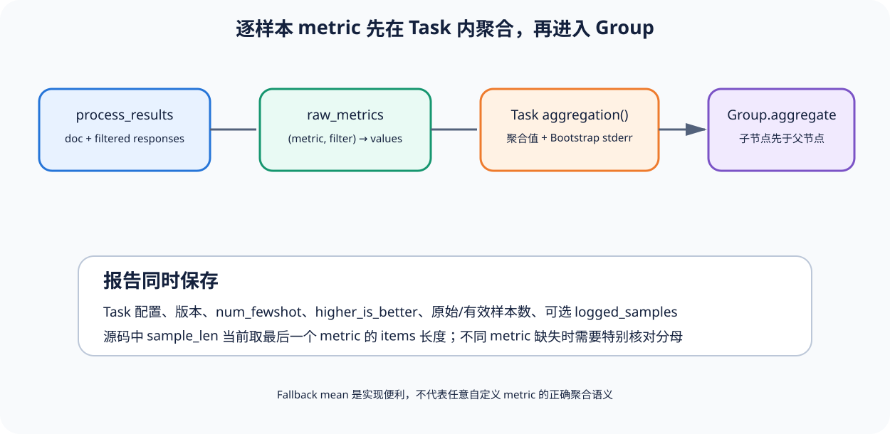

# 03｜评分、聚合与测试：从 `process_results` 到 Group 结果

[上一节](02-request-execution.md) · [下一节](../../contents.md)

## 本篇要解决什么问题

模型响应回填后还没有“准确率”，Task 需要把同一文档的若干响应解释成逐样本 metric，再为每个 metric 选择聚合函数，计算标准误，并可能把多个 Task 聚合为 Group。最容易被忽略的问题是：自定义 metric 没写 aggregation 会发生什么，有效样本数怎样计算，Group 为什么必须自底向上处理？测试又锁住了哪些语义？

## 先建立源码地图

逐样本处理由 [`Task.process_results()`](https://github.com/EleutherAI/lm-evaluation-harness/blob/ffb2f7b0dfbb05a8095b04947a15cc0a70d54c66/lm_eval/api/task.py#L403-L442) 承担，aggregation 配置也在同一个类里，而核心循环把结果加入 raw_metrics 的代码在 [`evaluate()`](https://github.com/EleutherAI/lm-evaluation-harness/blob/ffb2f7b0dfbb05a8095b04947a15cc0a70d54c66/lm_eval/evaluator.py#L429-L468)。Task 与 Group 聚合、stderr 和结果容器则分散在 `evaluator_utils.py` 的四个函数中——下一节会按顺序走一遍。

源码中的 `process_results` 名字容易误导：它处理的是一个 doc 的结果，不是整次运行报告；返回字典里的 value 才逐条积累，随后 aggregation 才产生 Task metric。

## 完整调用链



1. filter 完成后，调度器为每个 doc 调 `task.process_results(doc, responses)`，得到 `{metric_name: sample_value}`；
2. 每个值追加到 `raw_metrics[(metric, filter_key)]`，若启用 log_samples，同一记录保存 doc、target、arguments、resps、filtered_resps 与三个 hash；
3. `_process_results` 调 `_collect_results`，后者对每个 Task 调 `_compute_task_aggregations`；
4. 对每个 metric/filter，代码查询 `task.aggregation()[metric]`，找不到时记录 warning 并 fallback 到 mean；
5. 聚合函数作用于 items，结果键写成 `metric,filter`，若 bootstrap_iters > 0，再由 `stderr_for_metric` 选择可用标准误函数；样本不足或不支持时写 `N/A`；
6. `_collect_results` 保存 Task config、version、num_fewshot、higher_is_better、logged samples，以及 original/effective n_samples；
7. `aggregate_groups` 以 post-order 收集 Group，确保子组先于父组，再调用每个 Group 自己的 aggregate。

## 关键数据结构

```text
eval_results_acc[task] = {
  task,
  raw_metrics: {(metric, filter): [sample values]},
  logged_samples: [...]
}

EvalAcc
  metrics / configs / versions / num_fewshot
  higher_is_better / samples / n_samples / groups
```

锁定源码中 `sample_len` 在遍历 raw_metrics 时被设置为当前 items 的长度，注释明确提示它当前反映最后一个 metric 的 count；如果不同 metric 因缺失产生不同长度，只看单个 sample_len 可能隐藏分母差异。这是可直接核对的实现边界。这也是本仓库坚持每个 Metric 显式 denominator 的原因。

## 实现取舍与失败语义

Task 自带 aggregation 能让 metric 定义靠近任务语义，支持 mean 以外的函数；fallback mean 提高扩展容错，却可能把本应成对、加权或非线性的 metric 错聚合。Bootstrap stderr 提供基础不确定性，但重采样单位是 items——若多个 doc 来自同一实体或同一 prompt 模板，独立同分布假设需要额外审查。

Group 使用后序遍历处理嵌套层级，避免父组在子组结果尚未生成时聚合；higher_is_better 需要跨子任务传播，方向冲突不能偷偷选一个。有效样本与原始样本同时保存是优点，但它不是预声明 Trial Plan，limit、过滤和缺失仍需读者核对。

## 动手实验

手工计算以下两组 Task：T1 有 2 个样本，acc 为 `[1, 0]`；T2 有 4 个样本，acc 为 `[1, 1, 1, 0]`。Group 若 `weight_by_size=true`，求结果；若先对两个 Task metric 做不加权 mean，再求结果，并解释为什么二者不同。

再查看上游 `tests/test_aggregation_pipeline.py` 的单 Task、双 Task 加权、嵌套 Group 和错误路径测试名称，列出你会为自定义 aggregation 新增的最小测试。

## 预期输出与答案

T1=0.5，T2=0.75。按样本数加权为 `(2×0.5 + 4×0.75)/6 = 2/3`，而 Task 等权 mean 为 0.625；哪一个正确取决于 Group 声明的 estimand，不能看到结果后再选，自定义 aggregation 至少要测正常输入、空/单样本、不同 filter、stderr 支持与 Group 组合。

上游测试里的单 Task Group 应保持 Task metric；双 Task weighted Group 应按 sample_len 权重；嵌套 Group 必须验证子节点先产生结果。

## 如何核对

依次阅读 [`_compute_task_aggregations`](https://github.com/EleutherAI/lm-evaluation-harness/blob/ffb2f7b0dfbb05a8095b04947a15cc0a70d54c66/lm_eval/evaluator_utils.py#L173-L212)、[`_collect_results`](https://github.com/EleutherAI/lm-evaluation-harness/blob/ffb2f7b0dfbb05a8095b04947a15cc0a70d54c66/lm_eval/evaluator_utils.py#L222-L261)、[`aggregate_groups`](https://github.com/EleutherAI/lm-evaluation-harness/blob/ffb2f7b0dfbb05a8095b04947a15cc0a70d54c66/lm_eval/evaluator_utils.py#L275-L299) 和 [`_process_results`](https://github.com/EleutherAI/lm-evaluation-harness/blob/ffb2f7b0dfbb05a8095b04947a15cc0a70d54c66/lm_eval/evaluator_utils.py#L349-L387)。特别核对 fallback mean、bootstrap 上限特例、sample_len TODO 与 post-order traversal。再回到 [`api/task.py`](https://github.com/EleutherAI/lm-evaluation-harness/blob/ffb2f7b0dfbb05a8095b04947a15cc0a70d54c66/lm_eval/api/task.py) 查看 ConfigurableTask 怎样注册 aggregation 和 higher_is_better。

## 本篇不能证明什么

聚合测试通过不能证明 benchmark 的采样有效、stderr 覆盖真实不确定性，也不能把任务排行榜当发布 Gate；它证明的是锁定实现中逐样本值如何变成 Task/Group 输出，而独立性、外部有效性和非补偿风险政策仍需外层设计。

[上一节](02-request-execution.md) · [下一节](../../contents.md)
