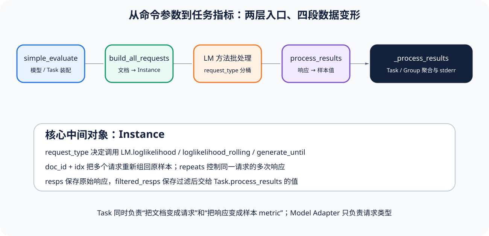

# lm-evaluation-harness 源码课程：Task 怎样变成批量模型请求

[上一节](../../foundations/07-eval-to-rl-and-release-eval.md) · [下一节](01-entry-task-loading.md)

## 本篇要解决什么问题

lm-evaluation-harness 常被理解成「跑 benchmark 的命令行工具」，但真正值得研究的是，它怎样把不同 Dataset、prompt 方式和 metric 统一成少数几种模型请求类型。如果只看 CLI 参数，就会错过三个关键问题：Task 何时把一条文档拆成多个请求，Model Adapter 为什么不必理解具体 benchmark，以及逐样本值怎样重新组合并聚合成任务结果。

本课程以锁定提交 `ffb2f7b0dfbb05a8095b04947a15cc0a70d54c66` 为准，不会追随浮动的 `main`，而在阅读时，源码会被分成装配、请求构造、执行回填、样本处理和聚合五站，同时也会指出它与本仓库 Trial/Attempt/Observation 语义并不完全等价的地方。

## 先建立源码地图

| 站点 | 锁定文件 | 主要责任 |
| --- | --- | --- |
| 高层入口 | [`evaluator.py`](https://github.com/EleutherAI/lm-evaluation-harness/blob/ffb2f7b0dfbb05a8095b04947a15cc0a70d54c66/lm_eval/evaluator.py) | `simple_evaluate` 装配模型、Task、缓存与运行配置 |
| Task 抽象 | [`api/task.py`](https://github.com/EleutherAI/lm-evaluation-harness/blob/ffb2f7b0dfbb05a8095b04947a15cc0a70d54c66/lm_eval/api/task.py) | 文档、上下文、Instance、过滤、逐样本 metric 与聚合函数 |
| Model Adapter | [`api/model.py`](https://github.com/EleutherAI/lm-evaluation-harness/blob/ffb2f7b0dfbb05a8095b04947a15cc0a70d54c66/lm_eval/api/model.py) | `loglikelihood`、rolling likelihood、generation 与缓存代理 |
| 请求对象 | [`api/instance.py`](https://github.com/EleutherAI/lm-evaluation-harness/blob/ffb2f7b0dfbb05a8095b04947a15cc0a70d54c66/lm_eval/api/instance.py) | 连接文档、请求参数、重复响应和过滤响应 |
| 聚合 | [`evaluator_utils.py`](https://github.com/EleutherAI/lm-evaluation-harness/blob/ffb2f7b0dfbb05a8095b04947a15cc0a70d54c66/lm_eval/evaluator_utils.py) | Task/Group metric、stderr、配置和样本数整理 |

这些都是**上游源码事实**，而当课程把它们映射成「Planner—Target Adapter—Scorer—Metric」时，给出的则是**机制解释**，因为上游并没有采用 Reference Harness 的全部对象或状态枚举。

## 完整调用链



1. CLI 最终调用 `simple_evaluate`；若 `model` 是字符串，Registry 创建 `LM` 子类，若启用缓存，再用 `CachingLM` 包装。
2. `TaskManager.load(tasks)` 返回 `tasks`、`groups` 等结构，入口覆盖 generation kwargs、few-shot 数和随机种子，并可运行 Task 完整性测试。
3. `simple_evaluate` 调用较低层 `evaluate(lm, task_dict, ...)`。后者为每个 Task 调用 `build_all_requests`，把评测文档变成 `Instance`。
4. `evaluate` 按 `Instance.request_type` 分桶，复制 `repeats`，必要时为分布式 rank 补齐，然后通过 `getattr(lm, reqtype)` 批量调用 Model Adapter。
5. 响应按顺序追加到 `Instance.resps`；Task 运行 filter 后，源码按 `doc_id` 重新分组、按 `idx` 排序，把过滤响应交回 `task.process_results`。
6. 每个文档得到的 metric 值进入 `raw_metrics[(metric, filter)]`；`_process_results` 先做 Task 聚合和 stderr，再自底向上做 Group 聚合。
7. 高层入口补充模型、batch、device、seed、git hash、日期、环境与 tokenizer 信息，返回结果字典。

## 关键数据结构

`Instance` 是理解全链路的钥匙，它不是 Dataset Sample，也不是一次独立进程运行，而是 Model Adapter 的一条请求：

```text
Instance
  request_type     loglikelihood / loglikelihood_rolling /
                   generate_until / multiple_choice
  doc              原 Task 文档
  arguments        交给 LM 方法的参数
  task_name, doc_id, idx
  repeats          同一请求需要几次响应
  resps            原始响应
  filtered_resps   filter 后交给 process_results 的响应
```

一个多项选择文档可以生成多个 loglikelihood Instance，这些 Instance 共享 doc_id，却使用不同的 idx，因此「请求数」可能远大于「样本数」。基数必须分清。上游结果还会保存 doc/prompt/target hash，以便核对 sample log，不过它的血缘对象与本仓库 Observation Bundle 并不是一一对应。

## 实现取舍与失败语义

把所有模型约束到少数请求方法，可以让 Task 与后端解耦，也方便批处理和缓存，但复杂 Agent 轨迹、工具副作用和环境终态很难自然地落进这些接口。Task 同时负责请求构造、filter、逐样本 metric 和 aggregation，这让扩展点比较集中，责任也随之变重——如果自定义 metric 没有 aggregation，源码会给出警告并 fallback 到 mean，而这个行为只是在容错，并不能证明 mean 符合该 metric 的统计语义。

如果 Task 被标为 unsafe code，却没有得到显式确认，`evaluate` 会拒绝运行，而多模态 Task 与非多模态 LM 不兼容时，系统也会提前失败，分布式 rank 之间请求数不相等时则会补齐调用。至于 Model 请求错误怎样恢复，主要取决于具体 Adapter，因为核心 `evaluate` 中的 `repeats` 是采样或重复响应机制，不能直接当作基础设施 Attempt。这不是同一种重试。

## 动手实验

即使不下载模型，也能通过对象变形验证这条链路，只要打开锁定源码的 `tests/test_aggregation_pipeline.py`，找到一个含 4 个 raw `acc` 值的测试，手工计算 Task 和单 Task Group 的结果，然后在本仓库运行：

```bash
python scripts/sources.py verify
python -m pytest tests/test_harness_course_docs.py -q
```

第二步不会运行上游模型，它只确认课程里的每条源码链接都落在锁定范围内，并检查正文与图示是否满足学习合同。

## 预期输出与答案

`[1, 0, 1, 0]` 经过 mean 后得到 0.5，单 Task Group 仍为 0.5，此时 sample_len 是 4。如果一个文档有四个候选选项，它通常会形成四个 loglikelihood Instance，但最后只产生一组文档级 metric，因此请求数不能直接充当准确率分母。

`sources.py verify` 应报告 8 个来源锁文件有效，同时课程测试也应通过，而如果上游链接使用 `main` 而不是 40 位 commit，或者路径不在锁定 scope 内，测试就应失败。

## 如何核对

从 [`evaluator.py`](https://github.com/EleutherAI/lm-evaluation-harness/blob/ffb2f7b0dfbb05a8095b04947a15cc0a70d54c66/lm_eval/evaluator.py) 搜索 `build_all_requests`，继续追到 `getattr(lm, reqtype)`、`req.resps.append`、`process_results` 和 `_process_results`，再读 [`api/instance.py`](https://github.com/EleutherAI/lm-evaluation-harness/blob/ffb2f7b0dfbb05a8095b04947a15cc0a70d54c66/lm_eval/api/instance.py)，验证 doc_id、idx、repeats、resps 的角色，而不要只引用 README 的概念描述。

## 本篇不能证明什么

锁定调用链只能解释这个提交怎样组织 benchmark 型评测，不能证明某个 benchmark 代表真实业务、某个模型排名可靠，也不能证明上游适合 Agent 环境评测，而数据有效性、Adapter 网络恢复和发布 Gate 都需要另行审查。

[上一节](../../foundations/07-eval-to-rl-and-release-eval.md) · [下一节](01-entry-task-loading.md)
