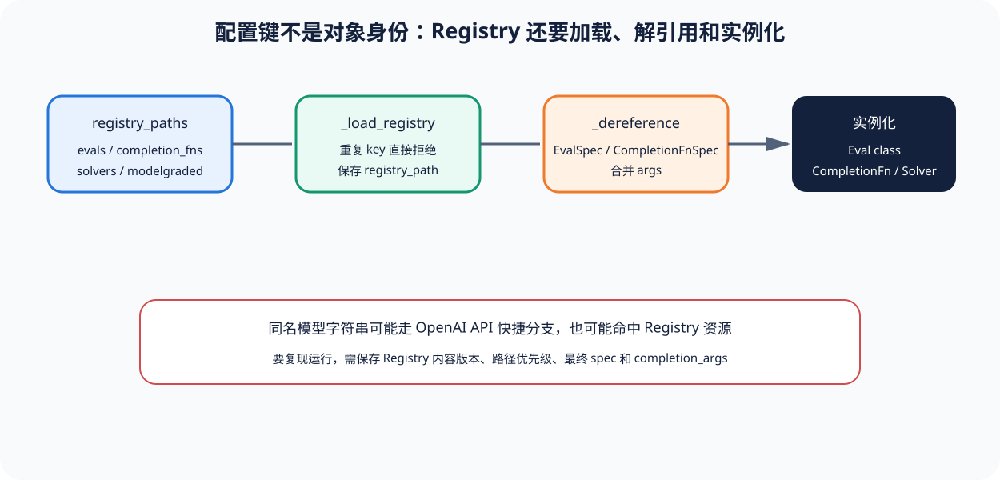

# 01｜Registry 与 EvalSpec：字符串怎样变成真实对象

[上一节](README.md) · [下一节](02-completion-sample-run.md)

## 本篇要解决什么问题

同一个 `eval-name` 放在不同 Registry 路径下，可能分别指向不同的 class、args 和数据，而模型字符串也既可能命中 API 模型快捷分支，又可能被解析成 Registry CompletionFn 或 Solver。一旦忽略加载顺序和解引用过程，看似相同的运行命令就可能创建出不同对象，所以本节先把 Registry 的身份解析讲清楚。

## 先建立源码地图

核心实现位于锁定 [`Registry` 类](https://github.com/openai/evals/blob/8eac7a7de5215c907fbddc30efdaf316913eccdd/evals/registry.py#L103-L142)，其下的 [`get_eval`](https://github.com/openai/evals/blob/8eac7a7de5215c907fbddc30efdaf316913eccdd/evals/registry.py#L210-L211)、[`_dereference`](https://github.com/openai/evals/blob/8eac7a7de5215c907fbddc30efdaf316913eccdd/evals/registry.py#L156-L191) 和 [`_load_registry`](https://github.com/openai/evals/blob/8eac7a7de5215c907fbddc30efdaf316913eccdd/evals/registry.py#L287-L310) 构成三段关键逻辑。要确认 CLI 何时添加 registry paths、怎样覆盖 args，需要转到 [`run()`](https://github.com/openai/evals/blob/8eac7a7de5215c907fbddc30efdaf316913eccdd/evals/cli/oaieval.py#L118-L157)，因为参数在入口合并，并不由 Registry 处理，而 Eval 怎样用 `eval_registry_path` 解析数据，则写在 [`Eval` 基类](https://github.com/openai/evals/blob/8eac7a7de5215c907fbddc30efdaf316913eccdd/evals/eval.py#L46-L85) 中。

Registry 管理 completion_fns、solvers、eval_sets、evals 和 modelgraded 等资源类型，每次访问相应属性时都可以从配置路径加载目录，同时保存资源来自哪里，并对重复条目执行断言。

## 完整调用链

1. Registry 初始化默认路径；CLI `--registry_path` 可追加更多目录。
2. `_load_resources` 扫描某一资源类型的 YAML，`_load_registry` 合并条目；重复 name 立即失败，避免静默覆盖。
3. `get_eval(name)` 通过 `_dereference` 把原始字典解析为 EvalSpec，并把 registry_path 留在 spec 中。
4. CLI 把 extra_eval_params 合入 EvalSpec.args，此时 spec 已不同于仓库静态 YAML，必须记录解析后值。
5. `make_completion_fn` 先识别 dummy 或已知 OpenAI 模型名，再查询 CompletionFn/Solver Registry；最终加载类、合并 kwargs，并验证实例满足 CompletionFn。
6. `get_class(eval_spec)` 取得 Eval class；实例化时传入 eval_registry_path，Eval 的数据路径通过 `_prefix_registry_path` 落到对应 Registry 的 data 目录。

## 关键数据结构

RawRegistry 是从 name 指向原始 spec 的字典，而 BaseEvalSpec/EvalSpec/CompletionFnSpec 会进一步把 key、class 名、args、metrics 和 registry_path 变成结构化字段。逻辑 key 负责引用，class 决定代码，args 决定行为，registry_path 决定数据相对路径，少了其中任何一项都不行。身份就会失真。

RunSpec 还会保存 run_id、completion_fns 和 eval_spec，供 Recorder 的每个 Event 引用，因此它比单条 EvalSpec 更接近一次运行身份。不过，数据文件内容、代码 commit 和服务端实际模型仍不在其中，需要用外部摘要补齐。

## 实现取舍与失败语义

多 Registry 路径为私有 Eval 的扩展留出了空间，但当前实现遇到重复 key 会直接失败，并不会让后加载者覆盖前者。这是一种显式暴露冲突的策略。资源随访问加载虽然直观，却让性能和确定性受文件系统状态影响，所以要做离线复现，就得同时冻结解析结果与来源版本。

CLI override 能加快实验调整，却也会让静态 YAML 与实际运行出现差异，而 CompletionFn 的模型快捷分支虽然方便调用常见 API，也使字符串解析规则成了运行身份的一部分——这套规则同样需要版本化。只要 key 不存在、class 载入失败，或实例不满足 Protocol，系统就应在运行前阻断，而不是留下一个看似完成的空结果。

## 动手实验

假设两个 registry paths 都定义了 `shipping.eval`，其中一个 class 是规则 Eval，另一个是 ModelGraded Eval，请判断加载器是否应该静默选择。接着只保留一个条目，并让 CLI 把 `max_samples` 从 100 改成 10，再判断报告应该保存 YAML 默认值还是解析后的值。

列出生成永久运行指纹所需字段，并与本仓库 `canonical_digest` 的输入思路比较。

## 预期输出与答案

锁定实现会拒绝重复 key，既不静默选前者，也不静默选后者。报告必须保存解析后的 10，同时留下 override 的来源，因为静态 YAML 中的 100 只能说明默认值，而运行指纹至少还应覆盖 Registry commit/路径、EvalSpec class/args、CompletionFn class/args、数据摘要和代码版本。

如果只哈希逻辑 key，两个不同 Registry 中的同名 Eval 就会碰撞。只哈希 YAML 又会漏掉 CLI override。它不能代表实际运行。

## 如何核对

依次打开 [`_load_registry`](https://github.com/openai/evals/blob/8eac7a7de5215c907fbddc30efdaf316913eccdd/evals/registry.py#L287-L310)（重复条目在这里被发现）、[`_dereference`](https://github.com/openai/evals/blob/8eac7a7de5215c907fbddc30efdaf316913eccdd/evals/registry.py#L156-L191) 和 [`make_completion_fn`](https://github.com/openai/evals/blob/8eac7a7de5215c907fbddc30efdaf316913eccdd/evals/registry.py#L120-L151)，再在 [`run()`](https://github.com/openai/evals/blob/8eac7a7de5215c907fbddc30efdaf316913eccdd/evals/cli/oaieval.py#L118-L157) 核对 extra_eval_params 和 completion_args 的合并时点。

## 本篇不能证明什么

即使已经确定解析出的对象，也不能据此证明 YAML 内容正确、数据授权充分或 class 没有副作用，因为 Registry 只负责配置发现与实例化，无法替代 Dataset 治理、Sandbox 隔离和 Scorer 有效性验证。

[上一节](README.md) · [下一节](02-completion-sample-run.md)
