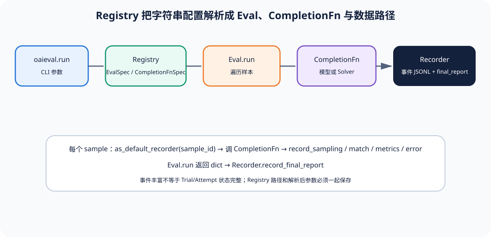

# 02｜CompletionFn 与 Sample：谁负责调用，谁负责判断

[上一节](01-registry-eval-spec.md) · [下一节](03-recorder-metrics-boundaries.md)

## 本篇要解决什么问题

CompletionFn 名字像“完成一次评测”，实际只负责给定 prompt 产生 CompletionResult；怎样遍历数据、构造 prompt、比较 Reference 和聚合 metric 由 Eval 决定。分清二者可以避免把模型重试、Sample 重复和 Scorer 判断混成一个 callback，也能解释 SolverEval 为什么是另一种执行边界。

## 先建立源码地图

[`CompletionFn` Protocol](https://github.com/openai/evals/blob/8eac7a7de5215c907fbddc30efdaf316913eccdd/evals/api.py#L23-L40)、[`CompletionResult`](https://github.com/openai/evals/blob/8eac7a7de5215c907fbddc30efdaf316913eccdd/evals/api.py#L16-L19) 与匹配 helper 都在锁定 `api.py`，整个文件只有一百多行。Eval ABC、Sample 迭代 helper、CompletionFn 包装和 SolverEval 位于 [`eval.py`](https://github.com/openai/evals/blob/8eac7a7de5215c907fbddc30efdaf316913eccdd/evals/eval.py#L46-L85)。CompletionFn 的解析入口位于 [`registry.py`](https://github.com/openai/evals/blob/8eac7a7de5215c907fbddc30efdaf316913eccdd/evals/registry.py)。

`Eval` 接收 CompletionFn 列表，`completion_fn` property 只是方便访问单项；`SolverEval` 则要求恰好一个 completion_fn，并将它包装成 Solver。这是两种扩展语义，不应按名称假设完全相同。

## 完整调用链

1. Registry 按模型名或 spec 创建 CompletionFn。对象只需满足协议，不需要知道 Eval key 或最终 Metric。
2. Eval class 从 Registry 相对 data 路径加载 JSONL Sample，可通过 `_index_samples` 给每条记录稳定运行内 index，并受 max_samples 限制。
3. Eval.run 为每条 Sample 设置 `recorder.as_default_recorder(sample_id)`，可先记录 raw_sample。
4. Eval 根据 doc 构造 prompt，调用 CompletionFn，取得 CompletionResult。具体实现可能记录 sampling 事件。
5. Eval 解析 sampled response，并调用 `record_match`、`record_metrics` 或自定义事件。`record_and_check_match` 同时记录 expected、picked、sampled 和 options。
6. Eval 累计局部结果，最后返回 dict。CLI 不理解每个 metric 的语义，只把 dict 交给 Recorder final report。
7. SolverEval 把单一 CompletionFn 作为 Solver 使用，Eval 代码与 Solver 交互；这允许多步逻辑，却仍需要具体 Eval 定义其状态和评分。

## 关键数据结构

`CompletionFn(prompt, **kwargs) -> CompletionResult` 是模型调用边界。CompletionResult 暴露 completion 或相关响应信息。Sample 通常是 JSONL dict，结构由具体 Eval class 解释；这比统一 Sample 模型灵活，但跨 Eval 复用和 schema 检查较弱。

Recorder Event 将 sample_id 与 sampling/match 等 data 绑定，却没有统一的 Trial ID、Target resolved identity 或 Attempt ordinal。若要接入本仓库，应由 Adapter 补充计划 Trial 和基础设施恢复记录，不能把多次 sampling event 直接当成多个 Trial。

## 实现取舍与失败语义

极小 CompletionFn Protocol 让多种模型和 Solver 接入简单，也使 Eval class 拥有较大自由度；代价是 batching、重试、缓存、身份调和和错误分类可能分散在不同实现。Eval 子类直接写事件方便快速开发，却难以静态证明每条 Score 都绑定相同证据字段。

模型 API 超时可能在 CompletionFn 内重试，核心接口没有显式 Attempt；CompletionFn 正常返回错误答案是产品结果，应由 Eval 的 match 或 scorer 判错。Sample schema 错误、Reference 缺失或 Eval class 异常应记录 error，并明确是否进入最终分母。Solver 自我尝试属于被测算法，不应由外层当成基础设施恢复。

## 动手实验

用伪代码写一个确定性 CompletionFn：输入金额，返回 shipping fee。再写 Eval：加载 99/100/101，调用 CompletionFn，记录 expected/picked/match，返回 accuracy。标注哪些代码属于 Target Adapter，哪些属于 Scorer，哪些属于 Metric。

把金额 100 的 buggy 返回视为正常 CompletionResult；说明为什么不应由 CompletionFn 外层重试到 fixed 答案。

## 预期输出与答案

CompletionFn 是 Target Adapter；expected/picked 比较是 Scorer；三条 match 的 mean 是 Metric。buggy 结果应产生 match=false，仍是一次完成的 Sample。若外层再次调用直到 match=true，Eval 就泄露 Reference 并改变被测策略，分数失去意义。

正确报告还应保留三条 Sample 事件和固定分母 3。若某条因基础设施错误无结果，应显式 unscored/blocked，而不是从 mean 列表删除。

## 如何核对

阅读 [`CompletionFn`](https://github.com/openai/evals/blob/8eac7a7de5215c907fbddc30efdaf316913eccdd/evals/api.py#L23-L40)、[`DummyCompletionFn`](https://github.com/openai/evals/blob/8eac7a7de5215c907fbddc30efdaf316913eccdd/evals/api.py#L48-L52) 与 [`record_and_check_match`](https://github.com/openai/evals/blob/8eac7a7de5215c907fbddc30efdaf316913eccdd/evals/api.py#L55-L93)。再对照 [`Eval`](https://github.com/openai/evals/blob/8eac7a7de5215c907fbddc30efdaf316913eccdd/evals/eval.py#L46-L85)、[`SolverEval`](https://github.com/openai/evals/blob/8eac7a7de5215c907fbddc30efdaf316913eccdd/evals/eval.py#L168-L207) 和 [`_index_samples`](https://github.com/openai/evals/blob/8eac7a7de5215c907fbddc30efdaf316913eccdd/evals/eval.py#L30-L38)，核对职责确实分开。

## 本篇不能证明什么

协议分层不能证明具体 Eval 子类正确处理缺失、并发或网络重试，也不能证明模型响应来自声明版本。它给出扩展接缝，真正证据质量取决于实现和运行记录。

[上一节](01-registry-eval-spec.md) · [下一节](03-recorder-metrics-boundaries.md)
