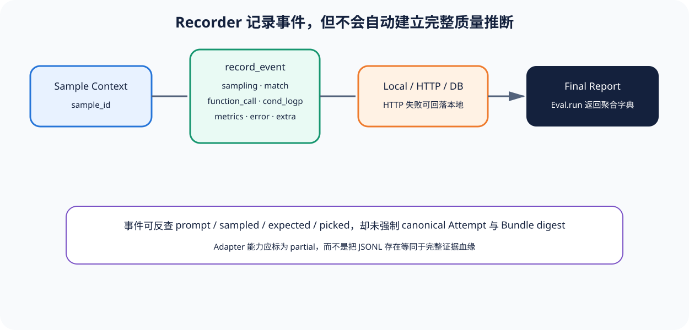

# 03｜Recorder 与 Metric 边界：事件很多，推断仍要另建合同

[上一节](02-completion-sample-run.md) · [下一节](../../README.md)

## 本篇要解决什么问题

OpenAI Evals 的 Recorder 可以记录 sampling、match、function_call、cond_logp、metrics、error 和任意 extra，LocalRecorder 还能写 JSONL，HTTP 失败时回落本地。但“记录到了事件”不自动回答：事件是否有因果顺序、哪次执行是 canonical、未评分样本多少、最终 accuracy 的分母是什么、报告能否作发布决定。本节划清记录层和推断层。

## 先建立源码地图

RecorderBase、Event、default recorder ContextVar、事件 helper 和 Local/HTTP/数据库实现位于锁定 [`record.py`](https://github.com/openai/evals/blob/8eac7a7de5215c907fbddc30efdaf316913eccdd/evals/record.py)。CLI 选择后端、补 token usage 和写 final report 位于 [`cli/oaieval.py`](https://github.com/openai/evals/blob/8eac7a7de5215c907fbddc30efdaf316913eccdd/evals/cli/oaieval.py)。match helper 位于 [`api.py`](https://github.com/openai/evals/blob/8eac7a7de5215c907fbddc30efdaf316913eccdd/evals/api.py)。

## 完整调用链

1. CLI 根据 dry-run、record_path、remote URL 等选择 Recorder。每个 Recorder 持有 RunSpec。
2. Eval 进入 `as_default_recorder(sample_id)`，ContextVar 暂存当前 Recorder 与 sample_id；离开上下文后恢复旧值。
3. CompletionFn/Eval 调用全局 helper，最终进入 `record_event(type, data, sample_id)`。没有显式或上下文 sample_id 时抛错，防止事件成为孤儿。
4. LocalRecorder 把 Event 写入本地 JSONL；HTTP Recorder 发送远端，异常时写 local fallback 并提示。
5. Eval.run 返回 final report。CLI 从 sampling events 可累计 token usage，再单独调用 `record_final_report`。
6. 消费者可按 type 查询 events，但 Metric 的聚合公式主要由 Eval 返回 dict 决定，Recorder 不验证分母或统计假设。

## 关键数据结构

Event 连接 run、sample、type 和 data。sampling data 可含 prompt/sampled/usage；match 可含 correct/expected/picked/sampled/options；function_call 可含 name/arguments/return；error 保存消息和异常；metrics 是 Eval 自由提供的键值。

RunSpec 负责运行头，final report 负责聚合输出。两者之间缺少强制的 ScoreRecord/MetricEstimate 引用链：final report 不一定列出参与每个 Metric 的 Event ID。做证据 Adapter 时需要保留原 Event，同时生成显式 Observation 与 Score 血缘。

## 实现取舍与失败语义

通用 Event API 让实验快速记录任意事实；代价是 type/data schema 由调用者约定，跨 Eval 语义可能不一致。ContextVar 比全局变量更适合并发上下文，但跨线程/异步任务传播仍需测试。Local fallback 是好的持久性策略，却会产生远端与本地两个位置，后续汇总必须去重并标记实际 sink。

记录服务失败属于 Harness 基础设施故障，不应改变模型 Score。Sampling event 存在但 match 缺失可能是 unscored，不应默认为失败或从分母消失。Final report 若只含平均值而没有 Sample 事件清单，证据能力为 partial。Recorder 也没有发布 Gate；任何阈值决策都应在独立政策层实现。

## 动手实验

给定事件：100 个 raw_sample、90 个 sampling、80 个 match=true、10 个 match=false、5 个 error、5 个只有 sampling 没有 match。分别设计：事件完整性报告、Score 状态映射、Metric denominator 和 Gate 输入。说明 HTTP fallback 重复上传时怎样去重。

再把这些字段映射到 Reference Harness 的 TraceEvent、ObservationBundle、ScoreRecord 与 MetricEstimate，标出 unavailable/partial。

## 预期输出与答案

计划 Sample 分母为 100。80 passed、10 failed、5 error（需按错误类别 blocked/invalid）、5 unscored。仅在 90 个 match 上算 88.9%不能直接通过；质量决定应暴露 10% 缺失。去重至少使用 run_id + sample_id + event identity/内容摘要，不能按事件文本相同删除。

Event 到 TraceEvent 为 partial，因为父子/sequence 未必存在；sampling/match 可组成 Observation，但缺 canonical Attempt digest；match 可转 Score；final report metric 若没有 score_ids，只能 partial；Gate 在核心 Recorder 中 unavailable。

## 如何核对

在 [`record.py`](https://github.com/openai/evals/blob/8eac7a7de5215c907fbddc30efdaf316913eccdd/evals/record.py) 阅读 `as_default_recorder`、`record_event`、LocalRecorder、HttpRecorder fallback 与 helper。再在 [`cli/oaieval.py`](https://github.com/openai/evals/blob/8eac7a7de5215c907fbddc30efdaf316913eccdd/evals/cli/oaieval.py) 核对 final report 与 token usage 是入口后处理，而不是 Recorder 自动推断。

## 本篇不能证明什么

JSONL 可读和 fallback 成功不能证明证据完整、事件未被改写或 Metric 统计有效。Recorder 提供观察存储；质量结论仍需要身份、血缘、分母、不确定性和 Gate Policy。

[上一节](02-completion-sample-run.md) · [下一节](../../README.md)
