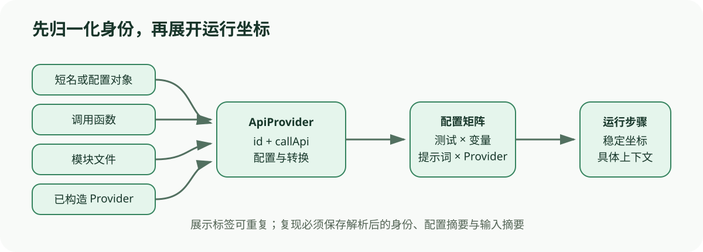

# Promptfoo 配置与 Provider：先解析身份，再生成请求

[上一节](README.md) · [下一节](02-test-case-runtime.md)

## 本篇要解决什么问题

看到 `providers: [openai:gpt-4o-mini]` 时，很容易以为 Evaluator 会直接用字符串调用 SDK，但实现还要处理短名、带 config 对象、JavaScript 函数、模块文件及多 Provider 配置。prompt 还可能带标签、模板和配置，测试也能覆盖 Provider。如果这些形式没有先归一化，执行层就会堆满类型分支，运行身份也难以准确记录，所以本篇追踪 Provider 解析及 prompt/provider/test 的组合边界。

锁定源码让解析路径可以逐段核对，但本篇不承诺列出 Promptfoo 支持的全部 Provider。由于同一短名将来可能映射到另一种实现，教材会以锁定 commit 以及解析后的 `id()`、配置与输入为核对单位。

## 先建立源码地图

| 源码位置 | 作用 | 阅读问题 |
| --- | --- | --- |
| [`src/providers/index.ts`](https://github.com/promptfoo/promptfoo/blob/ce89186a22c59543f4f71a55d42442ff3f0e3654/src/providers/index.ts#L83-L121) | `loadApiProvider`、`resolveProvider`、`loadApiProviders` | 输入形式怎样变成 ApiProvider |
| [`src/evaluator.ts`](https://github.com/promptfoo/promptfoo/blob/ce89186a22c59543f4f71a55d42442ff3f0e3654/src/evaluator.ts) | 合并 prompt 配置、生成 RunEvalOptions | 解析对象怎样进入运行矩阵 |
| [`src/types/index.ts`](https://github.com/promptfoo/promptfoo/blob/ce89186a22c59543f4f71a55d42442ff3f0e3654/src/types/index.ts) | TestSuite、RunEvalOptions、EvaluateResult 等契约 | 哪些字段跨越层级 |

## 完整调用链



1. `loadApiProviders` 接受单个或多个 Provider 引用。已经满足 ApiProvider 契约的对象可直接使用；函数被包装为 `callApi`；字符串和配置对象进入 `loadApiProvider`。
2. 路径型配置可导出一个或多个 Provider。单 Provider 入口若读到多个 Provider 会明确报错，避免调用者误以为只选择了第一个。
3. 解析阶段合并 basePath、环境、Provider options、label、transform、delay 与 inputs。带模板的动态配置保留到实际 `callApi()` 上下文再渲染，而不是在全局加载时过早求值。
4. Evaluator 先构建 tests，再对每个 test 计算变量组合；随后按 prompt 和 provider 逐层附加 `RunEvalOptions`。测试级 Provider override 可以替换套件默认 Provider。
5. `createRunEvalOption` 固定 testIdx、promptIdx、具体 `ApiProvider`、具体 `Prompt`、vars、timeout 和运行控制项。到这里，一个配置矩阵才变成可调度步骤。
6. 单步运行时把 Provider 配置与 prompt config 合并为调用上下文，渲染模板后调用 `provider.callApi(renderedPrompt, context, options)`，并把返回值标准化为结果行。

## 关键数据结构

`ApiProvider` 的核心不是厂商名称，而是稳定身份与调用能力，其中 `id()` 用于结果归属，`callApi()` 划出目标边界，label/config/transform/delay/inputs 描述额外行为。`Prompt` 同时保留 raw、label 与 config，避免报告只显示长模板而无法区分候选。`TestSuite` 是未展开的配置集合，`AtomicTestCase` 是合并 default/scenario 后的测试，只有 `RunEvalOptions` 才对应某个 provider × prompt × test × vars 的执行单位。

复现清单至少要有锁定 commit、解析后的 Provider ID 与 label、非敏感配置摘要、prompt 摘要、变量值、测试断言、输入文件摘要和运行选项。环境变量中的密钥只记录名称或来源，不能写入证据包。

## 实现取舍与失败语义

多种输入形式让用户可以从简单 YAML 逐步扩展到自定义函数——代价是配置解析本身也成了可信计算的一部分。当一个文件导出多个 Provider 时，解析器拒绝隐式挑选，从而用显式失败换取可预测性。动态配置要等到调用时才渲染，这样才能支持 per-test 变量，也说明 Provider 在加载时看起来相同，并不代表每个测试发出的实际请求相同。

Provider 解析失败属于装配错误，应该在目标调用前暴露，而 `callApi` 返回 error 属于目标执行结果，transform 或 prompt 渲染失败则属于输入或适配层错误。如果三者全被压成 `success: false`，使用者就会失去修复方向。缓存命中只是一次执行的来源属性。它不等于新增独立观察。

## 动手实验

设计短名、内联函数和模块文件三种逻辑相同的 Provider，写出各自的 identity 字段，并说明只留展示 label 为何不足以复现。随后构造一个 test 级 Provider override，画出它与 suite 默认 Provider 的优先级，最后给 prompt 配置加入 `temperature`，说明它应该在哪一层合并，以及怎样进入审计信息。

离线核对命令：

```bash
python scripts/sources.py verify
python -m pytest tests/test_harness_course_docs.py -q
```

## 预期输出与答案

短名至少要记录解析后的实现 ID 和配置，函数要记录模块或代码摘要与稳定 label，文件则要记录规范化相对路径、文件摘要和导出对象 ID。展示 label 可能重复，也可能被用户修改。它不能单独充当身份。测试级 override 只影响由该测试生成的步骤，其他测试仍然使用 suite providers。创建调用上下文时，prompt config 应按明确优先级与 Provider/prompt 配置合并，并随结果或运行清单保存非敏感快照。

如果一个文件导出多个 Provider，却通过单 Provider API 加载，预期行为应该是给出明确错误，而不是默默选中一个。如果配置包含每测试模板变量，则应在运行时根据当前 vars 渲染。

## 如何核对

先在 [`src/providers/index.ts`](https://github.com/promptfoo/promptfoo/blob/ce89186a22c59543f4f71a55d42442ff3f0e3654/src/providers/index.ts#L370-L409) 从 `loadApiProviders` 追到 `loadApiProvider`，观察函数包装、对象直通、文件配置和多导出拒绝逻辑，然后再到 [`src/evaluator.ts`](https://github.com/promptfoo/promptfoo/blob/ce89186a22c59543f4f71a55d42442ff3f0e3654/src/evaluator.ts#L2577-L2616) 追 `appendRunEvalOptionsForTestCase`、`appendRunEvalOptionsForVars`、`appendRunEvalOptionsForProvider` 和 `createRunEvalOption`。

## 本篇不能证明什么

Provider 成功加载以后，仍然不能证明凭据有效、模型版本固定、外部 API 可用，或请求确实被服务端按声明参数执行。配置摘要也替代不了完整的供应链锁定，而自定义函数的安全性与沙箱边界还需要单独审计。

[上一节](README.md) · [下一节](02-test-case-runtime.md)
