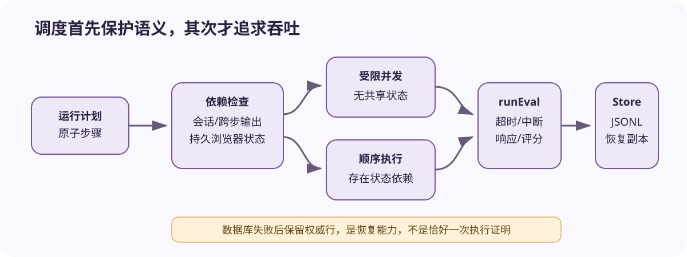

# Promptfoo 测试运行时：展开、串并行与结果落盘

[上一节](01-config-provider-prompt.md) · [下一节](03-assertion-results-ci.md)

## 本篇要解决什么问题

性能问题常被归因于“并发太低”，正确性问题则归因于“模型随机”，但判断之前都要先弄清 Promptfoo 怎样生成和调度运行步骤。变量数组会扩大测试数，resume 会过滤已完成步骤，会话历史和跨步骤输出会强制串行——调度从这里开始影响语义，而单步或全局超时、持久化失败又会留下不同结果。本篇既解释原子运行怎样从队列推进到结果存储，也追踪中间状态怎样变化。

重点不是记住每个私有函数，而是检查计划展开、依赖顺序、错误分层与权威结果是否正确。

## 先建立源码地图

| 源码位置 | 责任 | 需要核对的行为 |
| --- | --- | --- |
| [`src/evaluator.ts`](https://github.com/promptfoo/promptfoo/blob/ce89186a22c59543f4f71a55d42442ff3f0e3654/src/evaluator.ts) | Evaluator、runEval、串并行调度 | 计划、超时、速率限制、统计 |
| [`src/evaluator/runtime.ts`](https://github.com/promptfoo/promptfoo/blob/ce89186a22c59543f4f71a55d42442ff3f0e3654/src/evaluator/runtime.ts) | Store 与 writer 契约 | 结果怎样追加、读取和恢复 |
| [`src/types/index.ts`](https://github.com/promptfoo/promptfoo/blob/ce89186a22c59543f4f71a55d42442ff3f0e3654/src/types/index.ts) | 运行选项与结果类型 | timeout/cache/abort 和结果字段 |

## 完整调用链



1. Evaluator 合并 default tests 与 scenarios，准备变量并应用 input transform，得到 AtomicTestCase 列表。
2. 变量数组经 `generateVarCombinations` 展开，随后按 Provider 和 Prompt 生成 RunEvalOptions。resume 模式会读取已有结果并过滤已完成坐标。
3. `adjustConcurrencyForSerialFeatures` 检查 conversation 变量、`storeOutputAs` 和浏览器持久会话。任何一步依赖前一步状态时，最大并发被改成 1；其余步骤进入 `forEachOfLimit`。
4. 调度器为每步检查 abort/global duration，并给单步包裹 timeout；共享 RateLimitRegistry 可以根据 Provider 的限流反馈调整并发。
5. `runEval` 创建状态，渲染 prompt，构造 Provider context，调用 Provider，再处理 trace、delay、transform、空响应与 grading。
6. `EvaluateResult` 先更新 prompt metrics 和全局 stats，然后追加到 Store 与 JSONL writer。数据库追加失败会登记 persistence failure；之后在内存保留权威副本，供终局合并覆盖陈旧行。
7. 中断时保存已完成进度；目标被判定不可用时结束剩余步骤并保存当前结果。最终 Store 汇集结果、prompts、vars 与统计。

## 关键数据结构

运行坐标由 `testIdx + promptIdx + provider + vars` 共同确定，不能只看数组序号来判断。`EvalProcessingContext` 持有 concurrency、共享变量集合、目标不可用状态以及它们在本次运行中的变化。`EvaluateResult` 同时保存 testCase、prompt、provider、response、gradingResult、success、score、namedScores、failureReason、latency 与 tokenUsage，而 Store 提供 `appendResult`、`readResults`、`hasResultPersistenceFailure`、`recordFinalResult` 等接口，使 Evaluator 不必绑定某个数据库的具体实现。

Prompt metrics 适合写入报告，却不能替代行级证据，因为总通过数无法说明哪条输入失败、是否命中缓存、哪个 Provider 报错，也解释不了比较断言怎样改变得分。

## 实现取舍与失败语义

受限并发提高吞吐，串行检测保护有状态语义，但未声明的共享状态仍可能绕过检测。自适应限流能减少持续 429，却会重排等待时间，所以解释 latency 时要区分排队与 Provider 调用。单步 timeout 会生成一条失败记录，而全局 max duration 可能让剩余步骤没有任何结果。只看失败率，分不清这两种缺口。

持久化采用“数据库 + 流式 JSONL + 失败后内存权威副本”，能降低进程中后段丢结果的风险，但恢复合并仍依赖稳定坐标与去重规则。中断保存提供运行恢复能力，不能把同一逻辑测试在恢复前后的多次底层调用算成多个独立 Trial。

## 动手实验

构造六个 RunEvalOptions，其中前三个无状态，第四个写入 `storeOutputAs`，第五个读取该值，第六个使用 conversation 变量。分别给出并发 3 和并发 1 时的执行顺序，指出哪一种正确保持语义。再模拟第三条结果写数据库失败但写 JSONL 成功，写出恢复合并键与优先级，并区分 Provider 500、断言失败、单步超时、全局到时和用户中断的证据。

```bash
python scripts/sources.py verify
python -m pytest tests/test_harness_course_docs.py -q
```

## 预期输出与答案

前三个无状态步骤可以受限并发，但出现跨步骤存取或会话历史后，相关序列必须保持顺序，当前实现会把整次运行的并发降为 1。恢复键不能省。它至少要包含稳定运行身份与 test/prompt/provider/vars 坐标。如果数据库报告持久化失败，最终的内存或流式权威行应覆盖数据库陈旧行，同时去掉重复记录。

Provider 500 属于目标错误，断言失败表示有效响应未满足判据，单步超时应留下结果行，全局到时则意味着还有未运行步骤。用户中断还应记录终止原因。界面可以把后四种情况都显示成红色，但机器可读原因必须彼此不同。

## 如何核对

先在 [`src/evaluator.ts`](https://github.com/promptfoo/promptfoo/blob/ce89186a22c59543f4f71a55d42442ff3f0e3654/src/evaluator.ts#L2934-L2969) 核对 `adjustConcurrencyForSerialFeatures`、`runSerialEvalSteps`、`runConcurrentEvalSteps`、`processEvalStepWithTimeout`、`persistEvalRow` 与 `saveInterruptedEval`，再到 [`src/evaluator/runtime.ts`](https://github.com/promptfoo/promptfoo/blob/ce89186a22c59543f4f71a55d42442ff3f0e3654/src/evaluator/runtime.ts) 核对 Store 的读取、追加和 persistence failure 契约。

## 本篇不能证明什么

即使实现中存在 resume、JSONL 和自适应限流，也不能证明执行恰好发生一次、跨进程事务完整、远程 Provider 幂等，或中断后的统计没有偏差。课程没有对真实 API 做故障注入。这些问题需要专项验证。

[上一节](01-config-provider-prompt.md) · [下一节](03-assertion-results-ci.md)
