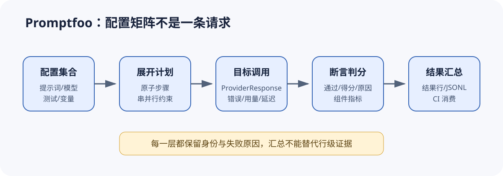

# Promptfoo 源码课程：配置矩阵怎样变成可判定的评测运行

[上一节](../openai-evals/03-recorder-metrics-boundaries.md) · [下一节](01-config-provider-prompt.md)

## 本篇要解决什么问题

Promptfoo 常被介绍为「用 YAML 对比多个提示词和模型」，但这句话略过了 Eval Harness 最关键的部分，因为配置里的 prompt、provider、test、变量、重复次数与断言并不等于一条请求，它们共同描述的是一张需要展开、调度、执行、判分和持久化的运行计划——每一步都会影响最终证据。本课程要回答配置对象怎样被标准化为原子测试、Provider 怎样成为统一调用边界、运行器为什么有时必须放弃并发，以及断言怎样把响应转成通过、得分与失败原因。最后还要分清 CI 看见的汇总与单条证据之间到底是什么关系。

锁定版本为 `ce89186a22c59543f4f71a55d42442ff3f0e3654`。课程只对该版本列出的五个源码文件作可核对解释，并明确说明它们的适用边界。Promptfoo 还包含红队、缓存、Web 界面、远程服务与大量 Provider，但这些内容不在本组入门课的覆盖承诺内。

## 先建立源码地图

| 站点 | 锁定文件 | 本课关注的问题 |
| --- | --- | --- |
| 总调度器 | [`src/evaluator.ts`](https://github.com/promptfoo/promptfoo/blob/ce89186a22c59543f4f71a55d42442ff3f0e3654/src/evaluator.ts) | 测试展开、运行步骤、并发、超时、判分和统计 |
| 运行时契约 | [`src/evaluator/runtime.ts`](https://github.com/promptfoo/promptfoo/blob/ce89186a22c59543f4f71a55d42442ff3f0e3654/src/evaluator/runtime.ts) | Store、结果写入器和运行时依赖 |
| Provider 装配 | [`src/providers/index.ts`](https://github.com/promptfoo/promptfoo/blob/ce89186a22c59543f4f71a55d42442ff3f0e3654/src/providers/index.ts) | 字符串、配置、函数和文件怎样解析为 ApiProvider |
| 断言执行 | [`src/assertions/index.ts`](https://github.com/promptfoo/promptfoo/blob/ce89186a22c59543f4f71a55d42442ff3f0e3654/src/assertions/index.ts) | 单断言、断言集合、模型判分和 trace-aware 判分 |
| 公共类型 | [`src/types/index.ts`](https://github.com/promptfoo/promptfoo/blob/ce89186a22c59543f4f71a55d42442ff3f0e3654/src/types/index.ts) | AtomicTestCase、EvaluateResult、GradingResult 与选项 |

## 完整调用链



1. 配置层提供 prompts、providers、tests、scenarios、defaultTest 与运行选项；加载后的 `TestSuite` 仍不是执行队列。
2. Evaluator 合并默认测试和场景，把变量数组展开为组合，并为每个 test × vars × prompt × provider 生成 `RunEvalOptions`。重复运行和比较断言会继续改变步骤数与分组关系。
3. Provider 解析器把字符串 ID、内联对象、函数或外部文件统一为带 `id()` 与 `callApi()` 的 `ApiProvider`；运行步骤因此不必知道某家模型 SDK。
4. 调度器检查 conversation 变量、`storeOutputAs` 和持久浏览器会话等跨步骤状态；这些特性存在时——并发会被降为 1。其余步骤用受限并发执行，并共享速率限制注册表。
5. 单步渲染 prompt 和变量，调用活跃 Provider，得到 `ProviderResponse`；空响应、Provider 错误、超时和目标不可用分别进入不同结果分支。
6. `runAssertions` 对 assertion 或 assertion set 求值，形成 `GradingResult`；Evaluator 再把 success、score、namedScores、failureReason、tokenUsage 和 latency 写回 `EvaluateResult`。
7. Store 与 JSONL writer 持久化单行结果，末尾聚合每个 prompt 的通过数、失败数、错误数和得分，供报告或 CI 决策使用。

## 关键数据结构

`AtomicTestCase` 表达已经可以运行的测试语义，其中包含 vars、assert、provider override、metadata 等字段，而 `RunEvalOptions` 会继续把具体 prompt/provider/testIdx/promptIdx 与超时、缓存和信号装进一次执行。`ProviderResponse` 是目标调用边界及其调用结果的来源，既可能带有 output，也可能带有 error、tokenUsage、latencyMs 与 metadata。`EvaluateResult` 对应一行运行结果，保留原测试、响应、评分、成功状态和失败原因，而 `GradingResult` 只关注 pass、score、reason、namedScores、componentResults 和 assertion 等判分信息。

这些结构相互关联，却不能彼此替换。类型边界必须保留。Provider 有返回并不表示断言通过，断言通过也不表示整个 Trial 具有统计代表性，而 prompt 汇总更不能直接充当发布 Gate。Reference Harness 会通过 Trial/Attempt 与独立 Gate 进一步拆开这几层含义。

## 实现取舍与失败语义

配置矩阵让同一组测试能够快速横向比较多个模型和提示词，代价是配置中的一行与结果中的一行不再一一对应，所以排查数量异常时要先计算展开规则。统一 Provider 接口降低了接入成本，但因为中间还存在字符串解析、插件加载和运行时配置，复现记录必须保存解析后的 Provider 身份，不能只留下原始短名。

并发降级是为了保证正确性，因为一旦会话历史或前一步输出参与后一步输入，乱序就会改变样本本身。Provider 重试、缓存命中和断言中的模型调用属于不同恢复层，不能把多次底层调用算作多个独立样本。持久化失败会被记录，并尝试保留 JSONL 权威副本，这能保护已有证据，却无法自动证明结果集没有缺口。

## 动手实验

假设配置有 2 个 prompt、3 个 provider 和 4 个 test，其中一个 test 的变量 `tone` 有 2 个值。先不要运行代码，写出最小步骤数，然后加入 `repeat: 2` 重新计算。接着标出哪些字段属于配置身份、目标响应、评分结果和运行汇总，最后解释如果某个 test 使用了会话变量，为什么把并发设为 8 也不应该并发执行。

运行仓库的离线检查：

```bash
python scripts/sources.py verify
python -m pytest tests/test_harness_course_docs.py -q
```

## 预期输出与答案

如果四个 test 都只有一个变量组合，基础步骤数就是 `2 × 3 × 4 = 24`。如果只有一个 test 因 `tone` 展开为两个原子测试，总数则是 `2 × 3 × (3 + 2) = 30`，全部重复两次以后变为 60。真实配置还可能受到 scenarios、过滤、已完成结果恢复、比较断言和 provider override 的影响，所以这里只给出用于理解展开规则的最小模型。

会话变量依赖前序结果，而任意并发都可能让输入取得错误历史或不同历史，所以调度器应该把相关步骤串行化。课程测试应在没有模型密钥和网络调用时通过，它验证的是课程结构与锁定链接，并不声称已经执行 Promptfoo 的全套集成测试。

## 如何核对

先在 [`src/evaluator.ts`](https://github.com/promptfoo/promptfoo/blob/ce89186a22c59543f4f71a55d42442ff3f0e3654/src/evaluator.ts) 依次找 `buildTestsFromSuite`、`generateVarCombinations`、`appendRunEvalOptionsForProvider`、`adjustConcurrencyForSerialFeatures`、`runConcurrentEvalSteps` 和 `runEval`。再到 [`src/providers/index.ts`](https://github.com/promptfoo/promptfoo/blob/ce89186a22c59543f4f71a55d42442ff3f0e3654/src/providers/index.ts) 核对 Provider 的多种输入形式，最后在 [`src/assertions/index.ts`](https://github.com/promptfoo/promptfoo/blob/ce89186a22c59543f4f71a55d42442ff3f0e3654/src/assertions/index.ts) 核对断言聚合。

## 本篇不能证明什么

本篇无法证明某个 Promptfoo 配置适合生产发布、模型判分可靠、缓存没有污染、所有 Provider 行为一致，或 CI 中的一次全绿具有统计显著性。它提供的是锁定版本下的运行骨架与核对方法。

[上一节](../openai-evals/03-recorder-metrics-boundaries.md) · [下一节](01-config-provider-prompt.md)
