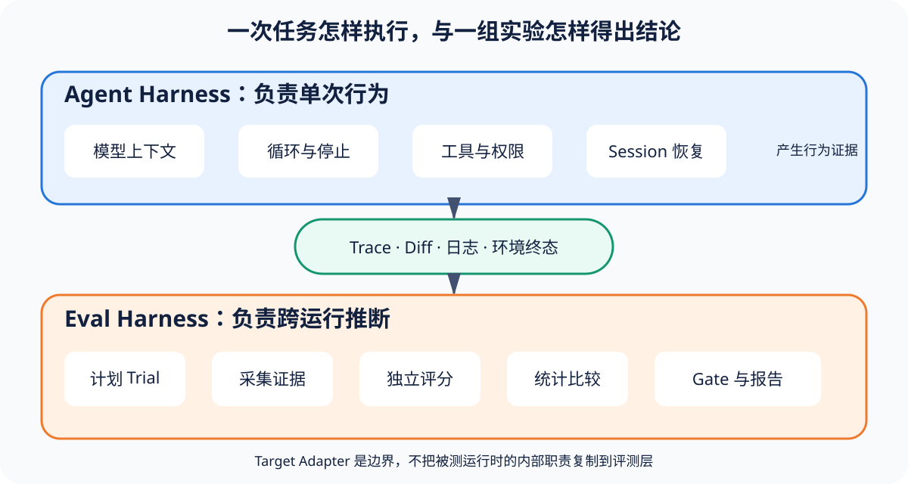

# 实验二：新增一个 Target Adapter

[上一节](01-run-one-deterministic-eval.md) · [下一节](03-write-a-scorer.md)

## 本篇要解决什么问题

Target Adapter（被测对象适配器）要把各不相同的被测系统接到统一的 `run(Trial) -> TargetResult` 接口上，后面的运行、评分和门禁才有同一套输入输出可用。这个实验先看安全子进程 Adapter 怎么做，然后再给 HTTP 或本地函数 Adapter 定合同。真正会影响评测是否可信的，是你怎么分错误、记身份和守住秘密边界，至于 SDK 参数只是实现细节。

## 核心机制



Adapter 只做一件事：执行当前 Trial。Harness 要不要 retry、Scorer 怎么打分、Gate 最后怎么判，都不归它管。这条边界要守住。运行结束后，Adapter 应该返回 completed 或 product_failure，只有基础设施出故障，导致这次运行没留下有效的产品观察时，它才抛出 InfrastructureError（基础设施错误）。它从 `trial.sample.input` 取输入，交回的输出则必须符合 JSON object 合同。

## 完整流程

1. 阅读 TargetAdapter Protocol 与 SubprocessTarget；
2. 列出新系统的 resolved identity、输入转换、输出 schema、timeout 和错误表；
3. 禁止 shell 字符串，使用 argv 或客户端结构化参数；
4. 把 4xx/5xx、timeout、拒答和非法输出按产品合同分类；
5. 为 Adapter 写合同测试：正常、产品失败、超时、启动/网络失败和秘密不落盘；
6. 只有 Adapter 输出有效 observation 后，Runner 才创建 canonical Attempt。

```bash
uv run pytest tests/test_subprocess_target.py tests/test_runner.py -q
```

## 关键数据与不变量

你至少要在 Adapter identity 里记下类型、实现版本、实际 endpoint/model/script digest 和非敏感配置，否则以后根本无法确认这份结果是哪个系统跑出来的。InfrastructureError code 也必须稳定，因为你要是把所有 Exception 一把抓住再无限 retry，就会把产品本身的失败伪装成偶发的基础设施问题。如果系统合同允许产品拒答，Adapter 就要把它当作 completed observation 交给 Scorer。只有网络根本连不上才算 infra。

## 动手实验

照着纸面模板实现 `LocalFunctionTarget`，让构造函数接收 callable，run 把 input 传给这个函数后，再检查返回值是不是 dict。然后写四个测试，分别让它返回 dict、返回 list、抛出业务异常和抛出 InfrastructureError，并说清楚每种情况应该产生什么 TargetResult 或 Attempt。

## 预期输出与答案

函数返回 dict 时，Adapter 应该交回 completed；函数返回 list 时，它则要交回 product_failure 或者明确的 contract error。如果业务异常说明被测代码自身失败了，就把它记成 product_failure，只有明确的基础设施异常才能触发新 Attempt。还有，Callable 的身份必须带上模块、qualname 和代码 digest，只写 `function` 根本分不出两段不同的实现。

## 如何核对

阅读 [`targets/base.py`](https://github.com/plwslpld-arch/eval-harness-internals/blob/main/src/eval_harness_reference/targets/base.py)、[`targets/subprocess.py`](https://github.com/plwslpld-arch/eval-harness-internals/blob/main/src/eval_harness_reference/targets/subprocess.py) 与测试，确认 Subprocess 使用 `shell=False`、UTF-8 和 timeout。

## 本篇不能证明什么

Adapter 合同通过，只能说这一层已经按约定转换了输入、执行了请求，也分好了结果。至于远端服务是否幂等、认证是否安全，输出又是不是声明的那个模型产生的，还得放到集成环境里，对照实际身份、服务端记录和端到端的完整请求链路来核验。

[上一节](01-run-one-deterministic-eval.md) · [下一节](03-write-a-scorer.md)
